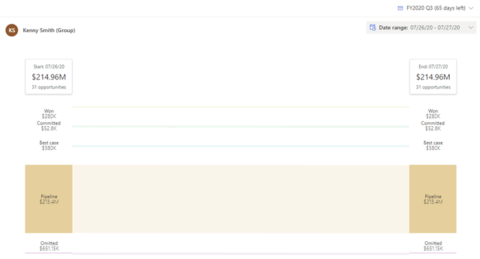
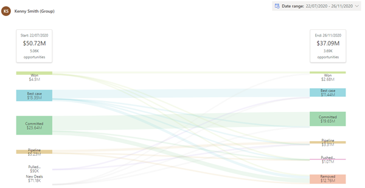

---	
title: "Analyze deals flows between snapshots in Dynamics 365 Sales Insights | MicrosoftDocs"	
description: "Analyze deals flows between snapshots in Dynamics 365 Sales Insights."	
ms.date: 10/26/2020	
ms.service: crm-online
ms.custom: 	
ms.topic: article	
author: udaykirang	
ms.author: udag	
manager: shujoshi	
---	

# Analyze deals flows between snapshots	

The **Flow** chart provides a visual representation of how the forecast changes between two moments in time. Managers can use flow charts to drill in to the specific deals that have contributed to the increase or decrease in forecast commitment, thus enabling them to follow up with their teams and coach their teams on how to improve their forecast accuracy.	

Review the following prerequisite before you start using deals flow analysis:	

- Verify that at least two snapshots have been created for the forecast. To learn more, see [Take snapshots automatically](manage-snapshots-forecast.md).	

**View and understand a deals flow**	

1. Sign in to the **Sales Hub** app and go to **Performance** > **Forecasts**.	

2. Select a forecast, and then choose a forecast period for the forecast.	

3. Select the **Flow** tab.	

   A sankey chart is displayed with a comparison between the two latest snapshots for the forecast. The order of forecast categories depends on how the forecast columns are arranged in the grid view.	

   > [!div class="mx-imgBorder"]	
   >  

4. To compare snapshots, choose **Start** and **End** dates from the calendar. The start date should always come before the end date. In this example, the start date is selected as **1** and the end date is selected as **27** in the month of July.	

   > [!div class="mx-imgBorder"]	
   > 	
 	
   Select **Apply**. The chart is updated to display the deal flow.
   
   > [!div class="mx-imgBorder"]	
   >     	
 	
   - The topmost stack in the column displays the date with aggregated opportunity amount and the number of opportunities that are influencing the aggregated amount.	
    
   - The other columns on the stack display the forecast categories and the aggregated opportunity amount for that snapshot in the order defined when the forecast was configured.	

   - New opportunities that are present in the end date snapshot and not available in the start date snapshot are classified as a **New deals** category under the start date snapshot column stack. 
    
     The opportunities that are added to the end date snapshot due to ownership change (within the forecast) or date change (within the forecast) are not part of this category but rather part of other categories known as [**Pulled in**](#pulled-in) and [**Pushed out**](#pushed-out). 	
    
     - The opportunities that are added to the end date snapshot due to ownership change (within the forecast) or date change (within the forecast) are classified under the **Pulled in** category under the bottom of the start date snapshot.   
    
     - The opportunities that are added to the start date snapshot due to ownership change (within the forecast) or date change (within the forecast) are classified under the **Pushed out** category under the bottom of the end date snapshot.   
    
      Let's look at the following examples: 

      - **Date change**: A few opportunities of Kenny Smith are moved from July 22 (Q3) to November 26 (Q4) and these opportunities are shown under the **Pushed out** category for Q3 and **Pulled in** category for Q4.     

        > [!div class="mx-imgBorder"]	
        >     

        1. **Pulled in**: Opportunity's date is moved from Q3 to Q4.   
        2. **Pushed out**: Owner moved out of the forecast hierarchy.     

      - **Ownership change**: Dustin Ochs has two opportunities that are transferred to Amber Rodriguez. The transferred opportunities appear under the **Pushed out** category for Dustin Ochs and **Pulled in** category for Amber Rodriguez.   
	
5. To view the summary and flow of a forecast category:	

   - Hover over a forecast category in the stack to see a summary of the category, including the forecast category with snapshot date, the aggregated budget amount, and the number of opportunities that are influencing the aggregated amount. Also, the flow is highlighted to show how the opportunities are trending between the snapshots.	

   - This flow depends on how the status of the opportunity in a forecast category of the start date snapshot changed to the other forecast category in the end date snapshot. If there's no change in the status of the opportunity, the flow remains the same between forecast categories in the snapshots.	

6. To view underlying opportunities, select a forecast category. The opportunities are displayed in a grid with side-by-side comparison of how the granular data for each opportunity—such as owner, value, date, and forecast category—is changing in columns from start date to end date.	

   > [!div class="mx-imgBorder"]	
   > 	

   You can't edit the opportunities inline. However, in the **Action** column, select the navigate icon corresponding to the opportunity that you want to edit and the opportunity is opened in a browser tab. The saved changes won't affect the status of the opportunity in the snapshot, because the snapshots are taken at a moment in time by using frozen data.	

### Whose deals flow am I viewing?	

You can identify whether the selected flow is for a team or an individual by looking at the deals flow heading:	

-	If the heading name contains **Username (Group)**, you're looking at the deals flow of a user's team.	

-	If the heading name contains only **Username**, you're looking at the deals flow of an individual user.	

Seeing the deals flow of other users depends on the sales hierarchy defined for you. To learn more, see [Forecasts and sales hierarchy](https://docs.microsoft.com/dynamics365/sales-enterprise/view-forecasts#forecasts-and-sales-hierarchy).	

### See also	

[Take snapshots automatically](manage-snapshots-forecast.md)   
[About premium forecasting](configure-premium-forecasting.md)
