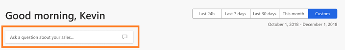
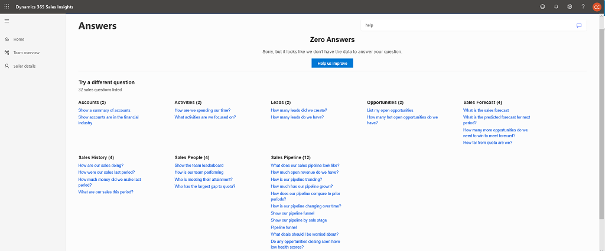
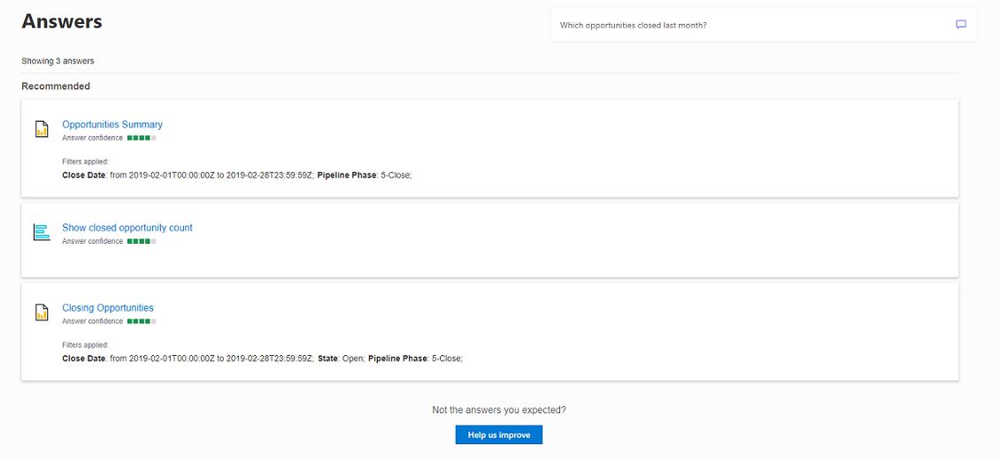
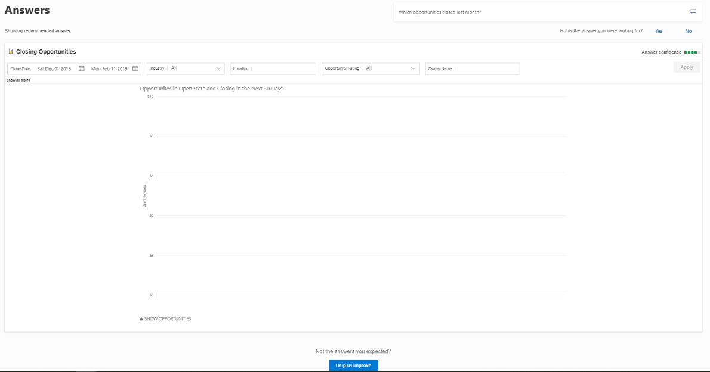
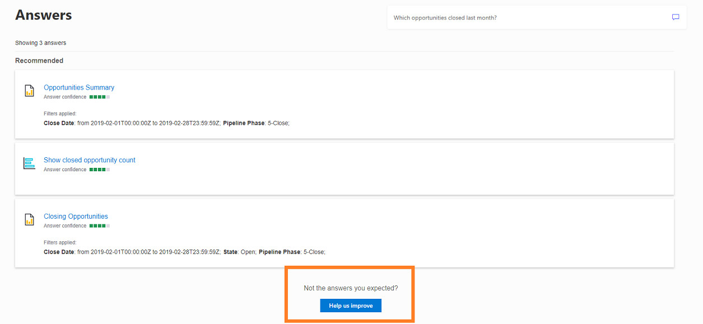
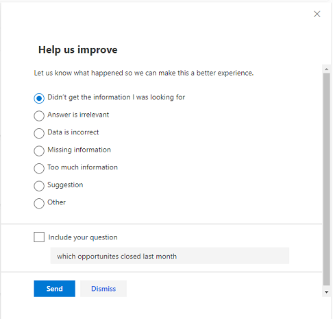

# Natural language Q&A 

[!INCLUDE [cc-beta-prerelease-disclaimer](../includes/cc-beta-prerelease-disclaimer.md)]

> [!IMPORTANT]
> [!INCLUDE[cc_preview_features_definition](../includes/cc-preview-features-definition.md)]

Sometimes, you want quick answers from your data without searching through reports in the sections. The **Dynamics 365 Sales Insights** application provides a **Natural language Q&A** feature so you can ask questions using natural language. This enables you to explore your data using intuitive, natural language capabilities and receive answers in the form of charts and graphs.

> [!NOTE]
> **Natural language Q&A** is a preview feature and contact your administrator to enable the preview feature in your organization. To learn more, see [Enable preview features](enable-preview-features-sales-insights-app.md).

For example, when you type "Which opportunities closed last month?" the application displays charts and graphs that contain details of the opportunities that closed last month. If a good report for answering your questions exists, this report will be opened and automatically filtered based on your question. If a report does not already exist, the **Sales Insights Q&A** capability will automatically generate a result to answer your question.

The **Natural language Q&A** capability of the Sales Insights application is an ever-evolving system, and it is being improved based on your feedback. We recommend you provide feedback for both satisfactory and unsatisfactory results as we tune the capability to work best for your questions.

To learn more on improving the search, see [Provide feedback to improve search results](#provide-feedback-to-improve-search-results).

To get started asking questions, you can use the search text box on the Sales Insights application home page:

## Ask a question

On the home page, type a conversational question in the search text box, and press **Enter**. For example, enter **Which opportunities closed last month?**, and the **Answers** screen opens with the potential results that are related to the question.

> [!IMPORTANT]
> If you don't know how to ask a question, type **Help** in the search text box, and press **Enter**. A list of possible questions that the application can answer is displayed. Select a question to view the answer.

> [!div class="mx-imgBorder"]
> 

> [!NOTE]
> You can also open the **Answers** screen by selecting the chat icon.

> [!div class="mx-imgBorder"]
> 

The three recommended answers displayed in the results set are the most relevant to the question. You can select and open the relevant results. Here we selected **Closing Opportunities**. 

> [!div class="mx-imgBorder"]
> 

You can refine the report by applying filters. Set the filters, and select **Apply**. You can also review the **Answer confidence**, which defines the accuracy of the results.

For more examples of asking questions, see [Reference](#reference).

## Provide feedback to improve search results

At times, the results that the application fetches might not be accurate or relevant to the question you asked. In such cases, you can improve the search results by providing feedback. This feedback helps the application to improve the search results and display more appropriate results in the future. You can always measure the accuracy of the result by viewing the **Answer confidence** in the results page. Follow these steps to provide feedback:

1. Sign in to the **Sales Insights** application.
2. In the **Q&A** text box, type a question, and press **Enter**.
3. If you do not find the appropriate suggestions in response to your question, select **Help us improve**. 
    
    > [!div class="mx-imgBorder"]
    > 
    
    **-OR-**

    If the displayed report is not an appropriate answer to your question, on the results page, select **No** for the question **Is this the answer you were looking for?** 

    > [!div class="mx-imgBorder"]
    > 

4. The **Help us improve** sidekick opens. Choose the appropriate response, and select **Send**.
    
    > [!div class="mx-imgBorder"]
    > 

    A confirmation message displays, and the questionnaire is sent to the application. This should result in more relevant answers the next time you search.

## Reference

Let’s look at the following three scenarios on how to use the Sales Insights Q&A in your organization.

- [Scenario 1: Sales manager preparing for meeting to coach seller](#scenario-1-sales-manager-preparing-for-meeting-to-coach-seller)
- [Scenario 2: Sales manager preparing for business review meeting with sales leadership](#scenario-2-sales-manager-preparing-for-business-review-meeting-with-sales-leadership)
- [Scenario 3: Track sales performance and monitor progress on goals of the sales team](#scenario-3-track-sales-performance-and-monitor-progress-on-goals-of-the-sales-team)
 
### Scenario 1: Sales manager preparing for meeting to coach seller

**Objective**: The goal of this scenario is to help you as a sales manager to improve the sales performance of a seller.

**Frequency**: When and where you can use this scenario:
- Daily, weekly, biweekly, monthly, and periodically
- During organization-wide performance review periods
- When a seller is underachieving

**Example motive**: You have a biweekly meeting with Bert Hair tomorrow, and you want reports and information on how he is performing.

**Questions**: You can ask the following types of questions to the **Sales Insights Q&A**.

|Type of question|Question|Description|
|----------------|--------|-----------|
|**Exploratory questions**|What is the scorecard for Bert Hair   What is the pipeline trend for Bert Hair?| View summarized data related to open leads, open opportunities, and gap-to-quota for Bert Hair and identify potential challenges with meeting his quota.     See Bert Hair's pipeline and opportunities with upcoming close dates that are most urgent to address.|
|**Focus in on specific leads and opportunities**|What are the oldest leads?   Show opportunities owned by Bert Hair closing this month    Which opportunities are at risk for Bert Hair?    What is the pipeline hygiene for Bert Hair?|See ranking of oldest leads. Coach Bert Hair on how to close the oldest leads.    Dive into open opportunities that are closing soon and sort open opportunities by largest estimated revenue. Help Bert Hair identify best opportunities to continue to pursue to meet his quota.    Review opportunities that are at risk by stage and by health score. Coach Bert Hair on how to close these opportunities.    Review opportunities with incorrect or missing information. Ask Bert Hair to update information so that you (the sales manager) can properly review all opportunities when preparing for the next coaching meeting.|
|**Compare performance to peers**| Show me the team scorecard    Compare Bert Hair and Amos Olive    How well are sales people doing at winning big opportunities? | See how the seller is performing compared to his peers on different metrics (won revenue, won opportunity count, attainment). Identify if the seller's performance is below or above the average sales people.   Compare Bert Hair's performance with a seller who owns a similar account.   See a correlation between opportunity size and win ratio by sales people.|

**Business outcome**: With the help of this information, you can:
- Provide constructive feedback or support to the seller.
- Coach the seller on sales techniques.
- Devise an action plan to win deals.

### Scenario 2: Sales manager preparing for business review meeting with sales leadership

**Objective**: The goal of this scenario is to help you as a sales manager analyze and present the performance of the sales team to sales leadership.

**Frequency**: When and where you can use this scenario:
- Monthly, periodically, quarterly, half yearly, and annually
- During organization-wide performance review periods
- For strategic business planning meetings

**Example motive**: You and other sales managers need to provide a business update on the performance sales teams—including yours—next week at a sales leadership meeting in New York.

**Questions**: You can ask the following types of questions to the **Sales Insights Q&A*.

|Type of question|Question|Description|
|----------------|--------|-----------|
|**Review sales history**|What are the sales results for this period?|View summary of wins and losses for the period.|
|**Review sales pipeline and sales targets**|Show me my quota    Show me our sales pipeline    Show our pipeline by sale stage|Review overall target, attainment, and gap-to-quota in Sales Forecast Summary report.    Review open opportunities in the pipeline.    See pipeline by opportunity phase and dive into details of different opportunities that can potentially cover gap.|
|**Trend analysis**|How does my won opportunity trend this period compare to the prior period?    How does this period trend compare to last year?|Compare opportunities trend this period to last period to see how sales are trending for the year.    Compare opportunities trend this period to same period last year to see how similar business lifecycle phases compare year over year.|

**Business outcome**: With the help of this information, you can:
- Provide updates to sales leadership regarding wins, losses, and open sales including sales trends.
- Work with sales leadership to identify deals to target those that align with the company strategy.

### Scenario 3: Track sales performance and monitor progress on goals of the sales team

**Objective**: You want to analyze the sales pipeline and identify gaps in sales targets to see if you can meet sales goals (biweekly, monthly, or quarterly).

**Frequency**: When and where you can use this scenario:
- Daily, weekly, biweekly, monthly, periodically, and quarterly
- For strategic business planning meetings

**Example motive**: You want to see how well your sales team is performing and if you are going to meet sales targets for the period.

**Questions**: You can ask the following types of questions to the **Sales Insights Q&A**.

|Type of question|Question|Description|
|----------------|--------|-----------|
|**Exploratory questions**|Show me my quota    Show me my gap-to-quota|Review overall target, attainment, and gap-to-quota in the Sales Forecast Summary report.|
|**Review opportunities to close gap**|Show me my pipeline    Show me a list of past-due opportunities    Open opportunities in propose phase    Which opportunities are at risk?    Are we going to meet quota?|See pipeline of opportunities that can potentially cover gaps in the Sales Pipeline Summary or Pipeline Trend report.    Review past-due opportunities that need to be addressed immediately.    Review opportunities that are in the propose phase and most likely to be closed soon in the Opportunities Summary report.    Review opportunities that are at risk by stage and by health score in the Pipeline Health and Risk report.   Review what-if scenarios to forecast if the target will be met.|
|**Review recent wins and losses**|What are the sales results for this period?    How does my won opportunity trend this period compare to the prior period?    How does my lost opportunity trend this period compare to the prior period?|View summary of wins and loss for the period.      Compare opportunity trend this period to last period.|

**Business outcome**: With the help of this information, you can plan your strategy to win deals that meet business and target goals.

### See also

[Enable preview features](enable-preview-features-sales-insights-app.md)

[View and understand home page](dynamics365-sales-insights-app-home-page.md)