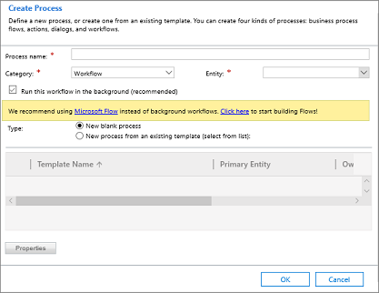
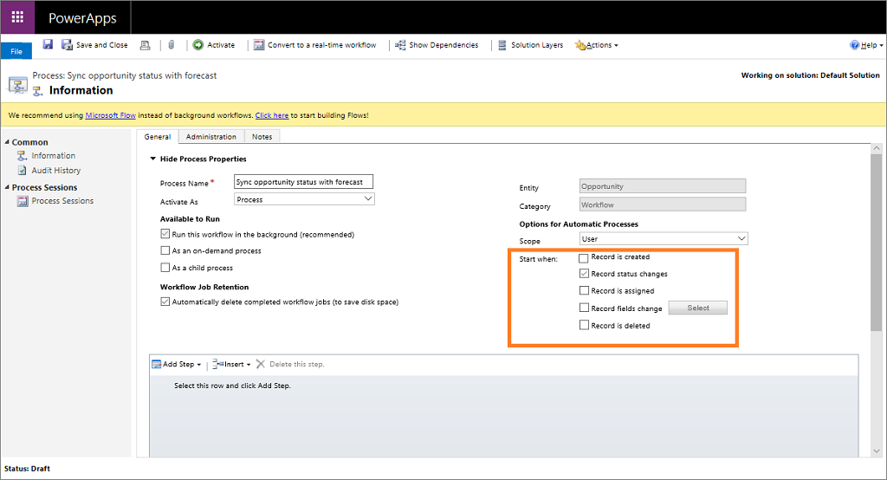
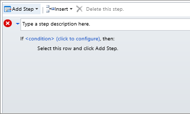
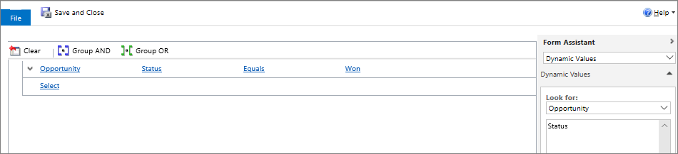
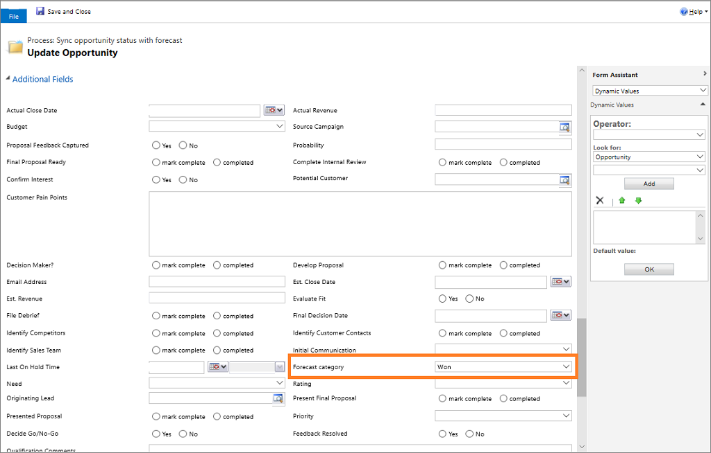
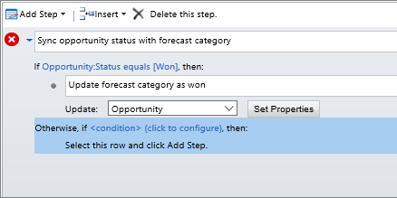

# Capture forecast category for opportunity

[!INCLUDE [cc-beta-prerelease-disclaimer](../includes/cc-beta-prerelease-disclaimer.md)]

> [!IMPORTANT]
> - [!INCLUDE[cc_preview_features_definition](../includes/cc-preview-features-definition.md)]  
> - [!INCLUDE[cc_preview_features_expect_changes](../includes/cc-preview-features-expect-changes.md)]
> - [!INCLUDE[cc-preview-features-no-ms-support](../includes/cc-preview-features-no-ms-support.md)]

The forecast category is used to determine the confidence level of an opportunity as it moves along the path to conversion. Forecasting shows how many opportunities are in the pipeline and which of those are committed, delivering actionable insights. 

1.	In the site map, select **Opportunities**.

2.	In the list of opportunities, open an opportunity for which you want to capture the forecast category.

3.	In the **Forecast Category** drop-down list, select one of the following, and then select **Save**:

    -  **Pipeline**. The confidence of winning this opportunity is low. Any opportunity that a sales rep has just started to work on can be set to this category (this is the default value).

    -  **Best case**. The sales rep has started talking to customers or has shared quotes, and there is a moderate chance of winning the opportunity.

    -  **Committed**. The customer has committed to closing the deal.

    -  **Omitted**. To exclude an opportunity’s numbers from the forecast. 
    
    - **Won**. If an opportunity is closed as won.
    
    - **Lost**. If an opportunity fails and is closed as lost.

       > [!div class="mx-imgBorder"]
       > 

## Sync opportunity status with forecast category

To ensure that the forecast is projecting proper values, we recommend that you create a workflow to sync the opportunity status with the forecast category. Currently, when an opportunity’s state is changed to Won or Lost, the forecast category remains unchanged.

To create a workflow, follow these steps:
 
1. Sign in to Dynamics 365 Sales and go to the **Sales Hub** app.

2. On the Sales Hub page, go to **Select Settings** > **Advanced Settings**.

    A new tab opens with the **Business Management** settings page.

3. On the site map, select **Settings** > **Process Center** > **Processes**.
 
    The processes page opens.

4. Select **+ New**.

    The **Create Process** dialog box opens.

    > [!div class="mx-imgBorder"]
    > 

5. Enter basic information for the workflow process and select **OK**:

    - **Process Name**: Name the process workflow.

    - **Entity**: Select **Opportunity**. 

    - **Category**: Select **Workflow**.

    The process configuration page opens.

    > [!div class="mx-imgBorder"]
    > 

6. Select **Start when** as **Record status changes** to automatically start the workflow when the status of an opportunity changes.

    > [!div class="mx-imgBorder"]
    > 

7. Select **Add Step** > **Check Condition** to add conditions on how the value should change when the condition is true.

    > [!div class="mx-imgBorder"]
    > 

8. Define the condition as follows for the step:

    - **Description:** Enter a description for the step. For example, **Sync opportunity status with forecast category**.

    - **If condition:** Define the If condition as **Opportunity** **Status** is **Equal** to **Won**. After you save the **If** condition, define what should happen when the condition is true through the **Then** condition. 

        > [!div class="mx-imgBorder"]
        > 
    
    - **Then condition:** Select **Add Step** > **Update Record**. Enter the description and then select **Set Properties**. Go to the **Additional Fields** section and select **Forecast category** as **Won**.

        > [!div class="mx-imgBorder"]
        > 

9. Select the previous **If** condition step (here it is **Won**) and select **Conditional Branch**. Repeat steps 7 and 8 for **Lost**.

    > [!div class="mx-imgBorder"]
    > 

10. Following steps 7 to 9, create a new step when the opportunity is reverted back to **Open** that changes the forecast category to **Pipeline**.

    > [!div class="mx-imgBorder"]
    > 

11. Save and close the workflow process.

    The workflow process to automatically sync opportunity status with forecast category is created.

To learn more about creating a workflow, see [Use Workflow processes to automate processes that don't require user interaction](/dynamics365/customer-engagement/customize/workflow-processes). 

## See also

[Create or edit an opportunity](create-edit-opportunity-sales.md)  

[Project accurate revenue with sales forecasting](project-accurate-revenue-sales-forecasting.md)  

[View forecasts](view-forecasts.md)
