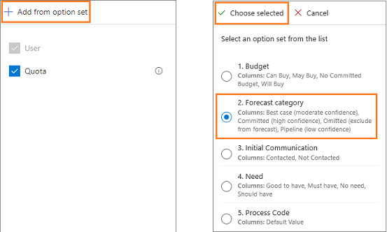
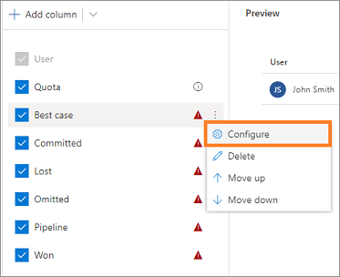

# Choose layout and columns

In the **Layout** step of the forecast configuration, you can configure columns to define the forecast grid that appears for users. You can configure roll-up columns from option sets that are defined for opportunities in your organization.

Perform the following steps to add columns and configure the forecast grid:

1.	[Add columns from an option set](#add-columns-from-an-option-set).

2.	[Configure columns](#configure-columns).

3.	[(Optional) Apply additional filters](#apply-additional-filters).

## Add columns from an option set

Every forecast needs an option set to define roll-up columns. 

> [!IMPORTANT]
> The **Prediction** column is available only when predictive forecasting is enabled for your organization. To learn more, see [About premium forecasting](https://docs.microsoft.com/dynamics365/ai/sales/configure-premium-forecasting).

To define the layout, select an option set and then add the roll-up columns accordingly, as described in the following steps.

1.	In the **Layout and column** section, select **Add from option set**. A list of option sets appears.

2.	Choose an option set, and then select **Choose selected**. The list shows only the option sets defined on the opportunity entity. Each option set value you select is added as a column for you to configure.

    > [!TIP]
    > We recommend you use the out-of-the-box **Forecast category** option set for column configuration. After choosing this option, select **Auto-configure** in the dialog box that asks if you want to auto-populate the configuration parameters. This saves time by automatically populating columns according to best practices.

    > [!div class="mx-imgBorder"]
    > 

    > [!NOTE]
    > By default, a **Quota** column of type **Simple** is added to the forecast. To begin tracking against targets, you must manually upload an Excel workbook that contains quota values to the forecast. To learn more, see [Activate and upload simple columns data](activate-upload-simple-columns-data-forecast.md).

    After the roll-up columns are added to the forecast, you can use **More options** to rearrange or remove the columns that you don't need.

    > [!div class="mx-imgBorder"]
    > 
    
## Configure columns

You can configure each column individually&mdash;such as changing the column type, allowing adjustments, and showing a column in the trend chart&mdash;according to your organizational requirements.

1.	Hover over a column name, select the **More options** icon, and then select **Configure**. For example, you can hover over **Best case**, and then select **Configure**.

    > [!div class="mx-imgBorder"]
    > 

    On the column configuration page, the **Name** specifies the name of the column.

3.	Select the **Type** of column. The options that appear depend on the type of column you select. For example, when you select a column of type **Calculated**, a text box appears for you to enter a formula to use for calculating the value of the column. 

    The following column types are supported:

    •	[Rollup type](#rollup-type)
    
    •	[Calculated type](#calculated-type)
    
    •	[Simple type](#simple-type)

    •	[Hierarchy related type](#hierarchy-related-type)

    When configuring columns, you'll see a preview of the configuration in the **Preview** section.

4.	Save and close the configuration.

5.	Repeat steps 1 through 4 for each column that you want to edit.

### Rollup type

The **Rollup** column type aggregates the values of all fields based on the selected **Selector** and **Amount field** values, by using the **Date field** value as the filter criteria. 

Select the column **Type** as **Rollup**. The following options are available to configure.

| Parameter | Description |
|-----------|-------------|
| Selector | Select the option set value that defines how this column is grouped. For example, if **Best Case** is selected, only opportunities with the forecast category set to **Best Case** will be aggregated. |
| Data type | Select the data type of the column that you want to display on the forecast grid. By default, the value is selected as **Currency** and can't be changed for **Rollup** type columns. |
| Amount field | Select the amount field on which the aggregation is calculated. The available fields are based on the selected **Rollup entity**, such as **Opportunity**. For example, if the **Forecast category** option set is selected, the amount field is automatically configured as **Est. Revenue**.   If you're using a custom field to track the estimated revenue for your organization, select that custom field. |
| Date field | Select the date field that defines the record's forecast period. The available fields are based on the selected **Rollup entity**, such as **Opportunity**. For example, if the **Forecast category** option set is selected, the date field is configured as **Est. Close Date**.  If you're using a custom field to track the estimated close date for your organization, select that custom field.|
| Description | Enter a description for the column. This description appears as a tooltip on the column header of the forecast grid, to help your users understand what the column contains. |
| Allow adjustments | Enable this setting to let users manually edit a system-calculated value directly in the forecast grid. When this setting is enabled, you'll see a pencil icon next to the forecasted value in that column. To learn more, see [Adjust values in a forecast](adjust-values-in-forecast.md). |
| Show progress compared to quota | Enable this option to compare the column's value against the quota column. When this is enabled, a progress bar indicating the attainment percentage is shown below the column's value.|
| Show in Trend Chart | Enable this option to show the value in the **Trend Chart**. This option is available only when predictive forecasting is enabled for your organization. To learn more about trend charts, see [Understand forecast projection through trend charts](https://docs.microsoft.com/dynamics365/ai/sales/understand-forecast-projection-through-trend-chart.md). |
| Unique name | The unique name is used to identify the column to use when you're writing a formula for a **Calculated** column. |

### Calculated type

When you select column **Type** as **Calculated**, the values for the column are calculated and displayed based on a formula that you define. The following options are available to configure.

| Parameter | Description |
|-----------|-------------|
| Data type	| Select a data type for the column that you want to display on the forecast grid, based on the formula. You can select the value **Currency** or **Decimal**, depending on your requirements. |
| Calculation | Enter a formula to calculate values for the column. When you start typing a formula, suggestions are displayed for your convenience. The names shown are the column's unique name and value. For example, if you want to see the best case forecast in this column, enter the formula as **Closed + Commit + Best Case**.   If you enter an invalid formula, an appropriate error message appears below the **Calculation** field. |
| Description | Enter a description for the column. This description appears as a tooltip on the column header of the forecast grid, to help your users understand what the column contains. |
| Show progress compared to quota | Enable this option to compare the column's value against the quota column. When enabled, a progress bar indicating the attainment percentage is shown below the forecast value in that column.|
| Show in Trend Chart | Enable this option to show the value in the **Trend Chart**. This option is available only when predictive forecasting is enabled for your organization. To learn more about trend charts, see [Understand forecast projection through trend chart](https://docs.microsoft.com/dynamics365/ai/sales/understand-forecast-projection-through-trend-chart). |
| Unique name | The unique name is used to identify the column when you're writing a formula for a **Calculated** column. |	

### Simple type

Use the **Simple** column type to manually upload external data to a forecast. An Excel workbook is available for you to download after you activate the forecast. You must edit the Excel workbook with the necessary values and then upload it to the forecast. To learn more, see [Activate and upload simple columns data](activate-upload-simple-columns-data-forecast.md).

For example, **Quota** is a simple column type where you can manually upload data by using an Excel workbook. The following options are available to configure.

| Parameter | Description |
|-----------|-------------|
| Data type	| Select a data type for the column that you want to display on the forecast grid. You can select **Single Line of Text**, **Currency**, or **Decimal**, depending on the type of value that you'll be uploading through an Excel workbook. |
| Description | Enter a description for the column. This description appears as a tooltip on the column header of the forecast grid, to help your users understand what the column contains. |
| Unique name | The unique name is used to identify the column to use when you're writing a formula for a **Calculated** column. |

### Hierarchy related type

When you select column **Type** as **Hierarchy related**, the column helps you pull additional attributes from the hierarchy entity. The following options are available to configure.

| Parameter | Description |
|-----------|-------------|
| Data type	| Data type of the column that you want to display on the forecast grid. By default, the value is selected as **Decimal** and can't be changed. |
| Attribute field | Select an attribute to display in the column. For example, you can select **Email**, which will be unique to each user in your organization and can help you identify to whom the record belongs. |
| Description | Enter a description for the column. This description appears as a tooltip on the column header of the forecast grid, to help your users understand what the column contains. |
| Unique name | The unique name is used to identify the column to use when you're writing a formula for a **Calculated** column. |

## Apply additional filters

Using additional filters, you can filter the opportunities that participate in calculating the forecast values. To filter the opportunities, you create filters based on conditions by using the attributes that belong to the Opportunity entity, including related entity attributes.

For example, you know that opportunities related to **Adatum Corporation** and revenue more than or equal to **$10,000** can't be closed for the current quarter. To filter such opportunities in the forecast, follow these steps to create a query for this condition.

1.	In the **Additional filters** section, select **+ Add filters**.
 
2.	Select **+ Add** > **Add row**. 

    > [!div class="mx-imgBorder"]
    > 
 
3.	In the selection boxes, select the attribute as **Potential Customer**, the condition as **Does Not Equals**, and the company to be considered as **Adatum Corporation**.
 
    > [!div class="mx-imgBorder"]
    > 

    With this condition, the opportunities related to **Adatum Corporation** will be removed from the forecast. In the next step, you'll add a condition to filter revenue that's more than or equal to **$10,000**.

4.	Select **+ Add** > **Add row**.

5.	In the selection boxes, select the attribute as **Est. Revenue**, the condition as **Is greater than**, and revenue to be considered as **10000**.

    > [!div class="mx-imgBorder"]
    > 
 
    Now the conditions are created for the query. When the forecast is activated, the query will be executed to filter the forecast for the added conditions.

<table>
<tr><td>

> [!div class="nextstepaction"] 
> [Previous step: Provide viewing permissions](provide-permissions-forecast.md)
</td><td>

> [!div class="nextstepaction"] 
> [Next step: Activate and upload simple columns data](activate-upload-simple-columns-data-forecast.md)
</td></tr>
</table>

### See also

[Configure forecasts in your organization](configure-forecast.md) 
[View a forecast](view-forecasts.md) 
[About premium forecasting](https://docs.microsoft.com/dynamics365/ai/sales/configure-premium-forecasting)
