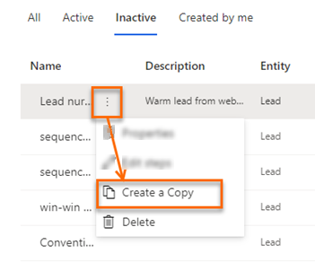
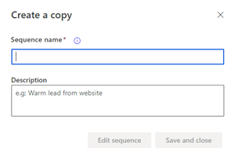

# Clone a sequence

You can clone a sequence to make it easier to add or remove steps, and save the changes to create new sequence. Cloning a sequence pulls down a full copy of the sequence data that you are cloning at that point in time, including all steps and configurations. After you make the changes you can save and activate the cloned sequence and apply it records.   
**To clone a sequence**   
1. Sign in to your sales app.   
2. Go to **Change area** in the lower-left corner of the page and select **Sales Insights settings**.   
3. Under **Sales accelerator**, select **Sequence**.   
4. Hover over a sequence and select **More options** > **Create a copy**.   
    > [!div class="mx-imgBorder"]
    >   
6. On the **Create a copy** dialog, enter the name of the sequence and description.    
    > [!div class="mx-imgBorder"]
    >    
7. Select one of the button:   
    - **Edit sequence**: Select this button to open the sequence editor and add steps as necessary. To add steps, see steps 7 and 8 from [Create and activate a sequence](create-and-activate-a-sequence.md).
    - **Save and close**: Select this button to save and create the sequence. 

### See also

[Create and manage sequences](create-manage-sequences.md)