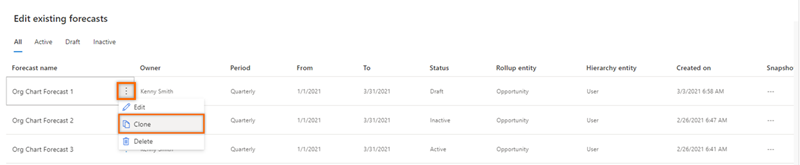
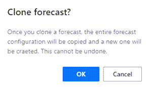

# Clone a forecast

When you clone a forecast, you duplicate any configurations you made previously. You can work on this cloned forecast as a draft for a new forecast that better meets your needs. You retain the configurations you want, make edits to others, and create a new forecast that matches your requirements. After you make the changes, you can save and activate the cloned forecast.<!--note from editor: Edits suggested. I wasn't sure what "in a draft state" was modifying. Also, edited to avoid "allow" (via Writing Style Guide).-->

**To clone a forecast**

1. Sign in to the Sales Hub app.

2. In the site map, select **Change area** , and then select **App Settings**.

3. Under **Performance management**, select **Forecast configuration**.    
    The forecast configuration page opens.

4. On the forecast that you want to clone, select **More options** , and then select **Clone**.   
    > [!div class="mx-imgBorder"]    
    >    

5. In the message that appears, select **OK**.<!--note from editor: Can you ask the UI designer to fix the misspelling in the message ("craeted" -> "created")? And actually, to meet our style guidelines, I can suggest a few other tweaks (the following edit assumes that "a new one" refers to a new forecast): "After you clone a forecast, the entire forecast configuration will be copied and a new forecast will be created. This can't be undone."-->
    > [!div class="mx-imgBorder"]    
    >     
    The clone of the selected forecast is opened in edit mode.

6. Edit the forecast to meet your needs, and then activate it.<!--note from editor: Would it be helpful to describe the activation step here, or will it be obvious to the reader?-->

### See also

[Configure forecasts in your organization](configure-forecast.md)   

[!INCLUDE[footer-include](../includes/footer-banner.md)]