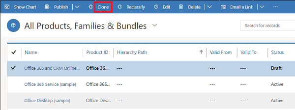

# Clone products (Sales Hub)

When you're creating a new product, family or bundle, save time by cloning an existing one. Cloning creates a copy of the original record with all the details except for the name and ID. If the product, bundle, or family has any properties, they're also copied to the cloned record.  
  
1. [!INCLUDE[proc_permissions_admin_cust_mgr_vp_sales_ceo](../includes/proc-permissions-admin-cust-mgr-vp-sales-ceo.md)]  
  
2. In the site map, select **Products**.   
  
3. Select a product family, product, or bundle record that you want to clone, and on the command bar, select **Clone**. 

    > [!div class="mx-imgBorder"]
    > 

    A confirmation dialog box appears.
    
    

4. Select **Confirm**.
    
    A new product record will open with the same details as the original one except for the name and ID.  
  
    The new record is created under the same parent node as the original one.  

### See Also  
 [Create a product](create-product-sales.md)   
 

[!INCLUDE[footer-include](../includes/footer-banner.md)]