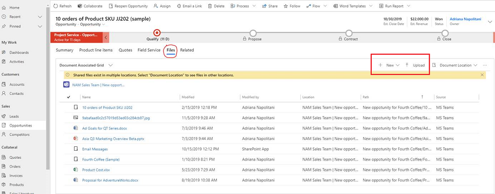
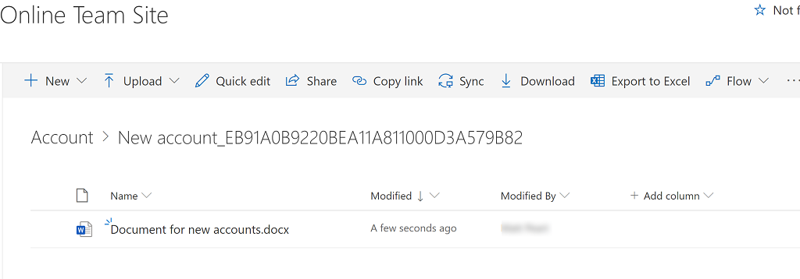

# Collaborate using SharePoint 

[!INCLUDE[cc-data-platform-banner](../includes/cc-data-platform-banner.md)]

Manage common document types, such as Word, Excel, and PowerPoint and create folders to save and manage those documents that are seamlessly stored in SharePoint from within a model-driven app. 

> [!NOTE]
> This feature requires that your system administrator has enabled SharePoint document management. More information: [Manage your documents using SharePoint](/power-platform/admin/manage-documents-using-sharepoint)

For lead and opportunity records, a default document location folder is automatically created on SharePoint the first time you go to the **Files** tab. For other standard or custom entity records, go to the **Related** > **Documents** tab. The name of the document location is in this format: <record_name>_<record_id>.

By default, the location is set to Documents on Default Site 1.

## Document Location Clarifications

### Lead Entity

When a lead is qualified and converted into an opportunity, the document location is available as follows:

-	If a document location is already created for the lead, the same document location is will be used for the qualified opportunity.

-	If there is no document location available for the original Lead, a new document location is will be created for the opportunity (if integration is configured as Based on Contact then the folder is will be created under Contact folder).

### Opportunity - Quote documents sharing

When you create a quote through sub-grid in an opportunity record, the documents that are associated with the opportunity are automatically made available in the documents tab of the created quote, if there is at least one SharePoint document location already created for the opportunity record.

If you don’t want to share the quote and opportunity documents, use **Quotes** grid to create quote and then add an opportunity as reference, the documents of the opportunity will not be shared with the quote.
 
Additionally, by default, the **Files** and **Documents** tab are added to the **Opportunity** form and a SharePoint document location is added to the opportunity record. The **Files** tab can be removed using system customizations.

## Add a document

1.	Open a lead or opportunity record and select the **Files** tab. For other standard or custom entities that are enabled for document management, select the **Related** tab, and then select **Documents**.

2.	Choose from the following options. 

    - To create a new document, select **New**, select the document type you want, such as Word, Excel, or OneNote, and then enter a name. Select **Save**. The blank document opens in a new tab. 

    - To add an existing document, select **Upload**, select **Choose File**, browse to and select the file you want, and then select **Open**. Select **OK**. 

    The document file appears in the **Document Associated Grid** view. 

    > [!div class="mx-imgBorder"] 
    > 

    The document also appears on the SharePoint site folder location. 

    > [!div class="mx-imgBorder"] 
    > 

## Manage SharePoint locations

You can create new or edit existing SharePoint locations from a model-driven app.

1. In the **Files** list on the command bar, select **Open Location**, and then select the location.

2. To edit the location, on the command bar, select **Edit Location** <location name>.

    The **Edit Location** dialog box appears.

3. The display name, parent site, and folder name are automatically populated. Enter details about the new location, and then select **Save**.

4. To add a location, on the command bar, select **Add Location**.

5. The **Add Location** dialog box appears.

    > [!div class="mx-imgBorder"] 
    > 

6. The display name, parent site, and folder name are automatically populated. Change the details if required, and then select **Save**.

## Actions on documents

When you select one or more documents in the Documents list, you can take the following other common SharePoint actions on the documents:

- Edit

- Delete

- Check in

- Check out

- Discard check out

- Edit properties

## Files tab FAQ

*Why was the location to access documents moved?* 
- We moved the command to make documents easier to find with fewer clicks.

*Has the Documents tab gone away?*
- No, it hasn’t gone away. Users can still access the documents associated with the record in question the old way, simply by clicking the Related menu and then the Documents link.

*With the change, will subfolders in SharePoint still be created automatically?*
- Yes. The behavior is similar to that of the **Documents** link under the **Related** menu. When a user selects the **Files** tab for the first time, the corresponding SharePoint sub-folder is created by the system. 

*Is there a way to add the Files tab to other entities or remove it?*
- Yes. To add or remove the File tab, follow the steps in this article. [Add the SharePoint documents tab to the main form for an entity](/powerapps/maker/model-driven-apps/add-documents-tab-entity-main-form)  

*Where can I send my feedback about this change?*
- You can send your feedback to the Dynamics 365 Sales Office and Teams Integration team at this email address: d365_ot_crew@microsoft.com

### See also

[SharePoint, OneNote, and OneDrive integration with Common Data Service](/powerapps/maker/common-data-service/sharepoint-onedrive-onenote-intro)

[!INCLUDE[footer-include](../includes/footer-banner.md)]