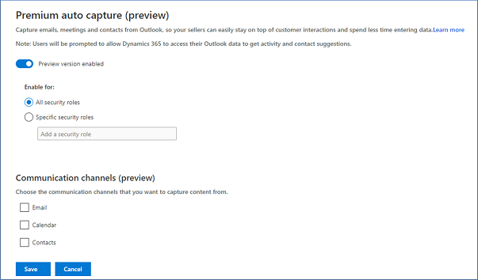

# Enable and configure auto capture

When you enable auto capture, you help salespeople in your organization by suggesting relevant customer activities in Microsoft Dynamics 365 Sales by capturing emails and meetings from Outlook.

Auto capture is available in two forms:

-	**Auto capture** (also called _basic auto capture_): This feature is available for free with Dynamics 365 Sales Insights for Dynamics 365 Sales. To learn more, see [How to enable auto capture](#how-to-enable-basic-auto-capture).

-	**Premium auto capture**: Premium auto capture is available as a preview with Dynamics 365 Sales Insights for Dynamics 365 Sales. To learn more, see [How to enable and configure premium auto capture](#how-to-enable-and-configure-premium-auto-capture).

> [!IMPORTANT]
> By enabling this feature, you consent to share data about your customers' email activity with an external system. Data imported from external systems into Sales Insights are subject to the [Microsoft Privacy Statement](https://go.microsoft.com/fwlink/?linkid=2116778).

## Things you must know

Before you configure auto capture for Dynamics 365 Sales in your organization, note the following:

-	You can enable both basic and premium auto capture for your organization.

-	To enable both versions of auto capture, you select a group of security roles to use premium auto capture. By default, security roles that are not assigned to use premium auto capture uses basic auto capture.

-	When premium auto capture is enabled for your entire organization, basic auto capture is disabled.

## How to enable basic auto capture

Enable basic auto capture by following these steps:

1.	[Review prerequisites for auto capture](#prerequisites-for-basic-auto-capture).

2.	[Enable auto capture](#enable-basic-auto-capture).

### Prerequisites for basic auto capture

Before you enable auto capture, perform the following tasks: 

-	Enable Sales Insights. To learn more, see [Enable and configure standard Sales Insights features](intro-admin-guide-sales-insights.md#enable-and-configure-standard-sales-insights-features).

-	Use Exchange as the server and Outlook as the mail client.

-	Approve the email addresses of users to allow queries against their Exchange data (this requires tenant-level admin privileges). To learn more, see [Approve email](/dynamics365/customer-engagement/admin/connect-exchange-online#approve-email).

-	Set up server-side synchronization. To learn more, see [Set up server-side synchronization of email, appointments, contacts, and tasks](/dynamics365/customer-engagement/admin/set-up-server-side-synchronization-of-email-appointments-contacts-and-tasks).

### Enable basic auto capture

1.	Sign in to the Dynamics 365 Sales Hub app, and go to **Change area** > **Sales Insights settings**.

2.	On the site map under **Productivity intelligence**, select **Auto capture**. 

3.	Turn on the **Enable basic auto capture** toggle.

   > [!div class="mx-imgBorder"]
   > 

## How to enable and configure premium auto capture

[!INCLUDE [cc-beta-prerelease-disclaimer](../includes/cc-beta-prerelease-disclaimer.md)]

> [!IMPORTANT]
> - [!INCLUDE[cc_preview_features_definition](../includes/cc-preview-features-definition.md)]  
> - [!INCLUDE[cc_preview_features_expect_changes](../includes/cc-preview-features-expect-changes.md)]
> - Microsoft doesn't provide support for this preview feature. Microsoft Technical Support won’t be able to help you with issues or questions. Preview features aren't meant for production use and are subject to a separate [supplemental terms of use](https://go.microsoft.com/fwlink/p/?linkid=870960).

In addition to getting suggestions for customer-related activities through capturing emails and meetings, premium auto capture gets suggestions by capturing contacts through a salesperson's communications.

To enable and configure premium auto capture, follow these steps:

1.	[Review prerequisites for premium auto capture ](#prerequisites-for-premium-auto-capture).

2.	[Enable and configure premium auto capture](#enable-and-configure-premium-auto-capture).

### Prerequisites for premium auto capture

Before you enable premium auto capture, perform the following tasks:

-	Enable Sales Insights. To learn more, see [Enable and configure standard Sales Insights features](intro-admin-guide-sales-insights.md#enable-and-configure-standard-sales-insights-features).

-	Use Exchange as the server and Outlook as the mail client.

-	(Optional) Approve the email addresses of users to allow queries against Exchange (this requires tenant-level admin privileges) and set up server-side synchronization. If you don't configure these options, users will be required to provide consent to access their Outlook data. To learn more, see [Approve email](/dynamics365/customer-engagement/admin/connect-exchange-online#approve-email) and [Set up server-side synchronization of email, appointments, contacts, and tasks](/dynamics365/customer-engagement/admin/set-up-server-side-synchronization-of-email-appointments-contacts-and-tasks).

### Enable and configure premium auto capture

1.	Sign in to the Dynamics 365 Sales Hub app, and go to **Change area** > **Sales Insights settings**.

2.	On the site map under **Productivity intelligence**, select **Auto capture**.

3.	On the settings page, in the **Premium auto capture (preview)** section, turn on the **Enable preview version** toggle.

    > [!div class="mx-imgBorder"]
    > 
    
4.	Select one of the following options: 

    -	**All security roles**: Select this option to enable the feature for the entire organization.

    -	**Specific security roles**: Select this option to enable this feature for specific security roles, and then choose the security roles. In the example in the following image, we're adding the security roles **Sales Manager**, **Salesperson**, and **Marketing Manager**.

        > [!div class="mx-imgBorder"]
        > 

        >[!NOTE]
        >The security roles displayed in the lookup are from the parent business unit and will not display child business unit's security roles. To learn more, see [Security roles and privileges](/power-platform/admin/security-roles-privileges).   

5.	Select the communication channels in which you want to capture customer-related activities. You can choose **Email**, **Calendar**, and **Contacts**.

6.	Save the settings.

Premium auto capture is now enabled for your organization. 

> [!NOTE]
> For more information about auto capture and how it can help your users, see [Capture customer-related activities with auto capture](auto-capture.md).

### See also

[Introduction to administering Sales Insights](intro-admin-guide-sales-insights.md)
