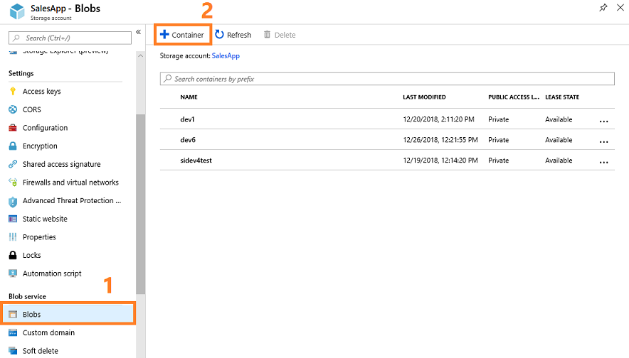
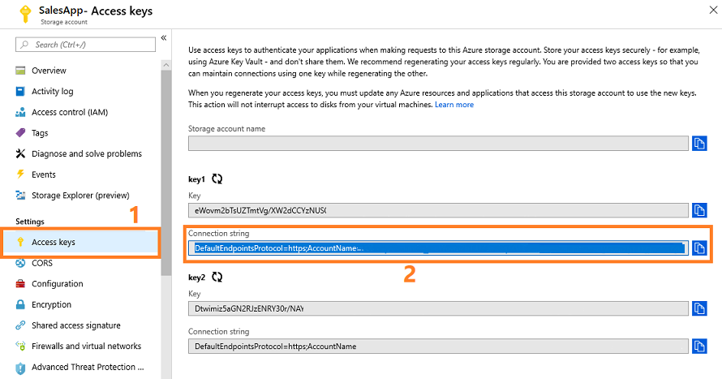
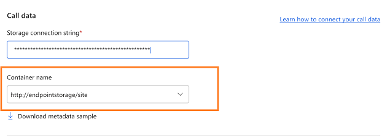

# Configure conversation intelligence to connect call data

Conversation intelligence in [!INCLUDE[pn_dynamics_sales_insights](../includes/pn-dynamics-sales-insights.md)] assists the sales managers in your organization to get an overview of the call center and drill down to get call statistics for individual sellers. This helps the sales managers change the shape of the business by giving smarter coaching and enhancing sales to generate revenue.

You must have administrative privileges to configure **Call intelligence** for your organization. To configure **Call intelligence**, perform the following steps:   
1. [Review the prerequisites](prereq-sales-insights-app.md)  
2. [Create a call recording repository](#create-call-recording-repository).  
3. [Upload call recordings or transcripts](#upload-call-recordings).

> [!NOTE] 
> If you want to update the storage container and connection string, see [Update configuration of call data](#update-configuration-of-call-data). 

## Create call recording repository

Create a call recording repository (blob container) in an Azure storage account to help you upload the call recordings in the repository for **Call intelligence** to assess.   
> [!NOTE] 
> While creating the repository, ensure that the repository is created in the same region as your tenant to upload the call recordings. For example, if your tenant is in NAM (North America), ensure that you create the repository in the NAM region only.      
1. Sign in to the Azure dashboard.   
2. On the navigation pane, select **All resources**, and open the desired storage account.   
    > [!div class="mx-imgBorder"]
    >     
3. From **Blob service**, select **Blobs** then **+ Container**.   
    > [!div class="mx-imgBorder"]
    >    
4. Specify the container information, such as name and public access level.   
5. Select **OK**.   
   The container is created. To learn more, see [Create a container](/azure/storage/blobs/storage-quickstart-blobs-portal#create-a-container)   
6. From **Settings**, go to **Access keys** and note the **Connection string** of the storage account. This connection string is used to connect **Call intelligence** to your Azure storage account.   
    > [!div class="mx-imgBorder"]
    >     
Now you are ready to upload call recordings to the blob container and configure the call data for conversation intelligence. 

<a name="upload-call-recordings"></a>
## Upload call recordings or transcripts   
Upload the call recording or transcript to the created call recording repository (blob container) in Azure to process and get data. Upload the following files to process the call or transcript:    
- Call recording or transcript file.   
    - The format of audio file can be MP3, WAV, or OGG.
    - To know about transcript file, see [Transcript file](#transcript-file).   
- Corresponding metadata file in JSON format.   

> [!NOTE]
> - You must have at least 10 call recording files in the call recording repository to process and display the data in **Call intelligence**. 
> - The **conversation-intelligence-managed** container is created and managed automatically by the application.

**Review the following requirements for files before you upload**   
- The file name cannot contain reserved characters, such as, **!*'();:@&=+$,/?%#[]"**.
- The length of the file name should be fewer than 260 characters.
- The call recording should be a stereo type recording only.
- The names of the uploaded files must be unique for your organization and must not be repeated.
- The file names for the audio or transcript file, and its corresponding JSON files must be the same. For example, if you name the audio file **call-recording-10-dec-2018.wav**, the corresponding JSON file should be named **call-recording-10-dec-2018.json**. Similarly, name of the transcript file is **call-recording-10-dec-2018.transcript.json**, the corresponding JSON file is named **call-recording-10-dec-2018.json**.  
- The JSON file parameters must be properly configured. The JSON file contains the following parameters:

    | Parameter | Objects | Description|
    |-----------|---------|------------|
    | `fileName` |--| Specifies the name of the conversation file. |
    | `conversationType`|--| Specifies the type of conversation. The following types of conversation are supported: audio and transcript. |
    | `startTime` |--|Specifies the start time of the conversation and calculated based on the ISO 8601 format. For example, 2020-11-17T13:33:59.909Z. | 
    | `participants` | | Specifies the details of the participants. |
    || `id`| Enter the unique identification number of each participant. The numbers must be positive numbers. For example, 1, 2, and 3. |
    || `role`| Specifies the role of the participant. The value must be agent, customer, or other. |
    || `email` | Specifies the email ID of the participant. |
    || `crmId` | Specifies the CRM ID of the participant. |
    || `aadId` | Specifies the Azure Directory ID of the participant. |
    |||**Note**: To uniquely identify the participant, one of the following objects is required in the file: `email`, `crmId`, or `aadId`  |
    || `displayName` | (Optional) Specifies the display name of the participant. |
    || `phoneNumber` | (Optional) Specifies the phone number of the participant. |
    | `crm` || Specifies the details of CRM. |
    || `accounts`| (Optional) Specifies an array of the CRM accounts that are related to the conversation. Each account is an object that contains `id`. |
    || `contacts`| (Optional) Specifies an array of the CRM contacts that are related to the conversation. Each contact is an object that contains `id`.|
    || `lead` | (Optional) Specifics the CRM lead details that are related to the conversation. The lead is an object that contains `id`.|
    || `opportunity` | (Optional) Specifics the CRM opportunity details that are related to the conversation. The opportunity is an object that contains `id`.|
    || `activity` | (Optional) Specifics the CRM activity details that are related to the conversation. The activity is an object that contains `id`.|
    || `mediaReferenceId` | (Optional) Specifics the CRM media reference ID (Guid) |.
    | `locale` |--| Specifies the locale used in the conversation. Currently, we support en-US, en-GB, de-DE, fr-FR, it-IT, es-ES, es-MX, ja-JP, pt-BR, zh-CN, nl-NL, fr-CA, pt-PT, and ar-BH. |
    | `version` |--| Specifies the version of metadata file. The value is 3.0.0.|
    | `title` |--| (Optional) Specifies the title of the conversation. |
    | `scope` |--| (Optional) Specifies whether the conversation is internal or external. The value is External or Internal.|
    | `agentChannel` |--| (Optional) Specifies the channel that the agent is recorded on. The value is **Left** or **Right**. By default, the value **Left** is selected. |
    | `country`|--| (Optional) Specifies from which country the conversation originated. |
    | `provider`|--| (Optional) Specifies the service provider of the conversation such as Skype. |
    | `payload` |--| (Optional) Specifies the customer custom payload. The payload will be returned only when calling the infra api. More information: [Conversation Intelligence Infra API](https://api-nam.sales.ai.dynamics.com/infra/v1.0-preview/docs/#/). |
    | `trackedKeywords` |--| (Optional) Specifies the keywords that must be tracked in the conversation along with the organization and manager level keywords. |
    | `trackedCompetitors` |--| (Optional) Specifies the competitors that must be tracked in the conversation and along with the organization and manager level competitors.|

    The following sample is an example of JSON file format:
    ``` JSON
    {
        "id": "c5538c88-2f87-436e-bdd8-ac4cdb77ba66",
        "fileName": "c5538c88-2f87-436e-bdd8-ac4cdb77ba66.mp3",
        "conversationType": "audio",
        "title": "Contoso Deal 1/1. Metadata version: v3.0.0",
        "startTime": "2020-11-17T13:33:59.909Z",
        "participants": [
            {
                "id": 1,
                "role": "agent",
                "email": "username@yourorganization.com"
            },
            {
                "id": 2,
                "role": "customer"
            }
        ],
        "locale": "en-us",
        "direction": "outbound",
        "agentChannel": "left",
        "scope": "internal",
        "version": "3.0.0",
        "payload": {
            "internalId": "a38ad647-ea6c-4e2d-a833-c60d1748b14d"
        },
        "region": "North America",
        "country": "United states",
        "provider": "Skype",
        "crm": {
            "activity":{
                "id": "f470ea8b-d928-eb11-a813-000d3a8d88aa",
            },
            "contacts": [
                {
                    "id": "ec0cc9bf-2595-ea11-a812-000d3a54419d",
                }
            ],
            "accounts": [
                {
                    "id": "ec0cc9bf-2595-ea11-a812-000d3a54419d",
                }
            ],
            "lead": {
                "id": "438c8775-7af8-44e3-b5ec-07dd5f561c52",
            },
            "opportunity": {
                "id": "b01138c5-9d50-4da7-a2ca-31cf180d0b8c",
            },
            "mediaReferenceId": "2d960ae3-e527-477c-83aa-862794ad5795"
        },
        "trackedKeywords": [ "printer", "price" ],
        "trackedCompetitors": [ "Contoso", "Alpine Ski House" ]
    }
    ```   
- <a name="transcript-file"></a> The transcript file must be a JSON file and the format of the file name is ***name*.transcript.json** and contains an array of fragments. Each fragment contains the following parameters:  

    | Parameter | Objects | Description|
    |-----------|---------|------------|
    | `id` |--| The unique ID of the transcript fragment (GUID). |
    | `text` |--| The content of the fragment. |
    | `offset` |--| The relative start time of the fragment from the start of the conversation in milliseconds. |
    | `duration` |--| The duration of the fragment from the offset in milliseconds. |
    | `participantId` |--| The participant ID in the conversation. For example, 1, 2, and 3. |
    | `words` |--| (Optional) An array of words in the fragment. |
    || `word` | A word in a phrase. |
    ||`offset`| The time of the word from the start of the conversation in milliseconds. |
    ||`duration`| The audio duration of this word in milliseconds. |
    |`confidence`|--|(Optional) The confidence value of the fragment. The value must be between 0 to 1.|
    |`locale`|--| The locale of the fragment. Currently, we support en-US, en-GB, de-DE, fr-FR, it-IT, es-ES, es-MX, ja-JP, pt-BR, zh-CN, nl-NL, fr-CA, pt-PT, and ar-BH. |

    The following sample is an example of transcript JSON file:  
    ```JSON
    [
        {
            "id": "3fc7468d-85e1-990d-de37-d6a65bd8233f",
            "text": "Hello hello Matthews, this Scott calling from Contoso to see how your printer trial is going.",
            "offset": 1230,
            "duration": 6460,
            "participantId": 1,
            "words": [
            {
                "text": "Hello",
                "offset": 12300,
                "duration": 5300
            },
            {
                "text": "hello",
                "offset": 17800,
                "duration": 3100
            },
            {
                "text": "Matthews,",
                "offset": 20900,
                "duration": 5000
            },
            {
                "text": "this",
                "offset": 25900,
                "duration": 1700
            },
            {
                "text": "Scott",
                "offset": 27600,
                "duration": 3500
            },
            {
                "text": "calling",
                "offset": 31100,
                "duration": 3100
            },
            {
                "text": "from",
                "offset": 34200,
                "duration": 1400
            },    
            { 
                "text": "Contoso",
                "offset": 35600,
                "duration": 5600
            },
            {
                "text": "to",
                "offset": 41200,
                "duration": 1100
            },
            {
                "text": "see",
                "offset": 42300,
                "duration": 2000
            },
            {
                "text": "how",
                "offset": 44300,
                "duration": 1200
            },
            {
                "text": "your",
                "offset": 45500,
                "duration": 2200
            },
            {
                "text": "printer",
                "offset": 47700,
                "duration": 5000
            },
            {
                "text": "trial",
                "offset": 65900,
                "duration": 4000
            },
            {
                "text": "is",
                "offset": 69900,
                "duration": 1600
            },
            {
                "text": "going.",
                "offset": 71500,
                "duration": 5400
            }
            ],
           "confidence": 0.925755441,
         "locale": "en-us"
         },
        {
            "id": "4f86204d-9a1b-4967-a66f-e2c40fa33484",
            "text": "Are you able to start using it?",
            "offset": 7710,
            "duration": 1330,
            "participantId": 1,
            "words": [
            {
                "text": "Are",
                "offset": 77100,
                "duration": 1800
            },
            {
                "text": "you",
                "offset": 78900,
                "duration": 900
            },
            {
                "text": "able",
                "offset": 79800,
                "duration": 1700
            },
            {
                "text": "to",
                "offset": 81500,
                "duration": 800
            },
            {
                "text": "start",
                "offset": 82300,
                "duration": 2700
            },
            {
                "text": "using",
                "offset": 85000,
                "duration": 2700
            },
            {
                "text": "it?",
                "offset": 87700,
                "duration": 2700
            }
            ],
        "confidence": 0.925755441,
        "locale": "en-us"
        },
    ]
    ```   

> [!div class="nextstepaction"] 
> [Continue with First-run set up experience](fre-setup-sales-insight-app.md#the-conversation-intelligence-application)

## Update configuration of call data

Configuring the call data helps us to fetch the call recording from your repository and process the audio file for call analytics. The analysis includes creating transcripts and providing insights for the call recordings. To configure the call data:

1.	Open the **Conversation Intelligence** application. 

2.	Select the settings icon on the top-right of the page and then select Settings.

    > [!div class="mx-imgBorder"]
    > 
 
3.	On the **Settings** page, select **Data source**. 

    > [!div class="mx-imgBorder"]
    > 
 
4.	In the **Call data** section, enter the **Storage connection** string that you configured in Azure.

    > [!div class="mx-imgBorder"]
    > 

    The list of containers that are available is displayed in the **Container name** drop-down.

5.	Select **Container name** from the list.

    > [!div class="mx-imgBorder"]
    > 

6.	(Optional) Download the metadata file sample that is used to upload to the call recording repository in Azure along with the call recording file.

7.	Select **Save**.

The call data storage container is updated, and you can start uploading the call data into the new container.


### See also

[Introduction to administer conversation intelligence](intro-admin-guide-sales-insights.md#administer-conversation-intelligence)     
[Prerequisites to configure conversation intelligence](prereq-sales-insights-app.md)     
[FAQs](faqs-sales-insights.md)
