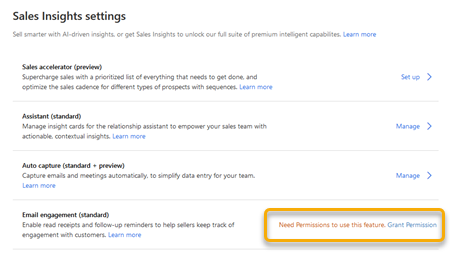

# Configure email engagement

Email engagement helps users in your organization receive alerts and reminders that help build customer relationships.

> [!NOTE]
> To benefit from the complete experience of email engagement, turn on the email engagement insight cards **[Email opened](action-cards-reference.md#EmailOpened)** and **[Email reminder](action-cards-reference.md#EmailReminder)**.

> [!IMPORTANT]
> By enabling this feature, you consent to share data about your customers' email activity with other Microsoft services. Data imported from external systems into Dynamics 365 Sales Insights is subject to our privacy statement.

## Prerequisites

Verify the following prerequisites before enabling email engagement for your organization:

- Enable standard Sales Insights features. More information: [Enable and configure standard Sales Insights features](intro-admin-guide-sales-insights.md#enable-and-configure-standard-sales-insights-features)

- To use followed email attachments:

    - [!INCLUDE[pn_onedrive_for_business](../includes/pn-onedrive-for-business.md)] must be available to your Dynamics 365 Sales server. More information: [Enable OneDrive for Business](/dynamics365/customer-engagement/admin/enable-onedrive-for-business) 

    - Enable document management for email in Sales. More information:[Enable SharePoint document management for specific entities](/dynamics365/customer-engagement/admin/enable-sharepoint-document-management-specific-entities) 

    - Enable SharePoint to be shared externally to anonymous (unauthenticated) users to allow external email recipients to access file attachments. More information: [External sharing overview](https://docs.microsoft.com/sharepoint/external-sharing-overview)

- To enable delivery-time recommendations based on recipients' time zones, you must enable [!INCLUDE[pn_bing_maps](../includes/pn-bing-maps.md)] in Sales. More information: [System Settings dialog box - General tab](/dynamics365/customer-engagement/admin/system-settings-dialog-box-general-tab)

## Enable email engagement

1.	Sign in to Dynamics 365 Sales, and go to the Sales Hub app.

2.	Go to **Change area** in the lower-left corner of the page, and select **Sales Insights settings**.

    > [!div class="mx-imgBorder"]
    > 

3. In the **Email engagement (standard)** section, select **Grant Permissions**.

    > [!div class="mx-imgBorder"]
    > 

    A confirmation message is displayed in a tab. Close the tab and proceed to set up email engagement.

    > [!NOTE]
    > If you've already granted permissions, this step will be skipped. You don't have to grant permissions to email engagement again.

4. In the **Email engagement** section, select **Set up** and then turn on the toggle. 

    > [!div class="mx-imgBorder"]
    >  

Email engagement is enabled and ready to use in your organization. 

### See also

[Introduction to administer Sales Insights](intro-admin-guide-sales-insights.md)  
[View message interactions with email engagement](email-engagement.md)
