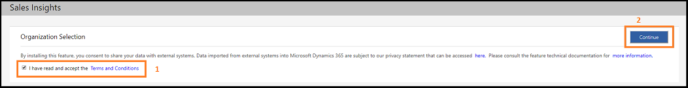
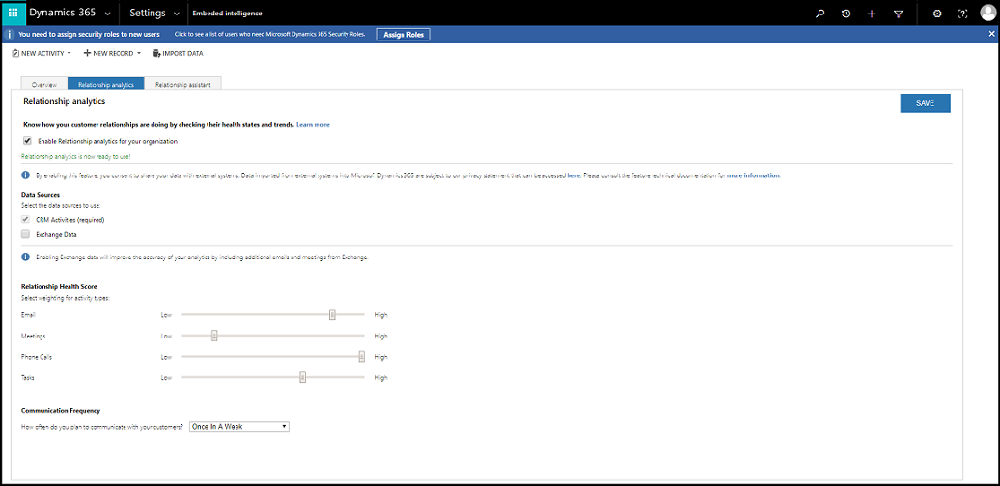
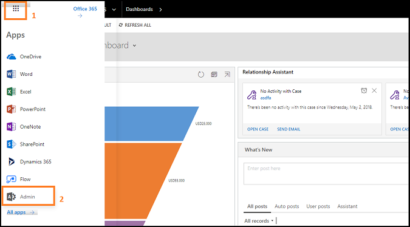

# Preview feature: Install and configure the Sales insights add-on

Applies to Dynamics 365 (online), version 9.0.2

<!--remove comment tags when the predictive lead scoring is going live.-->

The Sales insights add-on contains a Relationship analytics <!--and predictive lead scoring -->feature. <!--These--> This feature isn't available by default. To use this feature, you need to install the Sales insights add-on.  
> [!NOTE]
> To install this feature, you must be a [!INCLUDE[pn_dynamics_crm](../includes/pn-dynamics-crm.md)] administrator.

To understand how Relationship analytics is used<!--and predictive lead scoring works-->, see [Relationship analytics](../sales-enterprise/relationship-analytics.md). 
To know about Sales insights add-on related **General Data Protection Regulation (GDPR)**, see [Embedded Intelligence and GDPR](../sales-enterprise/embedded-intelligence-gdpr.md).  

To install and configure Relationship analytics<!-- and lead scoring-->:
1.  Install the Sales insights add-on.
2.	Configure Relationship analytics.
3.  (Optional) Uninstall the Sales insights add-on.

## Install the Sales insights add-on 
1.	Go to **Settings** > **Intelligence Configuration**. 
       
      

    > [!NOTE]
    > If you're using embedded intelligence for the first time, enable the features. [!INCLUDE[proc_more_information](../includes/proc-more-information.md)] [How to enable embedded intelligence](#How-to-enable-embedded-intelligence).

2.  On the **Sales insights add-on** tile, select **Install**.  
      
      
3.	On the **Sales Insights** installation page, carefully read and select the terms and conditions, and then select **Continue**.  
    The installation takes a few minutes to complete, and then the status appears in the status bar. 
      
Now you're ready to configure Relationship analytics<!-- and Predictive Lead Scoring-->.

## Configure the Sales insights add-on

After you install the Sales insights add-on, perform the following steps to configure Relationship analytics <!-- and predictive lead scoring --> according to the requirements of your organization.

1.	On the **Sales insights add-on** installation page, select **Go to Configuration**.

    > [!NOTE]
    > You can also select **Configuration** on the **Relationship analytics** <!-- or Predective lead scoring--> tile, which is on the embedded intelligence **Overview** tab. This option is available only after you install the Sales insights add-on.    
      
     <!--Have to change the screen once Predective lead scoring is available-->
    The **Relationship analytics** configuration page opens.
2.  Read and accept the Relationship analytics terms and conditions, and then select **Begin Setup**.  
      
3.	To configure<!-- predictive lead scoring and--> Relationship analytics, perform the following steps: 
    a. On the **Relationship analytics** page, configure the parameters as described in the following table.

    |**Parameter**|**Description**|  
    |---------------------|----------------------------------------------|  
    |Data Sources|**CRM Activities:** If enabled, all historical data from Dynamics 365 is ingested for computation in Relationship analytics. **Exchange Data:** If enabled, 30 days of data from Exchange is ingested for KPI and health computation. Exchange connector ingests three days of data per day until the last 30 days of data is complete.|  
    |Relationship Health Score|Businesses place different emphasis on the type of communication used with customers. You can modify the importance of activities of different types as they contribute to the relationship health score.|  
    |Communications Frequency|Businesses have varying sales cycles and different expected levels of communications with customers. A longer expected communications frequency reduces the expectation of more recent frequent communications in the health score. A shorter expected communications frequency increases the expectation of more recent frequent communications in the health score.| 
       
      
    b. Select **Save**. 
       Relationship analytics is configured and ready to use in your organization.
 

## (Optional) Uninstall the Sales insights add-on

If you don't want to use the Sales insights add-on for your organization, you can uninstall it. To uninstall this feature:
1.	Go to **Settings** > **Customization** > **Solutions**.
    A list of solutions that are installed in your organization is displayed.
2. Select **SalesInsightsAddOn**, and then select **Delete**. 
     
3. A confirmation message is displayed. Select **OK**. 
   The Sales insights add-on feature is uninstalled from your organization.

## Troubleshooting   

**I am unable to connect to Exchange server while enabling Exchange Data in Relationship analytics**
As an administrator, you must provide privillages to connect to exchange server in Admin center:

1.  Go to **Admin** center.
    
    

3.  Select **Settings** > **Services & add-ins** > **Dynamics Customer Insights Preview**.

    

4.  Configure the Dynamics Customer Insights Preview to **on** and select **Save**.

    
    
    Now you can connect to exchange server to collect data.

### See also

[Get insights on opportunities, activities, and leads of customers](../sales-enterprise/sales-insights-addon.md)

[Opt out of relationship analytics (GDPR)](../sales-enterprise/optout-relationship-analytics-gdpr.md)