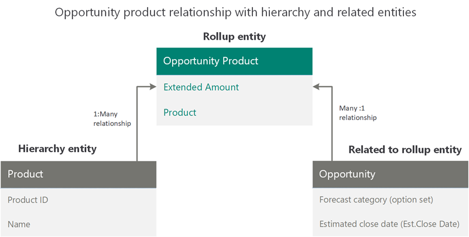
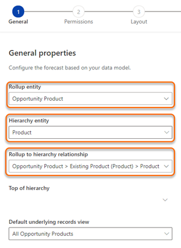
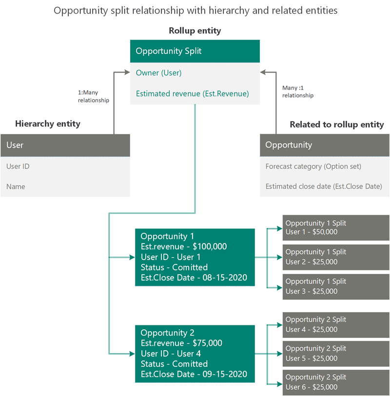
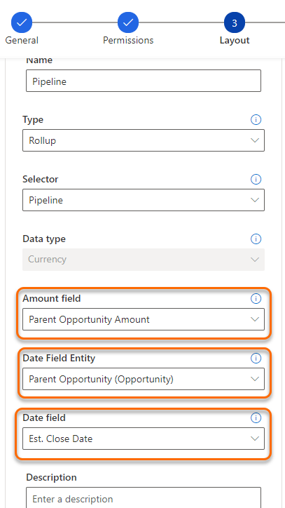

# Configure forecasts by using a custom rollup entity

Forecasting supports custom and other out-of-the-box rollup entities so you can configure a forecast that's specific to your organizational requirements.

## How it works

To configure a forecast that's specific to your organization, you can select any entity as a rollup entity, select any related entity as a hierarchical entity (defined in your organization), and establish a relationship between them.

Forecasting supports up to two levels of relationships between the rollup and hierarchical entities. For example, *Opportunity > Owner (User) > Territory (Territory) > Territory*. Here, **Owner** is the attribute in the **Opportunity** entity of type **User** and **Territory** is the attribute in **User** entity of type **Territory**. This helps the forecast to be more specific to your complex organizational requirements.

While configuring the forecast columns, some attributes that are necessary for a forecast are forecast category, estimated revenue, and estimated close date. Typically, these attributes are available in the selected rollup entity. For complex data models, such as opportunity splits and opportunity products, these attributes are distributed between rollup and related entities. To address this complexity, the enhanced forecasting supports the selection of related attributes for forecast category and estimated close date.

For example, let's consider two data models: [opportunity product](#opportunity-product) and [opportunity split](#opportunity-split).

## Opportunity product

Use this model to create a product-based revenue forecast.

For product-based forecasting, the product level revenue comes from the Opportunity Product entity. Therefore, **Opportunity Product** must be selected as the rollup entity and **Product** as the hierarchy entity that has a direct relationship with the Opportunity Product rollup entity. 

The other key attributes for the forecast are **Forecast category** and **Est.Close Date**. These attributes are available in the Opportunity entity that's related to the Opportunity Product rollup entity. 

So, we're using the following entities to create the forecast:

- **Opportunity Product** as the rollup entity
- **Product** as the hierarchy entity
- **Opportunity** for the forecast category and estimated close date

The following image illustrates the above mentioned data model.

> [!div class="mx-imgBorder"]
> 

Let's configure this forecast.

1.	Select the **Product forecast** template. This template is available to you to configure a forecast based on opportunity product and product hierarchies. 

    >[!NOTE]
    >You can choose **Create from scratch** to create a forecast based on your custom entities and custom relationships.
 
    > [!div class="mx-imgBorder"]
    > 

2.	In the **General** section, select the rollup entity as **Opportunity Product** and the hierarchy entity as **Product**.

    A direct relationship exists between the rollup and hierarchy entities, so you select the relationship as **Opportunity Product > Existing Product (Product) > Product**. Here, **Existing Product** is an attribute in the **Opportunity Product** rollup entity that has a relationship to the **Product** hierarchy entity.

    > [!div class="mx-imgBorder"]
    > 

    If there's no direct entity relationship between the rollup entity and the hierarchy entity, you can choose a related attribute to define the relationship. Select the **Related** tab, and then choose a related attribute from the list. The list displays attributes of the hierarchy-defined entities only. If no relationships exist, the entity and related tab will be empty, and you can't configure the forecast.    

    Enter other necessary information in the form, and then select **Next**. More information: [Define general properties and scheduling](define-general-properties-scheduling-forecast.md)

3.	Perform the steps in [Provide viewing permissions](provide-permissions-forecast.md).

4.	In the **Layout** section, choose the option set entity from the rollup entity or from its related entities. For this data model, the forecast categories exist in the Opportunity entity. Select the **Opportunity (Opportunity)** option set entity from **Related Entities**.

    > [!div class="mx-imgBorder"]
    > 

    a. In the **Opportunity (Opportunity)** entity, the **Forecast category** option set is selected and automatically configured.

    b. To configure each column, select the corresponding gear icon  and the column configuration section opens. 

    c. In the **Amount field**, the **Extended Amount** attribute is selected from **Opportunity Product** (rollup entity). However, **Date field entity** isn't available in the **Opportunity Product** entity. You can select the related **Opportunity** entity, and then select the **Est.Close Date** attribute.

    > [!div class="mx-imgBorder"]
    > 

    d. Enter other necessary information in the form, and then save it.

    Repeat the step to configure other columns in accordance with your needs, and then select **Next**. More information: [Choose layout and columns](choose-layout-and-columns-forecast.md)

5.	Perform the steps in [Apply additional filters](add-additional-filters.md).

6.	If you have enabled premium forecasting and want to take snapshots automatically, see [take snapshots automatically](https://docs.microsoft.com/dynamics365/ai/sales/take-snapshots-daily). 

7.	Perform the steps in [Activate and upload simple columns data](activate-upload-simple-columns-data-forecast.md).

## Opportunity split 

Use this model to create an opportunity split forecast.

For opportunity split&ndash;based forecasting, the user-level revenue comes from the Opportunity Split entity. Therefore, **Opportunity Split** must be selected as the rollup entity and **User** as the hierarchy entity that has a direct relationship with the rollup entity through the **Owner** attribute. 

The other key attributes for the forecast are **Forecast category** and **Est.Close Date**. These attributes are available in the Opportunity entity that's related to the Opportunity Split rollup entity. 

So, we're using the following entities to create the forecast:

- **Opportunity Split** as the rollup entity
- **User** as the hierarchy entity
- **Opportunity** for forecast category and estimated close date

The following diagram illustrates the above mentioned data model.

> [!div class="mx-imgBorder"]
> 

Let's configure this forecast.

1.	On the template selection page, select **Create from scratch** to create a forecast based on your custom rollup entities.

    > [!div class="mx-imgBorder"]
    > 

2.	In the **General** section, select **Opportunity Split** as the rollup entity and **User** as the hierarchy entity.

    Because there's a direct relationship between the rollup and hierarchy entities through the **Owner** attribute, select the relationship as **Opportunity Split > Owner (User) > User**. 

    If there's no direct entity relationship between the rollup entity and the hierarchy entity, you can choose a related attribute to define the relationship. Select the **Related** tab, and then choose a related attribute from the list. The list displays attributes of the hierarchy-defined entities only. If no relationships exist, the entity and related tab will be empty, and you can't configure the forecast.

    > [!div class="mx-imgBorder"]
    > 

    Enter other necessary information in the form, and then select **Next**. More information: [Define general properties and scheduling](define-general-properties-scheduling-forecast.md)

3.	Perform the steps in [Provide viewing permissions](provide-permissions-forecast.md).

4.	In the **Layout** section, choose the option set entity from the rollup entity or from its related entities. In this example, we select **Parent Opportunity (Opportunity)** from **Related Entities**. 

    > [!div class="mx-imgBorder"]
    > 

    a. In **Parent Opportunity (Opportunity)**, the **Forecast category** option set is selected. The columns for the **Forecast category** option set won't be automatically configured, because you might want to use some of the custom attributes. You must manually configure each column.

    b. To configure each column, select the corresponding gear icon , and the column configuration section opens.

    c. Select **Amount field**. From this list of out-of-the-box and custom revenue attributes that are related to **Opportunity Split** (such as **Parent Opportunity Amount** and **Revenue Total**), select **Parent Opportunity Amount**.

    d. For **Date Field Entity**, the **Opportunity Split** entity consists of date attributes. Select **Parent Opportunity (Opportunity)** from the **Related Entities** section that consists of the required estimated close date attribute.
    
    e. In **Date field**, select the **Est.Close Date** attribute. 

    > [!div class="mx-imgBorder"]
    > 

    Enter other necessary information in the form, and then save it.

    Repeat the steps to configure other columns as required, and then select **Next**. More information: [Choose layout and columns](choose-layout-and-columns-forecast.md)

    >[!NOTE]
    >You can't proceed to the next step until you complete the configuration of all the columns. 

5.	Perform the steps in [Apply additional filter](add-additional-filters.md).

6.	If you have enabled premium forecasting and want to take snapshots automatically, see [take snapshots automatically](https://docs.microsoft.com/dynamics365/ai/sales/take-snapshots-daily).  

7.	Perform the steps in [Activate and upload simple columns data](activate-upload-simple-columns-data-forecast.md).

### See also

[Configure forecasts in your organization](configure-forecast.md)  
[Project accurate revenue with sales forecasting](project-accurate-revenue-sales-forecasting.md)

[!INCLUDE[footer-include](../includes/footer-banner.md)]