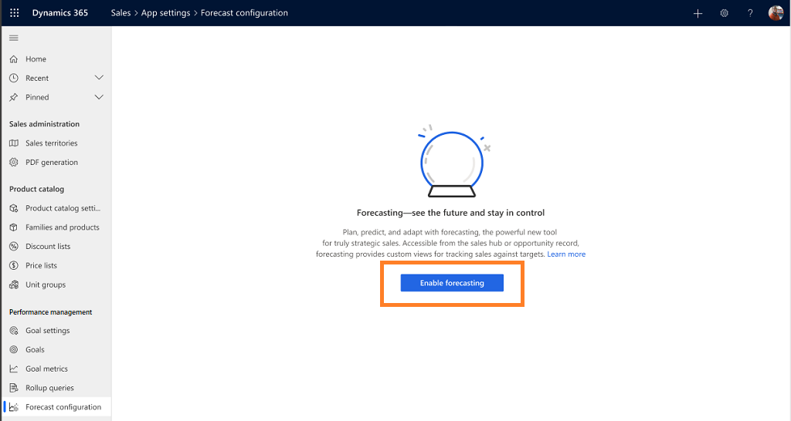
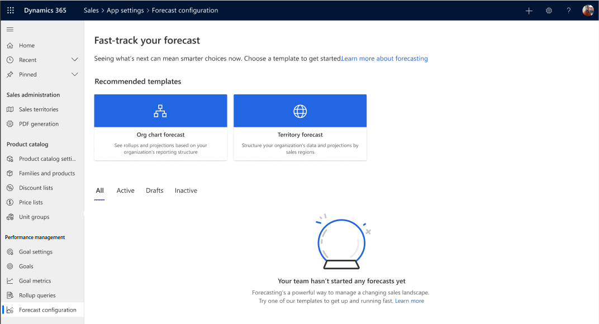
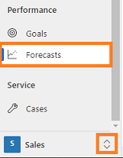

# Configure forecasts in your organization

>[!IMPORTANT]
>This feature is intended to help sales managers or supervisors enhance their team’s performance. This feature is not intended for use in making, and should not be used to make, decisions that affect the employment of an employee or group of employees, including compensation, rewards, seniority, or other rights or entitlements. Customers are solely responsible for using Dynamics 365, this feature, and any associated feature or service in compliance with all applicable laws, including laws relating to accessing individual employee analytics and monitoring, recording, and storing communications with end users. This also includes adequately notifying end users that their communications with sales persons may be monitored, recorded, or stored and, as required by applicable laws, obtaining consent from end users before using the feature with them. Customers are also encouraged to have a mechanism in place to inform their sales persons that their communications with end users may be monitored, recorded, or stored.

A forecast helps your organization predict how much revenue your sales team will generate in a given timeframe. When done correctly, forecasting can play a significant role in your company's success. By using a forecast:

- Sellers can track performance against their targets and identify pipeline risks that might jeopardize their ability to hit their targets.

- Managers can track individual sales performance against quotas to proactively provide coaching.

- Directors can use forecast trends to anticipate departmental sales and reallocate resources if necessary.

- Organization leaders can use the projected estimates to change the product strategy or convey updated projections to investors.

>[!IMPORTANT]
>Forecasting is not available on Government Community Cloud (GCC).  

As an administrator or forecast manager, you can configure forecasts in your organization. You can define the type of forecast, its hierarchy, permissions for accessing it, and the details you want to appear on the forecast grid. After a forecast is activated, your sales team can view the revenue and pipeline projections.

## Prerequisite tasks

Perform the following prerequisite tasks:

- Assign the **Administrator** or **Forecast manager** role that will allow you to perform the following tasks:

    -	Create, assign, and edit forecast configurations for your organization.

    -	Delete, activate, and deactivate forecast configurations that have been defined for your organization.

    > [!NOTE]
    > To learn more about assigning a role, see [Assign a security role to a user](/power-platform/admin/create-users-assign-online-security-roles#assign-a-security-role-to-a-user).

- Enable forecasting in your organization. To enable forecasting, follow these steps:

    1.	Sign in to the **Sales Hub** app.
    
    2.	At the bottom of the site map, select **Change area** , and then select **App settings**.

        > [!div class="mx-imgBorder"]
        > 
 
    3.	Under **Performance management**, select **Forecast configurations**.

        > [!div class="mx-imgBorder"]
        > 
 
    4.	Select **Enable forecasting**.

    5.	In the confirmation message, select **Enable**. 

    Forecasting is now enabled for your organization, and the following page is displayed:
 
     > [!div class="mx-imgBorder"]
     >  

    Also, when forecasting is enabled, the following changes appear in the **Sales Hub** app:

    -	**Forecasts** appears under **Performance** in the **Sales** site map.
    
        > [!div class="mx-imgBorder"]
        > 
 
    -	**Forecast category** appears on the **Opportunity** form. The categories define the confidence level of closing an opportunity. If necessary, you can add custom values specifically defined for your organization. To learn more, see [Capture forecast category for opportunity](capture-forecast-category-opportunity.md).

        > [!div class="mx-imgBorder"]
        > 

        > [!NOTE]
        > **Forecast category** options consists of **Won** and **Lost** opportunity statuses. If an opportunity is set as **Won** or **Lost**, the forecast category automatically changes status through the **Opportunity Forecast Category Mapping Process** out-of-the-box workflow.  
        > To view the **Opportunity Forecast Category Mapping Process** workflow, go to **Settings** > **Process Center** > **Processes** and select **All Processes** view. Search and open the **Opportunity Forecast Category Mapping Process** workflow. You can customize or deactivate the workflow according to your organization's requirements.  
        > If you're using a custom option set instead of forecast category, you must create a workflow to automatically sync the opportunity status with your option set to ensure that the forecast is projecting accurate values.   
        >  To learn more, see [Use Workflow processes to automate processes that don't require user interaction](https://docs.microsoft.com/dynamics365/customerengagement/on-premises/customize/workflow-processes).

## How do I configure a forecast?

To configure a forecast in your organization, follow these steps:

1.	[Review the prerequisite tasks](#prerequisite-tasks)

2.	[Select a template](select-template-forecast.md)

3.	[Define general properties and scheduling](define-general-properties-scheduling-forecast.md)

4.	[Provide viewing permissions](provide-permissions-forecast.md)

5.	[Choose layout and columns](choose-layout-and-columns-forecast.md)

6.	[Activate and upload simple columns data](activate-upload-simple-columns-data-forecast.md)

<table>
<tr><td>

> [!div class="nextstepaction"] 
> [Next step: Select a template](select-template-forecast.md)
</td></tr>
</table>

### See also

[Project accurate revenue with sales forecasting](project-accurate-revenue-sales-forecasting.md) 
[View forecasts](view-forecasts.md) 
[About premium forecasting](https://docs.microsoft.com/dynamics365/ai/sales/configure-premium-forecasting)
