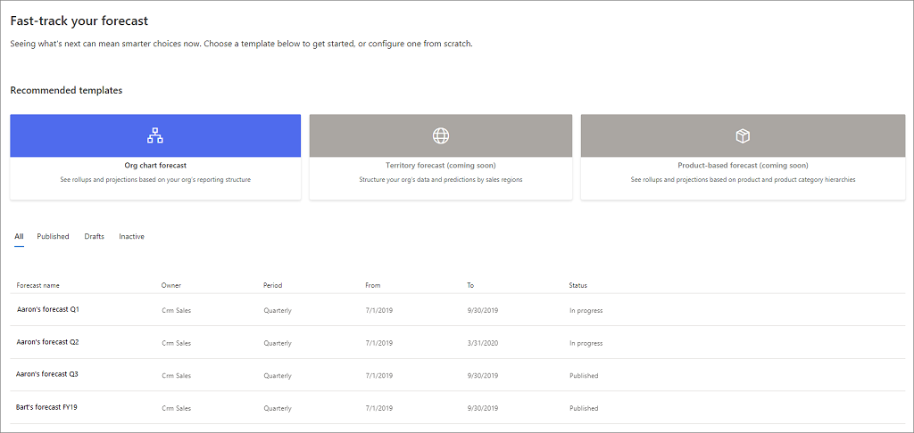
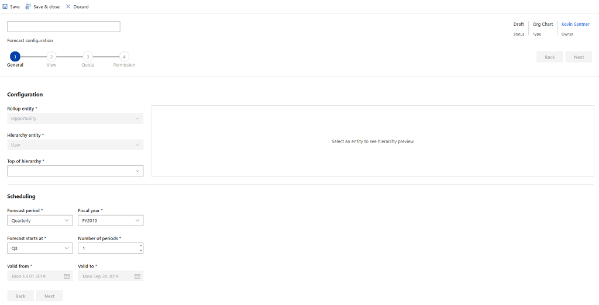
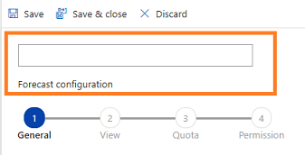
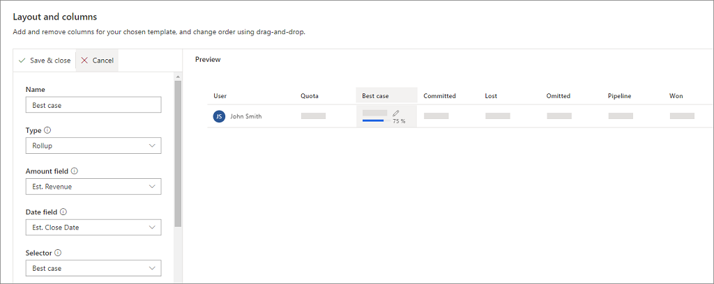
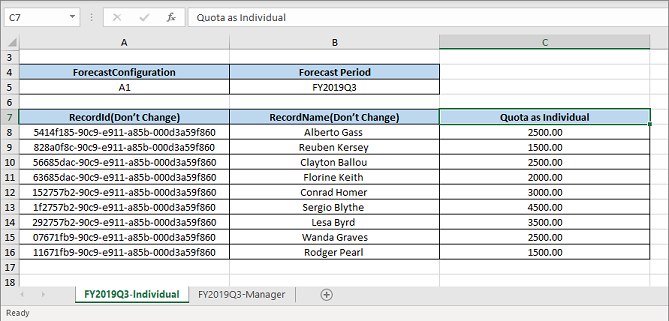

# Configure a forecast in your organization

[!INCLUDE [cc-beta-prerelease-disclaimer](../includes/cc-beta-prerelease-disclaimer.md)]

> [!IMPORTANT]
> - [!INCLUDE[cc_preview_features_definition](../includes/cc-preview-features-definition.md)]  
> - [!INCLUDE[cc_preview_features_expect_changes](../includes/cc-preview-features-expect-changes.md)]
> - Microsoft doesn't provide support for this preview feature. Microsoft Technical Support won’t be able to help you with issues or questions. Preview features aren't meant for production use and are subject to a separate [supplemental terms of use](https://go.microsoft.com/fwlink/p/?linkid=870960).

Capture information about parameters such as the period for which the forecast should be generated or the data to use for forecasting.

Forecasting helps your organization predict how much revenue its sales team will generate in a given timeframe. As an administrator or Forecast manager, you can configure a forecast in your organization.  

> [!NOTE]
> The **Forecast manager** role is created specifically to configure forecasting. Using this role, you can:
> - Create, assign, and edit forecast configurations in your business unit and other business units that are subordinate to yours.
> - Delete forecast configurations that are defined only for your business unit.
> - Share forecasts with all users in your organization.
> - View and edit forecasts at your business unit and other business units that are subordinate to your business unit, after the configured forecast is published.
 
The following changes are made to the forecast configuration from the previous release:

| Feature type | Previous version | Current version |
|--------------|------------------|-----------------|
| Security roles | Forecast manager and Forecast user roles are supported.|Forecast user role has been removed and you must be a Forecast manager to configure a forecast.|
| Forecast configuration | Forecasts were configured in the **Forecast definition** subsection. | Forecasts are now configured in **Forecast configuration**. |
| Entity support | Support for the out-of-the-box Forecast category on the opportunity entity. | Support for out-of-the-box and custom option sets from the opportunity entity. |
| Feedback and comments | -- | Send feedback and comments to [Forecast feedback](mailto:forecastingfeedback@microsoft.com). |

Explore the following links to get started configuring forecasts with this new release:

1. [Review the prerequisites](#prerequisites)

2. [Configure forecasting](#configure-forecasting)

## Prerequisites

Verify the following prerequisites before configuring the forecast:

- Administrator or Forecast manager role is assigned to you.

- Preview feature is enabled. To learn more, see [How do I enable a preview feature?](/power-platform/admin/what-are-preview-features-how-do-i-enable-them#how-do-i-enable-a-preview-feature)

- Proper hierarchy is defined for the users for whom you are creating the forecast.

## Configure forecasting

Configuration of forecasting includes the following steps:

1. [Open forecast configuration wizard.](#open-forecast-configuration-wizard)

2. [Enter configuration and scheduling information in the General tab.](#enter-configuration-and-scheduling-information-in-the-general-tab)

3. [Set up column options in the Layout tab.](#set-up-column-options-in-the-layout-tab)

4. [Publish and upload quota for forecast.](#publish-and-upload-quota-for-forecast)

### Open forecast configuration wizard

1.	Sign in to [!INCLUDE[pn-dyn-365-sales](../includes/pn-dyn-365-sales.md)] and open the **Sales Hub** app.

2.  In the lower left of the site map, select the **Change area** icon , and then select the **App Settings** area.	

3.	In the site map, select **Goal Management** > **Forecast configuration**.

    The forecast configuration home page opens with a list of created forecasts.

    > [!div class="mx-imgBorder"]
    > 

4.	Select **Org chart forecast** to configure your forecast using the wizard.

    > [!div class="mx-imgBorder"]
    > 

### Enter configuration and scheduling information in the General tab

The **General** tab is for defining basic properties–such as forecast name, type, and hierarchy entity–and setting a schedule.

1. In the **General** tab, enter a descriptive name for the forecast. For example, Alberto Gass Org Forecast 2019. 

    > [!div class="mx-imgBorder"]
    > 

2. In the **Configuration** section, assign the **Top user in hierarchy** (the user whose team forms the forecast hierarchy). Once selected, you'll see a preview of these users at right. 

   The forecast consists of the full hierarchy as defined by the **Manager** field of the User object. For example, if Caitlyn James, a manager, asks her admin to create a forecast for her sales team, the admin assigns Caitlyn as the top of the hierarchy. 

    > [!NOTE]
    > The parameters **Rollup entity** and **This hierarchy is made up of** are predefined and cannot be changed. Here, the **Rollup entity** value is **Opportunity** and **This hierarchy is made up of** value is **User**.

    > [!div class="mx-imgBorder"]
    > 

3. In the **Scheduling** section, enter the following information:

    | Parameter | Description |
    |-----------|-------------|
    | **Forecast period** | Select whether the forecast is to be generated monthly or quarterly. Quarterly is selected by default. You can create a forecast for up to a year.|
    | **Fiscal year** | Select the fiscal year for the forecast. This is populated based on the org’s fiscal year settings. |
    | **Forecast starts at** | Select when to start forecasting. If you select the forecast period as Monthly, select the month from which you want to start forecasting. If you select the forecast period as Quarterly, select the quarter from which forecasting should start. |
    | **Number of periods** | Enter the number of forecast periods that need to be generated. For example, when you select the forecast period as monthly, you can create a minimum of one to a maximum of 12 forecasts.   **Note:** If you select the forecast period as monthly, Fiscal year as FY19, Start month as January, and Number of forecasts as 4, the forecasts that are generated are grouped by four months, January, February, March, and April. In such case, the Forecast start and end date is automatically set to January 1, 2019, and April 30, 2019, respectively.|
    | **Valid from** | The start date is read only and helps you to identify the date when the forecast starts. |
    | **Valid to** | The end date is read only and helps you to identify the date when the forecast ends. |
 
    > [!div class="mx-imgBorder"]
    > 

4. Select **Next** after you enter the required information. 

    You are guided to the **Layout** tab that helps you define the forecast grid your users will see.

### Set up column options in the Layout tab

Use the **Layout** tab to set up the columns for the forecast. This defines how the forecast grid appears for the users. You can choose these columns from option sets that are defined for opportunities in your organization.

1. In the **Layout and column** section, select **+ Add from option set**. A list of option sets appears.

2. Choose an option set and select **Choose selected**. The application adds the columns to your forecast configuration.

    > [!TIP]
    > We recommend you use the out-of-the-box **Forecast category** option set for column configuration. After choosing this option, in the dialog box asking if you want to auto-populate the configuration parameters, select **Auto-configure**. Column values are then auto-populated according to best practice, saving you the time of configuring each column individually. To edit your columns, proceed to Step 3. 

    > [!div class="mx-imgBorder"]
    > 

3. Hover the cursor over a column name, select the vertical ellipsis, and then select **Configure**. 

    For example, hover the cursor over **Best case** and select **Configure**.

    > [!div class="mx-imgBorder"]
    > 

4. In the column configuration page, enter the following information:

    | Parameter | Description |
    |-----------|-------------|
    | **Name** | Name of the column.|
    | **Type** | By default, **Rollup** is selected.|
    | **Amount field** | Select the amount field to be calculated. The available fields are based on the selected **Rollup entity** (**Opportunity**). For example, if the **Forecast category** option set is selected, the amount field is configured as **Est. Revenue**. |
    | **Date field** | Select the date field that defines the record’s forecast period. The available fields are based on the selected **Rollup entity** (**Opportunity**). For example, if the **Forecast category** option set is selected, the date field is configured as **Est. Close Date**. |
    | **Selector** | Select the option set value that defines how this column is grouped. For example, if **Best Case** is selected, only opportunities with forecast category set to **Best Case** will be aggregated. |
    | **Allow adjustments** | Enable this setting to provide users the ability to overwrite a system calculation directly in the forecast grid. When enabled, you can see a pencil icon next to the forecasted value in that column. |
    | **Show progress compared to quota** | Enable this option to compare the column’s value against the quota. When enabled, a progress bar indicating the attainment percentage is shown below the forecast value in that column. |
    | **Unique name** | Unique column name.|

    When configuring columns, you’ll see a preview of the configuration in the **Preview** section. 

    > [!NOTE]
    > You can drag and drop to rearrange columns. 

5. **Save and Close** the configuration.

    > [!div class="mx-imgBorder"]
    > 

6. Repeat **step 3** to **step 5** for the columns that you want to edit.

7. (Optional) To show or hide any column,  toggle the check box next to the column name.

8. Select **Next**.

    Now you can publish the configured forecast and set quota for the users to display in the forecast grid.

### Publish and upload quota for forecast

Use the **Publish & Quota** tab to generate a forecast based on the configurations as defined in the **General** and **Layout** tabs. In this section you can also download and re-upload a template (Excel file) with quotas for all users defined in the forecast hierarchy. 

> [!NOTE]
> The option to download and upload the template that specifies quota will not be active until you publish the forecast. So, you must publish the forecast before you upload the quota template to the forecast configuration.   

1. In the **Publish forecast** section, select **Publish forecast**. The configured forecast starts calculating the values for forecast and is available for users in your organization. The publishing might take a few minutes.

    > [!div class="mx-imgBorder"]
    > 

    Once a forecast is published, a confirmation message is displayed. The option to download the quota template becomes available.

    > [!NOTE]
    > If the publishing fails, the forecast definition’s status and status reason is set to **Published and Failed**. To learn more, see [Why am I unable to publish forecast definition?](../sales-enterprise/troubleshooting.md#why-am-i-unable-to-publish-forecast-definition)

2. In the **Upload a quota for this forecast** section, select **Download quota template**. A template (Excel file) showing users in the hierarchy is downloaded to your local computer. 

    > [!div class="mx-imgBorder"]
    > 

    The name convention of the downloaded file is ***forecastname*_Quota.xlsx**. For example, if you have created a forecast with the name **Caitlyn’s forecast 2019**, the name of the downloaded file is **Caitlyn’s forecast 2019_Quota.xlsx**.
    
3. Open the downloaded Excel file. It contains two sheets, **Individual** and **Manager**.
     
    - **Individual tab**: This view shows all the sales reps—including managers—in the forecasting hierarchy. Enter a quota for each individual under the **Quota as Individual** column. When the file is uploaded, each individual’s quota will show under the **Quota** column in the forecast grid, managers included. The quota you enter for managers in the **Individual** tab will not affect the quota that you enter in the **Manager** tab (a manager can also be working on opportunities and will have a quota as an individual). In the following example, all the sales reps including the managers (**Wanda Graves** and **Rodger Pearl**) are listed, and the quota is entered for all individuals.

        > [!div class="mx-imgBorder"]
        > 

    - **Manager tab**: Shows anyone designated a manager in the selected hierarchy. A manager has at least one direct report. Enter the quota for each manager under the **Quota as Manager** column. When the file is uploaded, the quota will show under the **Quota** column in the forecast grid for managers (a level above individuals). In the following example, the quota is entered for the managers **Wanda Graves** and **Rodger Pearl**.

        > [!div class="mx-imgBorder"]
        >  

    > [!IMPORTANT]
    > Do not change any values in the file other than the quota values.

4. Save and close the file.

5. In the **Upload a quota for this forecast** section, select the option to browse and upload, or drag and drop the file in the upload area. Check the status at the bottom of the upload area.

    In this example, we are dragging and dropping the file into the upload area.

    > [!div class="mx-imgBorder"]
    > 

6. After the file is uploaded, select **Finish**.
 
    You are directed to the forecast configuration home page, where your organization's forecasts are listed.

## See also

[Project accurate revenue with sales forecasting](project-accurate-revenue-sales-forecasting.md)  

[View forecasts](view-forecasts.md)
