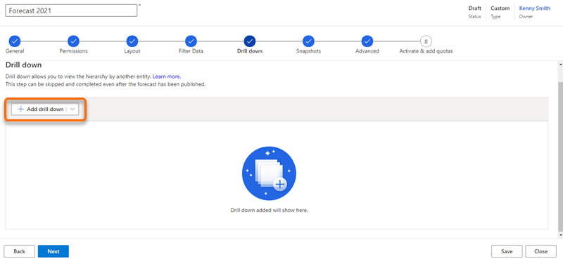

# Configure and manage drill-down entities

Once you’ve configured the forecast page, you'll have a view into the pipeline amounts that your sellers are projecting for the period. Now you might want to know which accounts contribute to a specific seller’s Committed value or maybe you want to know which products are contributing to a different seller’s Won value. The drill-down feature allows you to break down your seller’s forecast projections as a function of the contributing factors that you care about such as Account and Product. The drill-down feature looks at the underlying records that are contributing to the value of the rollup column and groups them according to the drill-down selection. 

Let’s look at an example. **Amber Rodriguez** is a seller who's associated with four accounts. Her projected revenue for the current period is $400,000. **Kevin Smith**, her sales manager, wants to understand how her revenue of $400,000 is broken down by each account. On the forecast page, Kevin chooses to drill down into Account from the drop-down menu. Then he selects the drill-down icon beside Amber’s record to view a list of accounts that make each of Amber’s forecast pipeline values.

> [!div class="mx-imgBorder"]
> 

As an administrator or forecast manager, you can enable and configure the drill-down option using the **Drill down** step in the forecast configuration. By configuring the drill-down choices that match your organizational requirements, you can break down your forecast values into any of the configured drill-down options. This allows users to understand what values are constituting their forecast projections.

> [!NOTE]
> To understand how drill-down selections are used, see [View and understand data through drill-down entities](view-understand-data-through-drill-down.md).

## Things you must know

Before you configure a drill-down choice, we recommend you understand the following concepts: 

-	[Drill-down type](#drill-down-type)
-	[Amount entity](#amount-entity)
-	[Entity relationship](#entity-relationship)

With the forecasting feature, we have provided [out-of-the-box drill-down templates](#templates) to configure the rollup and hierarchy entities.

To understand how to manage the drill-down feature, see [Manage drill-down options](#manage-drill-down-options).

### Drill-down type

A drill-down type specifies the data type that is used to break down the forecast values into its contributing parts. While configuring the drill-down feature, you can choose the drill-down type as an entity or an option set. 

#### Drill down by entity

If you choose the drill-down type by entity, you can select an entity that has a direct or indirect relationship with the rollup entity. For example, the **Account** entity has a direct relationship with the **Opportunity** rollup entity. Similarly, the **Product** entity has an indirect relationship with the **Opportunity** rollup entity through the **Opportunity Product** entity. To learn more about the relationships, see [Reference](#reference). 

#### Drill down by option set

If you choose the drill-down type by option set, you can select an option set from the list. These option sets are from the rollup entity—for example, the Forecast category and Budget. After you select the option set, you can save and proceed with forecast configuration. No further configuration is required because both the option sets and the amount field are from the rollup entity.

### Amount entity

To effectively break down each forecast data by the drill-down entity, you need to identify an entity that contains the amount fields to be aggregated. This entity can either be the rollup entity or any related entity of the rollup entity that contains a number or currency field.

The amount entity contains the fields of type amount or currency. For each defined forecast column, you must select an amount field that corresponds to the aggregate value. Choose the appropriate amount fields, so that the drill-down values sum up to the aggregate value. 

> [!div class="mx-imgBorder"]
> 

Depending on the amount entity, you must establish the entity relationship between the amount and drill-down entity. 

### Entity relationship

The entity relationship is established to connect drill-down and rollup entities through the amount field in the amount entity. This relationship guides the forecast to break down the amount data by drill-down values.

-	If the amount and rollup entities are same, you can establish a direct relationship between amount and drill-down entities. 
-	If the amount and rollup entities are different, you must establish a relationship between amount and rollup entities and then establish a relationship between amount and drill-down entities. 

> [!div class="mx-imgBorder"]
> 

### Templates

The following out-of-the-box templates are provided for you to configure drill-down views. You can add these templates according to the rollup and hierarchy entities that you have used to configure the forecast.

|Rollup entity | Hierarchy entity | Drill-down templates |
|--------------|------------------|----------------------| 
| Opportunity |	User | Account, Product, and Parent Product |
| Opportunity | Territory | User, Account, Product, and Parent Product |
| Opportunity |	Account | User, Product, and Parent Product |
| Opportunity | Product | Product, Account, and Owner |

Using these templates, you can break down your forecast values by accounts, products, parent products, users, owners, and territory.

### Manage drill-down options 

-	You can [add](#add-a-drill-down-entity) or [edit](#edit-a-drill-down-entity) drill-down choices and make them available for users even after the forecast has been activated. 
-	You can [delete](#delete-a-drill-down-entity) the drill-down choice if it is no longer required in a forecast. 

## Add a drill-down entity

1.	In the **Drill down** step, select **Add drill down**.

    > [!NOTE]
    > You can select the down arrow icon and choose a template to autoconfigure the drill-down option.

    > [!div class="mx-imgBorder"]
    > 

2.	In the **General properties** section, choose the drill-down type.

    To learn more, see [Drill-down type](#drill-down-type).

    -	**Drill down by entity**: Displays a list of entities that are directly related to the rollup entity and its related entity.
        
        Select an entity, then enter a **Display name**. The value you enter here is visible to users to select the drill-down choice. In this example, we are configuring a drill-down selection that is based on Territory.

        > [!div class="mx-imgBorder"]
        >  

    -	**Drill down by option set**: Displays the list of option sets that are available in the rollup entity.
        
        Select an option set from the **Drill down option set** list, then enter a **Display name**. The value you enter here is visible to users to select the drill-down option. In this example, we are selecting a drill-down option that is based on the **Forecast category** option set.

        > [!div class="mx-imgBorder"]
        >  

    If you select this option, go to [step 5](#step-5).

3.	In the **Amount data** section, select the entity from the **Amount entity** list. The entity list that is displayed here is populated based on the selected drill-down entity. To learn more, see [Amount entity](#amount-entity).
    
    -	If the amount and rollup entities are the same, the **Amount field** values are automatically configured, and these values can’t be edited. In this example, the amount entity is selected as **Opportunity**, which is also the rollup entity, and the forecast columns are configured as follows:
        
      -	For **Best case**, **Committed**, **Omitted**, and **Pipeline** as **Est. Revenue**.
      -	For **Won** and **Lost** as **Actual Revenue**.

        > [!div class="mx-imgBorder"]
        >      

    -	If the amount and rollup entities are different, you must manually configure the amount fields. Select and add the appropriate amount field for each forecast column from the drop-down list in the Amount field. In this example, the amount entity is selected as **Opportunity product** and is different from the rollup entity. Therefore, the amount fields for each forecast column are selected manually as **Extended Amount**.
        
        > [!div class="mx-imgBorder"]
        > 

    > [!NOTE]
    > You can select the amount field for multiple forecast columns at the same time by hovering your cursor to the left of the columns and selecting the radio buttons that appear to make a selection. Then, a drop-down list will display with the option to **Choose amount field to be applied to all selected forecast columns**.
    >
    > 
       
4.	In the **Entity relationship** section, select the relationship as described:

    -	**Amount and rollup entities are the same**: Select the **Amount entity to drill down entity relationship** from the drop-down menu to establish a relationship between the drill-down and amount entities.
        
        In this example, the amount entity is **Opportunity**, which is also the rollup entity, and the drill-down entity is **Account**. A relationship between amount and drill-down entities can be established through the **Account** attribute. The relationship is mapped as **Opportunity** > **Account (Account)** > **Account**. The mapping specifies that the **Opportunity** and **Account** entities can be connected by the shared attribute **Account**. 

    -	**Amount and rollup entities are different**: If the amount entity is different from the rollup entity, you must establish a relationship between amount and rollup entities. Then you must establish a relationship between the amount and drill-down entities. Select **Amount to rollup entity relationship** from the drop-down menu to establish a relationship between amount and rollup entities. The values displayed in the list are based on the selected amount entity. 
        
        In this example, the amount entity is **Opportunity Product** and relationship is established through **Opportunity**. Select **Amount** entity to drill-down entity relationship attribute to establish a relationship between the drill-down and amount entities. The values displayed in the list are also based on the selected amount entity. 
        
        The amount entity is **Opportunity Product** and relationship is established through the **Product** attribute. The relationship is mapped as **Opportunity Product** > **Existing Product (Product)** > **Product**. The mapping specifies that there is an attribute **Product** in the **Opportunity Product** entity that's related to the **Existing Product** entity that in turn is related to the **Product** attribute. 

        > [!div class="mx-imgBorder"]
        >         

    To learn more, go to [Entity relationship](#entity-relationship).

 
5.	Save and select **Next**.

## Edit a drill-down entity

You can edit your drill-down entities for your forecast at any point in time. Follow these steps:

1.	Open the forecast for which you want to edit the drill-down entity.

2.	On the configuration wizard, select the **Drill down** step. 

3.	Select the drill-down option you want to edit and perform steps 2 to 4 from [Add a drill-down entity](#add-a-drill-down-entity) as required.

4.	Save and close the configuration.

## Delete a drill-down entity

You can delete a drill-down entity that is no longer required in a forecast. Follow these steps: 

1.	Open the forecast for which you want to edit the drill-down entity.

2.	On the configuration wizard, select the **Drill down** step. 

3.	Select the drill-down option you want to remove and then select the **Delete** icon. The drill-down option is then deleted from the forecast.

4.	Save and close the configuration.

## Reference

Understand the relationships many-to-1 and 1-to-many in detail:

**In drill-down type**

- **Many-to-1 relationship entity**: The drill-down types that are defined based on a many-to-1 relationship with rollup entity are simpler to configure because the drill-down entity is directly related to the rollup entity, and an intermediary relationship needs to be established. For example, if you select the rollup entity as Opportunity and the drill-down entity as Account, the relationship rollup entity (Opportunity) has a many-to-1 relationship with the drill-down entity (Account) and this type of drill-down entity is easy to break into groups. 

- **1-to-many relationship entity**: The drill-down types that are defined based on a 1-to-many relationship with rollup entity are often complex to break because the drill-down entity is a related entity of the rollup entity. For example, if you select the rollup entity as Opportunity and the drill-down entity as Product, the relationship rollup entity (Opportunity) has a 1-to-many relationship with the drill-down entity (Product) and this type of drill-down entity is complex to break into groups.

**In account entity**

- If the selected drill-down entity has a many-to-1 relationship with a rollup entity and the amount entity is the same as the rollup entity, the amount fields are automatically configured because these values are taken from the amount fields that are configured in forecast columns. These amount fields can’t be edited—for example, if you select Account as the drill-down entity and the rollup entity as Opportunity. Select the amount entity as Opportunity, which is the same as the rollup entity. For each column, the amount fields are automatically taken from the amount fields that are used while configuring the forecast columns.

- If the selected drill-down entity has a 1-to-many relationship with a rollup entity and the amount entity is different from the rollup entity, the amount fields must be manually configured. After you select the amount entity, the possible amount fields that are used to aggregate the rollup columns are displayed. For example, if you select Product as a drill-down entity and the rollup entity is Opportunity, the amount fields for the product are available in the Opportunity Product entity and are selected as the amount entity. 

To learn more about entity relationships, go to [Entity relationships](/powerapps/maker/common-data-service/create-edit-entity-relationships).

<table>
<tr><td>

> [!div class="nextstepaction"] 
> [Previous step: Apply additional filters](add-additional-filters.md)
</td><td>

> [!div class="nextstepaction"] 
> [Next step: Configure advanced settings](forecast-configure-advanced-settings.md)
</td></tr>
</table>

### See also

[View and understand data through drill-down entities](view-understand-data-through-drill-down.md)

[Configure forecasts in your organization](configure-forecast.md)

[!INCLUDE[footer-include](../includes/footer-banner.md)]