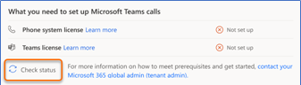
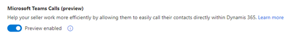
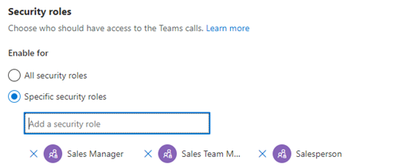
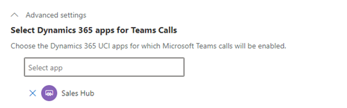

# Configure Microsoft Teams dialer

[!INCLUDE [cc-beta-prerelease-disclaimer](../includes/cc-beta-prerelease-disclaimer.md)]

Microsoft Teams dialer helps sellers to be more productive and get work done more effectively by calling customers directly within Dynamics 365 Sales.   
As an administrator, you must configure the Teams dialer  for sellers to use. When configured the Teams dialer are available in your Dynamics 365 app for phone activity.     
Perform the following steps to configure Teams dialer for your organization:    
1.	[Review the prerequisites](#review-the-prerequisites).   
2.	[Configure the dialer](#configure-the-dialer).    

## Review the prerequisites    
Review the following requirements before you configure the Microsoft Teams dialer in your sales app:     
-	You must have an administrator or equivalent security role. To learn more, see [Assign a security role to a user](https://docs.microsoft.com/power-platform/admin/create-users-assign-online-security-roles#assign-a-security-role-to-a-user).    
-	Your organization has a phone system installed with proper license to use. To learn more, see [Set up Phone System in your organization](https://docs.microsoft.com/MicrosoftTeams/setting-up-your-phone-system).    
-	You have license to use Microsoft Teams. To learn more, see [Microsoft Teams add-on licenses](https://docs.microsoft.com/MicrosoftTeams/teams-add-on-licensing/microsoft-teams-add-on-licensing?tabs=small-business).    

## Configure the dialer     
1.	Sign in to your sales app.     
2.	Go to **App settings** and under **General settings** select **Teams calls (preview)**.    
    > [!div class="mx-imgBorder"]
    >      
3.	In the **What you need to set up Microsoft Teams calls** section, the application validates that your organization has sufficient privileges to use the **Phone system** and **Microsoft Teams**.     
    - Up on successful validation, the status corresponding to **Phone system license** and **Teams license** display **Status: Successfully set up**. Proceed to step 4. 
    select **Check status**.   
        > [!div class="mx-imgBorder"]
        >       
    -  If any of the validations fails, you can’t proceed with the configure and you must contact your tenant administrator to set up the phone system and Microsoft Teams for your organization.   
    When the tenant administrator completes the configuration of [phone system](https://docs.microsoft.com/MicrosoftTeams/setting-up-your-phone-system) and [Teams licenses](https://docs.microsoft.com/MicrosoftTeams/teams-add-on-licensing/microsoft-teams-add-on-licensing?tabs=small-business), you can continue with the configuration.       
        > [!div class="mx-imgBorder"]
        >       
4.	Select **Enable preview** and the Microsoft Teams call preview is enabled.   
    >[!NOTE]
    >The **Enable preview** option will be available only after the phone system and Microsoft Teams licenses are successfully validated.    
    
    > [!div class="mx-imgBorder"]
    >       
5.	In the **Security role** section, select one of the following options to provide permissions to users who will view the Microsoft Teams dialer.    

    | Option | Description |
    |--------|-------------|
    | All security roles | This option provides access to view Teams dialer to all the security roles of users in your organization. |
    | Specific security roles | This option allows you to specify security roles when you want to give access to view Teams dialer to specific users. |     

    > [!div class="mx-imgBorder"]
    >       
6.	Select **Advanced options** and in the **Select app** drop-down, choose and add apps such as, your custom apps. By default, **Sales Hub** app is selected. 
    > [!div class="mx-imgBorder"]
    >       

    >[!NOTE]
    >When Teams dialer is enabled in your organization for an app, other telephony systems that are connected to app through Channel Integration Framework (CIF) will stop working . Administrator can deactivate or delete the CIF phone system. Follow these steps:
    >1.	Go to your **Channel Integration Framework** app.
    >2.	From the **Active Channel Providers** view, choose the phone system.
    >3.	From the **Tool** bar, select **Deactivate** or **Delete** according to your requirement.   
    >The phone system is disabled or removed from your organization.    
7.	Save and publish the configurations.    
    A confirmation message is displayed, and the Teams dialer is enabled in your organization for selected security roles in the selected app.    
    >[!NOTE]
    >You must refresh the configuration page to make the changes available in the application. 

### See also

[Microsoft Teams integration](../teams-integration/teams-integration.md)     
[Call a customer](https://docs.microsoft.com/dynamics365/ai/sales/connect-with-customers#call-a-customer)      
[View and understand call summary pages](https://docs.microsoft.com/dynamics365/ai/sales/view-and-understand-call-summary)
