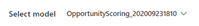
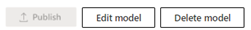
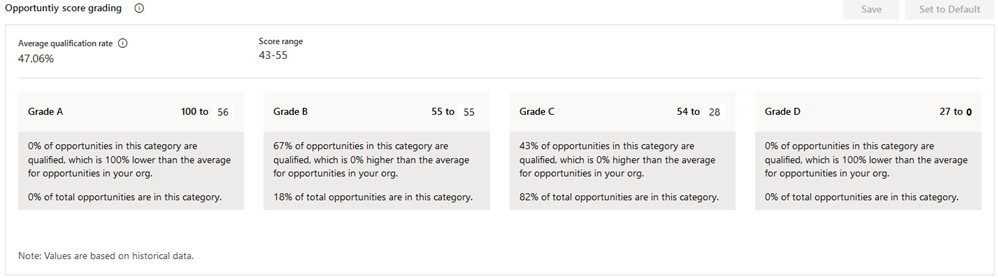
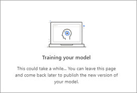
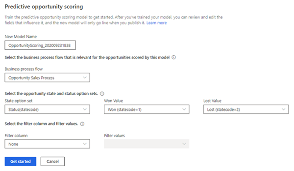
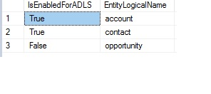
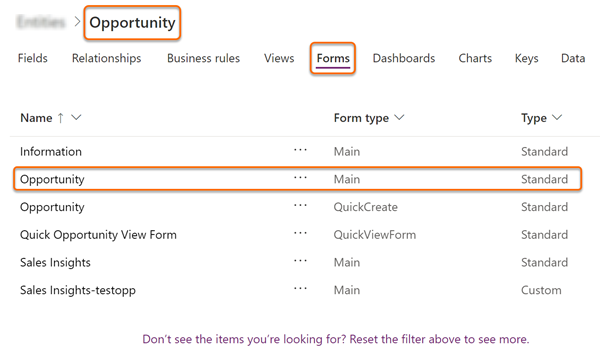
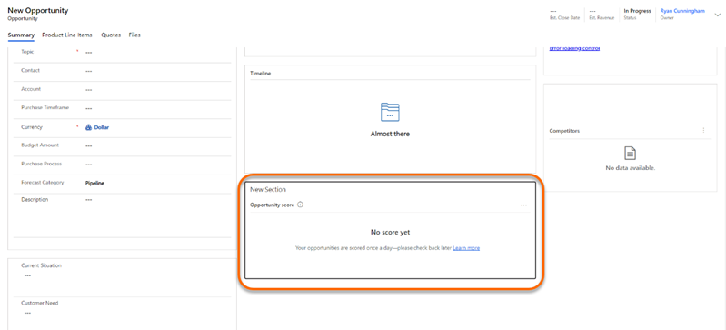

# Configure predictive opportunity scoring

Predictive opportunity scoring uses a predictive machine learning model to calculate a score for all open opportunities. The score helps salespeople prioritize opportunities, achieve higher opportunity qualification rates, and reduce the time that it takes to qualify an opportunity.

Using this score, you can:

- Identify quality opportunities and convert them into won deals.
- Spend time on opportunities that have low scores and convert them into possible deals.

For example, say you have two opportunities&mdash;Opportunity A and Opportunity B&mdash;in your pipeline. The opportunity scoring model applies a score of 75 for Opportunity A and 55 for Opportunity B. By looking at the score, you can predict that Opportunity A has more chances of being converted into a won deal, and you can engage it. Also, you can further analyze why the score of Opportunity B is low by looking at the top reasons that are influencing the score and deciding how to improve this score.

The following image is an example of an opportunity scoring widget.

> [!div class="mx-imgBorder"]
> 

>[!IMPORTANT]
>- If you're using predictive opportunity scoring that pertains to a version prior to 2020 release wave 2 for Dynamics 365, delete the model. Otherwise, the previous version of the model will be applied on all opportunities in your organization, and the newly generated models won't have any effect on the opportunities. More information:[Delete a model](#delete-a-model)
>- From 2020 release wave 2 for Dynamics 365, the application writes the opportunity scoring related data to **msdyn_predictivescore** entity and has stopped writing to the opportunity entity. This entity is common for both lead and opportunity scoring. More information: [Entity reference](entity-reference.md).

You can add custom fields to generate an accurate model for predictive opportunity scoring. The custom fields can be specific to your organization so that you can decide the impact of the outcome.

## Prerequisites

Verify that you meet the following requirement before adding predictive opportunity scoring models for your organization:

- A minimum of 40 qualified and 40 disqualified opportunities within the past 18 months.

    >[!NOTE]
    >These numbers represent the minimum requirement. The more opportunities you can include to train the model, the better the prediction results will be.

## Understand the configuration page

Before we configure the predictive opportunity scoring, let's understand the configuration summary page. When a model is generated and published, the configuration summary page is displayed as shown in the following image.

> [!div class="mx-imgBorder"]
> 

The configuration page is organized into the following sections:

- [Select a model](#select-model)
- [Actions you can perform on the model](#actions-you-can-perform-on-the-model)
- [Version details](#version-details)
- [Opportunity score grading](#opportunity-score-grading)
- [MultiModel](#multimodel)

<a name="select-model"></a>

### Select model

In the upper-left corner of the page, you can use the **Select model** drop-down list to choose the model you want to view, edit, or delete. The list consists of both published and unpublished models.

> [!div class="mx-imgBorder"]
> 

### Actions you can perform on the model

In the upper-right corner of the page, you can choose from actions that you can perform on the model.

> [!div class="mx-imgBorder"]
> 

- **Publish**: When you publish a model to your organization, users in your organization can see the My Open Opportunities Scored system view and the opportunity score widget on opportunity forms. After you publish, this button appears dimmed and will be available only after you retrain or edit the model.
- **Edit model**: You can update or add fields that affect the prediction accuracy score. This is useful when you want to modify fields to consider or include a unique business process. More information: [Edit and retrain a model](#edit-and-retrain-a-model)
- **Revert version**: You can return the model to its previous version when the retrained model isn't satisfactory or doesn't meet an acceptable level of your organization's requirements. This action is only available when you've retrained the model but haven't published it yet.
- **Delete model**: You can delete models that aren't required in your organization. This option is displayed for published models. More information: [Delete a model](#delete-a-model)

### Version details

The parameters displayed in this section show information about the status and performance of the model.

> [!div class="mx-imgBorder"]
> 

| Parameter | Description |
|-----------|-------------|
| Version trained on | Displays a date that lets you know when the model was last trained. |
| Status | Displays whether the model is active or inactive. |
| Attributes used | Displays the number of attributes used from the available list to train the model. If you're not satisfied with the outcome of the trained model, you can select **Retrain with recommended fields** to retrain the model with the standard (out-of-the-box) attributes. If the parameter displays **Edited** next to the number of attributes used, this specifies that the attributes used are custom-selected. |
| Model performance | Displays information about the model's accuracy and projected performance based on the data available and selected to train the model.<br>**Note**: The range of the accuracy score is defined based on the area under the curve (AUC) classification measurements.<br>- **Ready to publish** specifies that the model accuracy is above the range, and you can expect that the model will perform well.<br>- **OK to publish** specifies that the model accuracy is within range, and you can expect that the model might perform reasonably well.<br>- **Not ready to publish** specifies that the model accuracy is below the range, and you can expect that the model will perform poorly. |
| Business process flow | Displays the business process flow that's applied on the opportunities that are scored by this model. |
| Filter column and filter values | When multiple models are used, this selection defines which column and which values within that column correspond to the opportunities that this specific model should score. |
| State option set | Displays the option set that's used for won and lost opportunities in this model. |
| Retrain automatically | Allows you to set the model to be retrained automatically. More information: [Automatic retraining](#automatic-retraining) |
| Most influential fields | Displays the top five attributes that most affect the outcome of the prediction accuracy score. |

### Opportunity score grading

When a model is published, the opportunities that are in your organization's pipeline are graded according to the range defined in this section. Each opportunity in the pipeline is graded A, B, C, or D, according to the opportunity score. Opportunities in the top score range are graded A while opportunities within the lowest score range are graded D.

> [!div class="mx-imgBorder"]
> 

You can configure the range for the grading according to your organizational requirements. When you change the opportunity score range for a grade, the maximum range value for the adjacent grade changes automatically in accordance with the change in the minimum value. For example, when you change the minimum range value score for **Grade A** to 51, the maximum opportunity score range for **Grade B** changes to 50.

### MultiModel

In the lower-left corner of the page, you can use **Add model** to generate a new model to represent a line of business that might use different leads than your first model. The **Add model** command will be disabled as soon as you reach the maximum limit of 10 models (both published and unpublished). More information: [Add a model](#add-a-model)

> [!div class="mx-imgBorder"]
> 

## First-run setup experience

When the predictive opportunity scoring configuration section is opened for the first time in your organization and no models have been trained on the installation of Sales Insights, you must add the model. 

However, if your organization has enough opportunities that match the application default configurations, a model is generated by default and a pop-up window is displayed with the prediction accuracy score and top five fields that are influencing the score. Based on your organization's requirements, you can publish the model, or you can edit and then publish the model.

If you're using your custom attributes for opportunity generation, you can generate the model by configuring the parameters with your custom attributes.

>[!NOTE]
>Before you configure the model, review the [prerequisites](#prerequisites).

1. Verify that advanced Sales Insights features are enabled. More information: [Install and configure premium Sales Insights features](intro-admin-guide-sales-insights.md#install-and-configure-premium-sales-insights-features). 

2. Go to **Change area** in the lower-left corner of the page, and select **Sales Insights settings**.

    > [!div class="mx-imgBorder"]
    > 

3. On the site map under **Predictive models**, select **Opportunity scoring**.

    The **Predictive opportunity scoring** configuration page is displayed.

    > [!div class="mx-imgBorder"]
    > 

4. In the **New model name** box, enter a name that contains alphanumeric characters. Underscores are allowed, but not spaces or other special characters.

    By default, the name is selected as **OpportunityScoring_**<***YYYYMMDD***><***Time***> (for example, **OpportunityScoring_202009181410**). The date and time are based on Coordinated Universal Time (UTC).

5. In the **Business process flow** list, select a business process flow that's relevant for the opportunities for which you're generating the model. The values displayed in the list are the business process flows that are defined for opportunities in your organization.

    A business process flow defines a set of steps that users can perform to achieve an outcome. An organization can have multiple business processes flows to represent the work of different security roles or lines of business.

    You must enable custom business process flow entities for analytics and to be able to select them. More information: [Define entities for analytics](#define-entities-for-analytics)

6. In the **State option set** list, select the option set in which the status of the opportunities is defined, and then select the corresponding won and lost values in the **Won value** and **Lost value** lists, respectively.

    Opportunities are marked as:
    - **Won** when they've met certain criteria that denotes that they are ready to purchase a product or service from a business.
    - **Lost** when the criteria aren't met. 

    The out-of-the-box **Status** state option set contains the won and lost values as **Won** and **Lost**, respectively. You can also select your custom option set that's relevant to your business.

7. Select **Filter column** and **Filter values** to define the opportunities for which the model must score. 

    With multiple models, each model can be directed to score a specific set of opportunities based on the line of business they belong to, or based on other criteria. The filter column is the column that holds the value that distinguishes which opportunities the model should score. These selections determine which column and which values within that column correspond to the opportunities that this model will score.

8. Select **Get started**. 

    The application starts generating a model, and a notification is displayed. The application uses the standard attributes to generate the model.

    > [!div class="mx-imgBorder"]
    > 

    >[!NOTE]
    >If there aren't enough opportunities to generate the model, an error message is displayed. Review and edit the configurations, and try generating the model again.

9. After the model is generated, the lead scoring configuration page is displayed with the version summary, including model performance, the top fields that are influencing the outcome, and the option to choose to automatically retrain the model. 

10. Select **Publish**, if the accuracy of the score is at an acceptable level in accordance with the standards of your organization.

    The model is applied to the selected set of opportunities in your organization. Users can see the opportunity scoring in their views under the **Opportunity score** column and a widget in the opportunity form. More information: [Convert leads into opportunities](../sales/work-predictive-opportunity-scoring.md)

    >[!NOTE]
    >If the accuracy of the score isn't acceptable, select **View details**. You can review the details of the model and edit the fields to improve the score's accuracy. More information: [Edit and retrain a model](#edit-and-retrain-a-model)

## Add a model

In organizations that have different lines of business, you might need different models to score the corresponding leads<!--NOTE FROM EDITOR: Should this be "opportunities"?-->. To accomplish this, you can add and publish multiple models that are specific to each line of business in your organization. To ensure that these models are accurate for your organization, you can choose custom attributes (fields) to be used to generate the opportunity score for a model.

1. Go to the predictive opportunity scoring configuration summary page.

2. In the lower-left corner of the page, select **Add model**.

    > [!div class="mx-imgBorder"]
    > 

    >[!NOTE]
    >If you already have 10 models (both published and unpublished), the **Add model** option is disabled. Delete the models that are no longer required in your organization.  More information: [Delete a model](#delete-a-model)

    > [!div class="mx-imgBorder"]
    > 

3. Perform steps 4 through 8 in [First-run setup experience](#first-run-setup-experience), earlier in this topic, to add the model. 

4. After the model is generated, a confirmation message appears with a summary of model performance, the top fields that are influencing the outcome, and the option to choose to automatically retrain the model. 

    > [!div class="mx-imgBorder"]
    > 

5. Select **Publish**, if the accuracy of the score is at an acceptable level in accordance with the standards of your organization.

    The model is applied to the selected set of opportunities in your organization. Users can see the opportunity scoring in their views under the **Opportunity score** column and a widget in the opportunity form. More information: [Prioritize opportunities through scores](../sales/work-predictive-opportunity-scoring.md)

    >[!NOTE]
    >If the accuracy of the score isn't acceptable, select **View details**. You can review the details of the model and edit the fields to improve the score's accuracy. More information: [Edit and retrain a model](#edit-and-retrain-a-model)

## Edit and retrain a model

It's time to retrain a model when its prediction accuracy score doesn't meet your organization's standards, or the model simply gets old. Retraining generally increases the prediction accuracy score. The application uses the latest data (opportunities) from your organization to train the model so that it can provide more accurate scores for your users.

>[!NOTE]
>For better prediction accuracy scoring, retrain a model after the data in your organization is refreshed.

You can retrain the model [automatically](#automatic-retraining) or [manually](#manually-retraining). Both methods are described in the following sections.

### Automatic retraining

Automatic retraining allows the application to retrain a model automatically once every 15 days. This can allow the model to learn from historical data and improve its prediction accuracy over time. Depending on the model's accuracy, the application makes an informed decision whether to publish or ignore the retrained model.

To retrain a model automatically, go to the predictive opportunity scoring configuration page and select **Retrain automatically**. By default, this option is enabled when a model is published. Here are the scenarios where the application automatically publishes the model:

- When the accuracy of the retrained model is equal to or greater than 95 percent of the accuracy of the active model.
- When the current model is more than three months old. 

    >[!NOTE]
    >A retrained model might not be published if the accuracy of the model isn't maintained at the application's standard. If this occurs, the existing user-published model will be retained.

### Manually retraining

1. Go to the predictive opportunity scoring configuration page, and select **Edit model**.

2. On the **Edit fields** page, select your custom attributes from **Main Entity** and **Related Entities**.

    > [!div class="mx-imgBorder"]
    > 

3. Select **Retrain model**.

    The model starts to be generated with the selected custom attributes, and a notification is displayed on the screen.

4. On the configuration summary page, review the model performance and other parameters. If the retrained model satisfies your organizational requirements, publish the model.

    >[!NOTE]
    >If the parameters of the retrained model aren't satisfactory, edit the attributes and retrain the model. 

## Delete a model

You can delete a model when it's no longer required in your organization. You can have only 10 models&mdash;both published and unpublished&mdash;simultaneously.

1. Go to the predictive opportunity scoring configuration page.

2. Select a model from the **Select model** list, and then select **Delete model**. In this example, we've selected the model **OpportunityScoring_202009231810**.

    >[!NOTE]
    >You can't delete a model if the **Retrain automatically** option is enabled. Disable the option first.

    > [!div class="mx-imgBorder"]
    > 

3. In the confirmation message that appears, select **Delete**.

The model is deleted from your organization.

## Define entities for analytics

To display the list of business process flows that are defined for opportunities in your organization, and to allow for analytics, the business process flows entities must be enabled.

**To define entities for analytics**

1. Verify that **Change Tracking** is enabled for the business process flow entity for Azure Data Lake Storage. More information: [Enable change tracking to control data synchronization](https://docs.microsoft.com/power-platform/admin/enable-change-tracking-control-data-synchronization)

2. Create an entry in `EntityAnalyticsConfig` to enable an entity for Data Lake Storage. You must update the following columns:

    1. `ParentEntityLogicalName`: The logical name of the entity. 

    1. `IsEnabledForADLS`: If the value is **True**, the entity is enabled to sync to Data Lake Storage and if **False**, the entity won't sync to Data Lake Storage. By default, the value is **False**.

    > [!div class="mx-imgBorder"]
    > 

>[!NOTE]
>Change Tracking on the business process flow entity and `IsEnabledForADLS` must be configured as **True** to sync the data to Data Lake Storage using the Export to Data Lake service.

**Examples:**    

Create, read, update, and delete (CRUD) operations can be performed either through OData/SDK or solution import. 

- Sample to create an operation payload through OData:

    ```HTTP
    POST http://<OrgUrl>/api/data/v9.0/entityanalyticsconfigs
    {
        isenabledforadls: true,
        parententitylogicalname: "account"
    }
    ```

- Sample to patch an operation payload to update a record via OData:

    ```HTTP
    PATCH http://<OrgUrl>/api/data/v9.0/entityanalyticsconfigs(<copy guid from 'entityanalyticsconfigid' column>)
    {
        isenabledforadls: false
    }   
    ```    
    To learn more on how to use OData requests for Update and Delete, see [Update and delete entities using the Web API](https://docs.microsoft.com/powerapps/developer/common-data-service/webapi/update-delete-entities-using-web-api)
     
- Sample to manage a solution to enable Account and Contact entities for Data Lake Storage. Create the following three XML files, and zip them into **ADLSConfigDataSampleTest.zip**.
    - **[Content_Types].xml**
        ```XML
        <?xml version="1.0" encoding="UTF-8"?>
        -<Types xmlns="http://schemas.openxmlformats.org/package/2006/content-types">
        <Default ContentType="application/octet-stream" Extension="xml"/>
        </Types>
        ```
    - **customizations.xml**
        ```XML
        <?xml version="1.0"?>
        -<ImportExportXml xmlns:xsi="http://www.w3.org/2001/XMLSchema-instance">
        <Entities/>
        <Roles/>
        <Workflows/>
        <FieldSecurityProfiles/>
        <Templates/>
        <EntityMaps/>
        <EntityRelationships/>
        <OrganizationSettings/>
        <optionsets/>
        <CustomControls/>
        <EntityDataProviders/>
        -<EntityAnalyticsConfigs>
            -<EntityAnalyticsConfig>
                <parententitylogicalname>account</parententitylogicalname>
                <isenabledforadls>1</isenabledforadls>
            </EntityAnalyticsConfig>
            -<EntityAnalyticsConfig>
                <parententitylogicalname>contact</parententitylogicalname>
                <isenabledforadls>1</isenabledforadls>
            </EntityAnalyticsConfig>
        </EntityAnalyticsConfigs>
        -<Languages>
            <Language>1033</Language>
        </Languages>
        </ImportExportXml>
        ```
    - **solution.xml**
        ```XML
        <?xml version="1.0"?>
        -<ImportExportXml xmlns:xsi="http://www.w3.org/2001/XMLSchema-instance" generatedBy="OnPremise" languagecode="1033" SolutionPackageVersion="9.1" version="9.1.0.5507">
        -<SolutionManifest>
            <UniqueName>ADLSConfigDataTest</UniqueName>
            -<LocalizedNames>
                <LocalizedName languagecode="1033" description="ADLSConfigDataTest"/>
            </LocalizedNames>
            <Descriptions/>
            <Version>1.0</Version>
            <Managed>1</Managed>
            -<Publisher>
                <UniqueName>Cr7e230</UniqueName>
                -<LocalizedNames>
                    <LocalizedName languagecode="1033" description="CDS Default Publisher"/>
                </LocalizedNames>
                <Descriptions/>
                <EMailAddress xsi:nil="true"/>
                <SupportingWebsiteUrl xsi:nil="true"/>
                <CustomizationPrefix>cr926</CustomizationPrefix>
                <CustomizationOptionValuePrefix>88399</CustomizationOptionValuePrefix>
                -<Addresses>
                    -<Address>
                        <AddressNumber>1</AddressNumber>
                        <AddressTypeCode xsi:nil="true"/>
                        <City xsi:nil="true"/>
                        <County xsi:nil="true"/>
                        <Country xsi:nil="true"/>
                        <Fax xsi:nil="true"/>
                        <FreightTermsCode xsi:nil="true"/>
                        <ImportSequenceNumber xsi:nil="true"/>
                        <Latitude xsi:nil="true"/>
                        <Line1 xsi:nil="true"/>
                        <Line2 xsi:nil="true"/>
                        <Line3 xsi:nil="true"/>
                        <Longitude xsi:nil="true"/>
                        <Name xsi:nil="true"/>
                        <PostalCode xsi:nil="true"/>
                        <PostOfficeBox xsi:nil="true"/>
                        <PrimaryContactName xsi:nil="true"/>
                        <ShippingMethodCode xsi:nil="true"/>
                        <StateOrProvince xsi:nil="true"/>
                        <Telephone1 xsi:nil="true"/>
                        <Telephone2 xsi:nil="true"/>
                        <Telephone3 xsi:nil="true"/>
                        <TimeZoneRuleVersionNumber xsi:nil="true"/>
                        <UPSZone xsi:nil="true"/>
                        <UTCOffset xsi:nil="true"/>
                        <UTCConversionTimeZoneCode xsi:nil="true"/>
                    </Address>
                    -<Address>
                        <AddressNumber>2</AddressNumber>
                        <AddressTypeCode xsi:nil="true"/>
                        <City xsi:nil="true"/>
                        <County xsi:nil="true"/>
                        <Country xsi:nil="true"/>
                        <Fax xsi:nil="true"/>
                        <FreightTermsCode xsi:nil="true"/>
                        <ImportSequenceNumber xsi:nil="true"/>
                        <Latitude xsi:nil="true"/>
                        <Line1 xsi:nil="true"/>
                        <Line2 xsi:nil="true"/>
                        <Line3 xsi:nil="true"/>
                        <Longitude xsi:nil="true"/>
                        <Name xsi:nil="true"/>
                        <PostalCode xsi:nil="true"/>
                        <PostOfficeBox xsi:nil="true"/>
                        <PrimaryContactName xsi:nil="true"/>
                        <ShippingMethodCode xsi:nil="true"/>
                        <StateOrProvince xsi:nil="true"/>
                        <Telephone1 xsi:nil="true"/>
                        <Telephone2 xsi:nil="true"/>
                        <Telephone3 xsi:nil="true"/>
                        <TimeZoneRuleVersionNumber xsi:nil="true"/>
                        <UPSZone xsi:nil="true"/>
                        <UTCOffset xsi:nil="true"/>
                        <UTCConversionTimeZoneCode xsi:nil="true"/>
                    </Address>
                </Addresses>
            </Publisher>
            -<RootComponents>
                <RootComponent behavior="0" schemaName="account" type="430"/>
                <RootComponent behavior="0" schemaName="contact" type="430"/>
            </RootComponents>
            <MissingDependencies/>
        </SolutionManifest>
        </ImportExportXml>
        ```


## Add the opportunity scoring widget to a form

By default, the predictive opportunity scoring widget is available only in the out-of-the-box **Sales Insights** form. If you're using customized forms for opportunities, you can display the predictive opportunity scoring widget on your custom forms by following these steps.

> [!IMPORTANT]
> - Adding opportunity scoring widgets is only supported in Unified Interface apps.
> - You can't use the legacy form designer to add an opportunity scoring widget to a form.

1. Sign in to the [Power Apps](https://make.powerapps.com/) portal.

    > [!div class="mx-imgBorder"]  
    > 

2. Search for and select your organization's environment.

    > [!div class="mx-imgBorder"]  
    > 

3. Select **Data** > **Tables**.

    The **Tables** page opens with the list of tables.

    > [!div class="mx-imgBorder"]  
    > 

4. Open the table, select the **Forms** tab, and then select a main form to add the widget to. In this example, the table **Opportunity** is selected and the main form **Opportunity** is selected.

    >[!NOTE]
    >If you're unable to view the table to which you want to add the widget, in the upper-right corner of the page, change the filters settings to **All**. 

    > [!div class="mx-imgBorder"]  
    > 

5. In the form designer, select **Component**, and then from **Layout**, add a column to the form as a placeholder to add the widget.

    > [!div class="mx-imgBorder"]  
    > 

    The column is added to the form.

7. From the site map, select **Display** > **Predictive score**.

    >[!NOTE]
    >Ensure that the added placeholder column is selected. If it isn't, the widget will be added at a random place in the form. 

    > [!div class="mx-imgBorder"]  
    > 

8. In the **Edit predictive score** pop-up window, select **Done**.

    > [!div class="mx-imgBorder"]  
    > 

    The predictive score widget is added to the form, as shown in the following image.

    > [!div class="mx-imgBorder"]  
    > 

    >[!NOTE]
    >To hide the **New section** label, go to the **Properties** tab of the **New Section** settings pane, and then select **Hide label**.

9. Save and publish the form.

### See also

[Prioritize opportunities through scores](../sales/work-predictive-opportunity-scoring.md)  
[Install and configure premium Sales Insights features](intro-admin-guide-sales-insights.md#install-and-configure-premium-sales-insights-features)