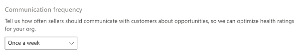
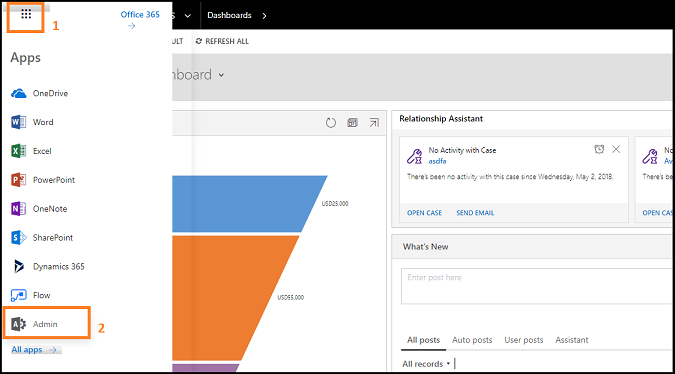
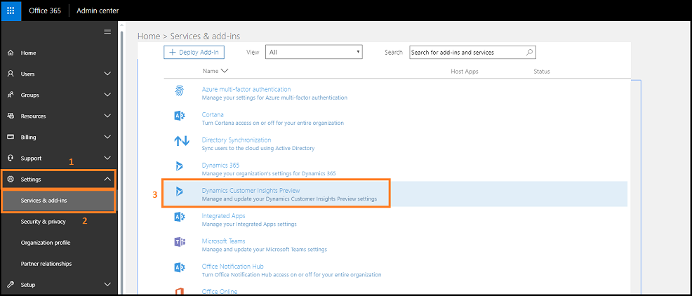
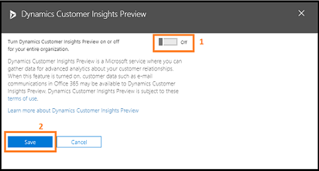
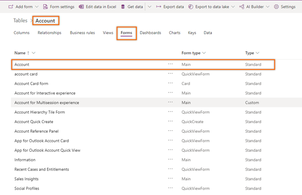

# Configure relationship analytics and health

Relationship analytics provides graphical representation of KPIs and activity histories for any contact, opportunity, lead, or account to the users. 

To configure relationship analytics, follow these steps:   
1. Verify that advanced Sales Insights features are enabled. To learn more, see [Install and configure premium Sales Insights features](intro-admin-guide-sales-insights.md#install-and-configure-premium-sales-insights-features).    
2. Go to **Change area** in the lower-left corner of the page and select **Sales Insights settings**. 

    > [!div class="mx-imgBorder"]
    >     
    
3. On the site map, under **Relationship insights**, select **Relationship analytics**. 

    The configuration page opens.   
    
4. Select the toggle to enable relationship analytics for your organization and then select **Save**.    

    > [!div class="mx-imgBorder"]
    >   
    
    > [!NOTE]
    > **Data sources** and **Relationship analytics with modern design and similar opportunities** are enabled by default.  
    
    The application takes few seconds to enable relationship analytics for your organization. After relationship analytics is enabled, you can configure the parameters as required.    

5. To view similar opportunities, under the **Relationship analytics with modern design and similar opportunities** section, turn on the **Enabled** toggle. By default, this option is enabled when you enable relationship analytics for your organization.   

    > [!div class="mx-imgBorder"]
    >  
    
    By enabling this option, users in your organization can see an improved relationship analytics tab for opportunities. The tab displays customer interaction KPIs along with suggestions calculated from similar won opportunities through AI-driven models.   
    
    If you don't want to view the similar opportunities in your organization, you can select the toggle and disable. The older version of relationship analytics is available for users. 
    
    For newly configured organizations, the enhanced relationship analytics is available by default for contacts, opportunities, leads, and accounts. 
    
    > [!NOTE]
    > - You must have at least 30 won and 30 lost opportunities to compare with existing opportunities.
    > - To understand how users use this feature, see [View similar opportunities](relationship-analytics.md#relationship-analytics-with-similar-opportunities).   
    
6. To show the relationship health score in opportunities, views, and charts, set the toggle to **On**.    

    > [!NOTE]
    > You can disable the option if you don't wish to display the score in opportunities, views, and charts. However, disabling the option does not affect the process of gathering the relevant health data.   
    
    > [!div class="mx-imgBorder"]
    >  
    
7. Adjust the importance of activities of different types as they contribute to the relationship health score.  

    Businesses place different emphasis on the type of communication used with customers. The activities include, Emails, Meetings, Phone calls, and Tasks. 
    
    > [!div class="mx-imgBorder"]
    > 
    
8. Choose **Communication frequency**.     

    Businesses have varying sales cycles and different expected levels of communications with customers. A longer expected communications frequency reduces the expectation of more recent frequent communications in the health score. A shorter expected communications frequency increases the expectation of more recent frequent communications in the health score. 
    
    > [!div class="mx-imgBorder"]
    >     
    
9.  Set **Health score grading** for health scores to grade opportunities.  

    When health score is calculated, the opportunities in your organization's pipeline are graded according to the range defined in this section. Each opportunity in the pipeline is graded Good, Fair, or Poor, according to the health score. Opportunities in the top score range are graded Good while records within the lowest score range are graded Poor.  
    
    You can configure the range for the grading according to your organizational requirements. When you change the health score range for a grade, the maximum range value for the adjacent grade changes automatically in accordance with the change in the minimum value. For example, when you change the minimum range value score for Good to 60, the maximum lead score range for Fair changes to 59.    
    
    After setting the values, the initial grading of opportunities can take up to 24 hours.
    
    > [!div class="mx-imgBorder"]
    >     
    
10. Select **Save**.   

    Relationship analytics is ready to use in your organization.   

## Allow to collect information from Exchange server 

Enable the **Dynamics 365 Sales Insights – Analytics** option in the admin center to collect valuable information about communications&mdash;such as emails and meetings&mdash;for users in your organization from Exchange server. This data is used in analytics features for salespeople and sales managers. When you enable, the **Exchange Data** option on the relationship analytics configuration page is automatically selected. 

Follow these steps:    
1. Go to the **Admin** center.    
    > [!div class="mx-imgBorder"]
    >    
    
2. Select **Settings** > **Settings** > **Dynamics 365 Sales Insights – Analytics**.    
    > [!div class="mx-imgBorder"]
    >     
    
3. Read the description carefully, select the **Allow org data to be used by ‎Dynamics 365 Sales Insights - Analytics**‎ option, and then select **Save changes**.    
    > [!div class="mx-imgBorder"]
    >     
    
    Now you can connect to the Exchange server to collect data.

## Add the health score widget to a form

By default, the health score widget is available only in the out-of-the-box **Sales Insights** form. If you're using customized forms, you can display the health score widget on your custom forms by following these steps.

> [!IMPORTANT]
> - Adding health score widget is only supported in Unified Interface apps.
> - You can't use the legacy form designer to add a health score widget to a form.

1. Sign in to the [Power Apps](https://make.powerapps.com/) portal.    
    > [!div class="mx-imgBorder"]  
    >     
2. Search for and select your organization's environment.    
    > [!div class="mx-imgBorder"]    
    >     
3. Select **Data** > **Tables**.   
    The **Tables** page opens with the list of tables.   
    > [!div class="mx-imgBorder"]  
    >    
4. Open the table, select the **Forms** tab, and then select a main form to add the widget to. In this example, the table **Account** is selected and the main form **Account** is selected.   
    >[!NOTE]
    >If you're unable to view the table to which you want to add the widget, in the upper-right corner of the page, change the filters settings to **All**.     
    
    > [!div class="mx-imgBorder"]  
    >     
5. In the form designer, select **Component**, and then from **Layout**, add a column to the form as a placeholder to add the widget.    
    > [!div class="mx-imgBorder"]  
    >    
7. From the site map, select **Display** > **Relationship Health**.    
    >[!NOTE]
    >Ensure that the added placeholder column is selected. If it isn't, the widget will be added at a random place in the form.   

    > [!div class="mx-imgBorder"]   
    >    
8. In the **Edit relationship health** pop-up window, select **Done**.    
    > [!div class="mx-imgBorder"]  
    >     

    The health score widget is added to the form.     
    >[!NOTE]
    >To hide the **New section** label, go to the **Properties** tab of the **New Section** settings pane that is displayed on the right side of the page, and then select **Hide label**.     
9. Save and publish the form.   

### See also

[Use relationship analytics to gather KPIs](../sales/relationship-analytics.md)  
[Opt out of relationship analytics (GDPR)](optout-relationship-analytics-gdpr.md)  
[GDPR for Sales Insights](embedded-intelligence-gdpr.md)  
[View and export KPI data (GDPR)](view-export-KPI-data-gdpr.md)  