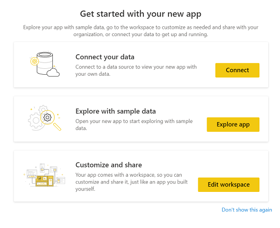
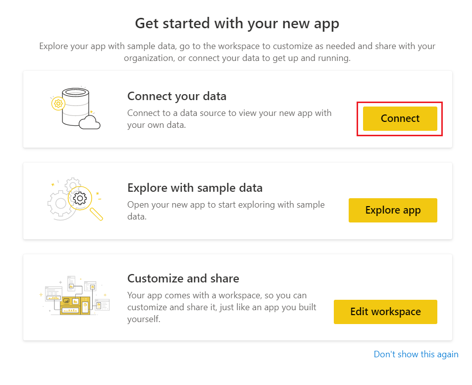
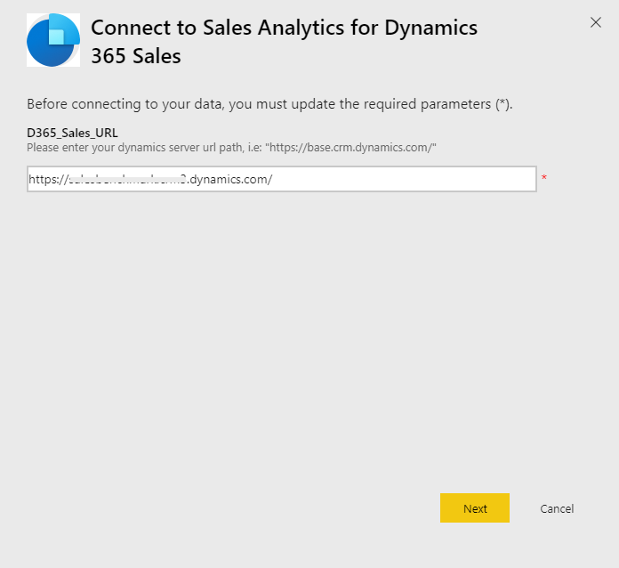
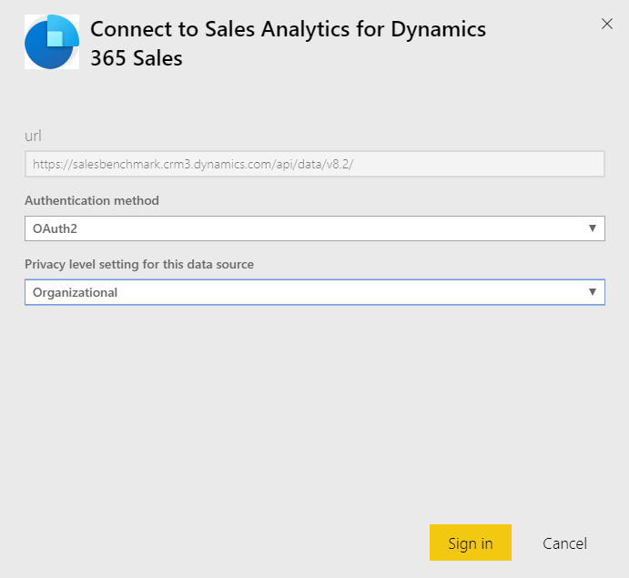
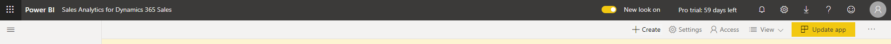
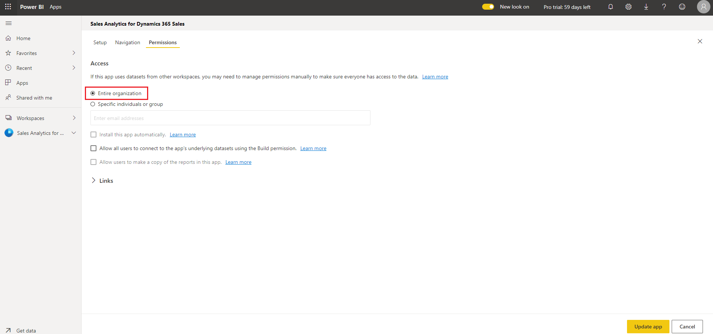
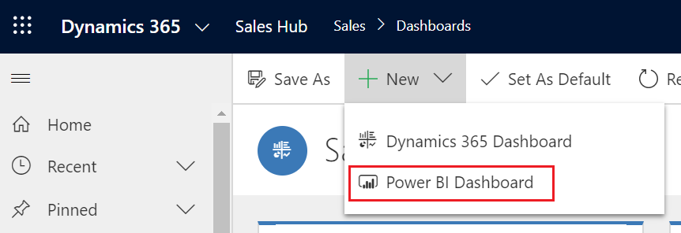
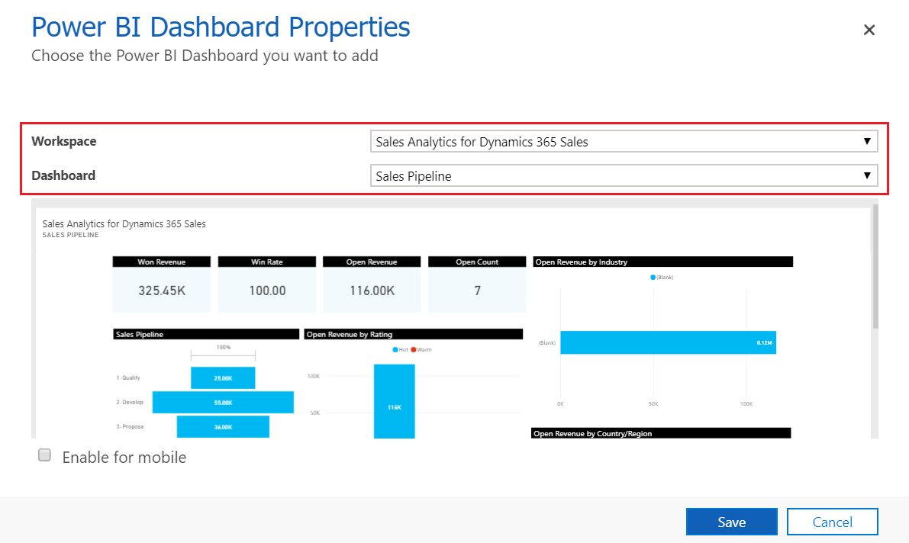
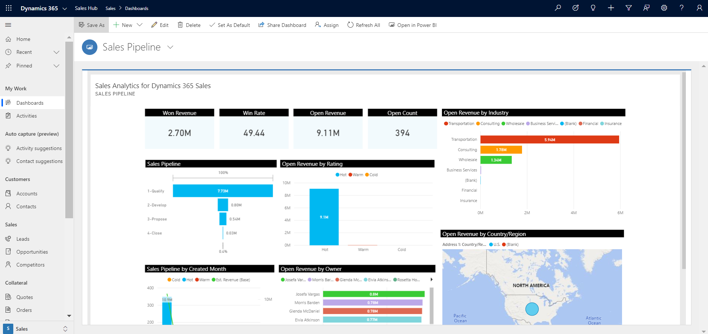

# Configure Power BI template apps to work with Dynamics 365 Sales

You must perform the following steps to configure Sales Analytics for Dynamics 365 Sales or Process Analytics for Dynamics 365:

1. [Review the prerequisites](#step-1-review-prerequisites).
2. [Install the Power BI template app](#step-2-install-the-power-bi-template-app).
3. [Connect your Dynamics 365 Sales organization to the Power BI template app](#step-3-connect-your-dynamics-365-sales-organization-to-the-power-bi-template-app)<!--I assume this applies to Process Analytics for Dynamics 365 also? Even though "Sales" isn't part of the product name?-->.
4. [Configure the refresh frequency for the Power BI dataset](#step-4-configure-the-refresh-frequency-for-the-power-bi-dataset).
5. [Publish the application within your organization](#step-5-publish-the-application-within-your-organization).
6. [Enable Power BI reporting in the Common Data Service platform (optional)](#step-6-enable-power-bi-reporting-in-the-common-data-service-platform).
7. [Add the Power BI Dashboard to the Sales Hub app (optional)](#step-7-add-power-bi-dashboards-to-the-sales-hub-app).

> [!NOTE]
> In the following steps, you'll configure the Sales Analytics for Dynamics 365 Sales app. You can follow the same steps to configure the Process Analytics for Dynamics 365 app.

### Step 1: Review prerequisites

Review the following prerequisites before configuring the Power BI template apps:

- You have administrative privileges for Dynamics 365 and Power BI.
- You have a Power BI Pro license for all users of the reports or dashboards in the Power BI template apps.

### Step 2: Install the Power BI template app

1.  Sign in to the [Power BI](https://app.powerbi.com/) app as an administrator.

2.  Open the [Sales Analytics template app](https://go.microsoft.com/fwlink/p/?linkid=2121603) link.
<!--You've said that this procedure applies to the Sales Analytics app, so you either need to cover the alternative steps for Process Analytics throughout, or stick with the installation for Sales Analytics.
    - [Process Analytics template app](https://go.microsoft.com/fwlink/p/?linkid=2121604)-->

3.  Install the Power BI template app.

4.  After the Power BI template app is installed, the app configuration options page is displayed.

    > [!div class="mx-imgBorder"]
    > 
<!--You don't need to prepare the reader for the next step. The numbers in the procedure take care of that already.-->

### Step 3: Connect your Dynamics 365 Sales organization to the Power BI template app

1.  On the Power BI template app configuration options page, select **Connect**.

    > [!div class="mx-imgBorder"]
    > 

2.  On the connect data page, enter the URL for your Dynamics 365 organization<!--Edit okay?-->, and then select **Next**.

    > [!div class="mx-imgBorder"]
    > 

3.  For **Authentication method**, select **OAuth2** and for **Privacy level**, select **Organizational**. Select **Sign in**.

    > [!div class="mx-imgBorder"]
    > 

4.  Enter your Dynamics 365 Sales credentials, and then select **Enter**.
<!--I've removed the indent from the the last line here (and in some of the following sections) because it's a conclusion for the whole section, not just step 4 within this section.-->
When you're signed in, the existing report will be updated with the data from your organization.

### Step 4: Configure the refresh frequency for the Power BI dataset

After you connect the Power BI template app with Dynamics 365 Sales, you need to configure the refresh frequency on the Power BI dataset to update reports and dashboards properly.

1.  Sign in to Power BI as an administrator.

2.  Go to the Power BI template app workspace.
 
3.  On the **Datasets** tab, select **Settings**.

    > [!div class="mx-imgBorder"]
    > 
 
4.  Under **Scheduled refresh**, turn on the **Keep your data up to date** toggle<!--This is via Writing Style Guide. Edit assumes that the UI in the screenshot is current.-->.

    > [!div class="mx-imgBorder"]
    > 

> [!NOTE]
> We recommend that you set **Refresh frequency** to **Daily**.

### Step 5: Publish the application within your organization

You must share the configured application with your entire organization for users to view the dashboards and reports by using their own Power BI Pro accounts.

1.  On the app workspace, select **Update app**.

    > [!div class="mx-imgBorder"]
    > 

<!--2.  On the Update app page, go to the **Permissions** tab.-->
<!--It's rare that UI actually includes a named wizard anymore. If the following screenshot appears after the user selects **Update app**, you don't need any more location information.-->

2.  On the **Permissions** tab, select **Entire organization**, and then select **Update app**.

    > [!div class="mx-imgBorder"]
    > 

The app is now available to install for all individuals in your organization.

### Step 6: Enable Power BI reporting in the Common Data Service platform

As an administrator, you must enable Power BI reporting in the Common Data Service platform<!--I don't think either "platform" or "environment" are correct as descriptors for Common Data Service, but I do see that "platform" is used throughout the Sales Enterprise folder (though not consistently). When you have time, would you be willing to check the Writing Style Guide *platform* and *operating environment* entries and see whether you agree? I think we should be consistent about this. --> for sales managers to view the dashboards in the Sales Hub app.

1.  Sign in to the Common Data Service platform, and then go to **Settings**.

2.  Select **Administration** > **System Settings**.

3.  On the **Reporting** tab, turn on the **Allow Power BI visualization embedding** toggle.

    > [!div class="mx-imgBorder"]
    > 
 
### Step 7: Add Power BI dashboards to the Sales Hub app

Each sales manager must configure their environment to integrate the Sales Analytics for Dynamics 365 Sales dashboard.

1.  Sign in to Dynamics 365 Sales, and then open the **Sales Hub** app.

2.  Under **My Work**, select **Dashboards**.

3.  Select **New** > **Power BI Dashboard**.

    > [!div class="mx-imgBorder"]
    > 
 
4.  For **Workspace**, select **Sales Analytics for Dynamics 365 Sales**. For **Dashboard**, select **Sales Pipeline**.

    > [!div class="mx-imgBorder"]
    > 
 
5.  Select **Save**, and then select **Close**.

     > [!div class="mx-imgBorder"]
    > 

The Sales Analytics for Dynamics 365 Sales dashboard is now available in Dynamics 365.

<!--I'm a bit confused by the structure here. The following section seems to have been written as a separate article that doesn't refer back to the previous section. Can it be published separately? If it must be published in this article, the article needs to introduce another H2 up above. You can't skip from H1 to H3 to H2, and you need to have more than one  have only one H2. By which I mean something like:

# Capture and customize Power BI template apps for Dynamics 365 Sales
_Need an introduction here_
## Configure Power BI template apps for Dynamics 365 Sales
### Step 1
### Step 2
...etc.
## Customize Power BI template apps for Dynamics 365 Sales
### Prerequisites
...etc.
-->
## Customize Power BI template apps for Dynamics 365 Sales

> [!IMPORTANT]
> Microsoft doesn't support customizations made to the Power BI template app and doesn't provide updates after modifications are made.

Power BI is a comprehensive collection of services and tools that you use to visualize your business data. Power BI Template apps make it easy to visualize and analyze the sales data with Power BI based on a standard data model. The Sales Analytics for Dynamics 365 Sales and Process Analytics for Dynamics 365 Power BI template apps are built with a set of entities and fields that are useful for most reporting scenarios.

Dynamics 365 apps are often extended with custom fields. These custom fields don't automatically show up in the Power BI model. This section describes how you can edit and extend the report included in the template app to include custom fields in the Power BI model.

Before you customize the template app, read the information here and perform each task, as necessary.

### Prerequisites

- [Power BI service registration](https://powerbi.com/)
- [Power BI Desktop](https://powerbi.microsoft.com/desktop/) application for editing Power BI reports
- Power BI report for the template app that you want to customize:
    - [Download the Power BI report for Sales Analytics for Dynamics 365 Sales](https://go.microsoft.com/fwlink/p/?linkid=2121605)
    - [Download the Power BI report for Process Analytics for Dynamics 365](https://go.microsoft.com/fwlink/p/?linkid=2121504)

### Prepare a PBIX for customization

1.  Start Power BI Desktop.

2.  Select **File** > **Open**. Open the .pbix file you want to edit<!--The reader will know which one to choose?-->, and then select **Open**.

    Several pages of reports are loaded and displayed in Power BI Desktop.

3.  On the Power BI Desktop ribbon, select **Edit Queries**.

4.  In the left navigation pane of the **Edit Queries** window, under **Queries**, select the D365_Sales_URL query, and then on the ribbon, select **Advanced Editor**.

    In the source definition, replace the placeholder value with the URL of your app's instance. For example, if the organization name is _Contoso_, the URL looks like this: Source = `https://contoso.crm.dynamics.com`

5.  Select **Done**, and then select **Close & Apply** in the Query Editor.

6.  When the **Access an OData feed** dialog box appears, select **Organizational account**, and then select **Sign in**.
 
7.  When the sign-in field appears, enter your credentials to authenticate to your instance.

8.  In the **Access an OData feed** dialog box, select **Connect**.

It might take several minutes for the queries to be updated.

### See also

[Analyze your sales data by using Power BI template apps](introduction-sales-template-apps.md)