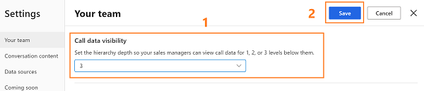
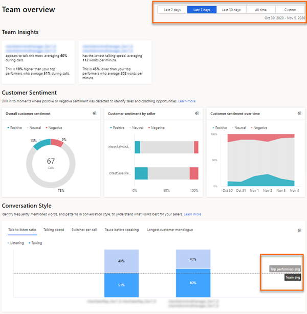
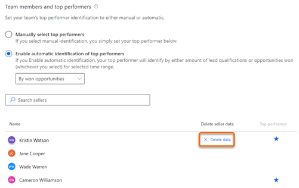

# Configure and view your team page

As an administrator, you can:

-	Configure the levels of hierarchy that you can view. 
-	Select the top performers in your hierarchy.  
-	Delete seller data.

As a sales manger, you can: 

-	View the list of employees who are part of your hierarchy.
-	Select the top performers in your hierarchy.

## Open your team settings page

> [!NOTE]
> Review the prerequisites. To learn more, see [Prerequisites to configure conversation intelligence](prereq-sales-insights-app.md).

**In conversation intelligence app**   
1.	Open the **Conversation intelligence** application.  
2.	Select the **Settings** icon on the top-right of the page and then select **Settings**.  
    > [!div class="mx-imgBorder"]
    >   
3.	On the **Settings** page, select **Your team**.  
    Your team page opens and you can perform the following tasks:  
        - [Configure hierarchy levels](#configure-hierarchy-levels)  
        - [Choose top performers](#choose-top-performers)  
        - [Delete seller data](#delete-seller-data)  

**In Sales Hub app**  
1.	Go to **Change area** in the lower-left corner of the page and select **Sales Insights settings**.  
    > [!div class="mx-imgBorder"]
    >   
2.	In the configuration page, under **Productivity**, select **Conversation intelligence**.  
    > [!div class="mx-imgBorder"]
    > 
3.	Select **Your team**.  
    Your team page opens and you can perform the following tasks:  
        - [Configure hierarchy levels](#configure-hierarchy-levels)  
        - [Choose top performers](#choose-top-performers)  
        - [Delete seller data](#delete-seller-data)  

## Configure hierarchy levels    
1.	Choose the hierarchy level from the **Call data visibility** list to display team members for managers. You can choose up to a maximum of three levels. To learn more, see [understand hierarchy levels](#understand-hierarchy-levels).  
    A list of team members is displayed under **Team members and top performers**. The list consists of team members who report to the manager in Dynamics 365 and Azure Active Directory (AD), including those who don't have access to conversation intelligence.   
    The application automatically updates the list every 24 hours and displays the current active team members in the manager's hierarchy.     
    > [!div class="mx-imgBorder"]
    >     
2.	Save the configuration.  

### Understand the hierarchy levels
Let’s look at the example to understand hierarchy levels:   
The matrix explains which data you’ll view as a sales manager, for different hierarchy levels.    
> [!div class="mx-imgBorder"]  
>    

| Managerial level	| View user hierarchy |
|-------------------|---------------------|
| Level 1 | Choose this option to get insights on your direct team members. |
| Level 2 | Choose this option to get insights on both your direct team members and their direct team members. |
| Level 3 | Choose this option to get insights on level 1, level 2, and level 2’s team members. |

> [!NOTE]
> Conversation intelligence supports up to three levels of hierarchy. To learn more about hierarchy, see [Set up Manager and Position hierarchies](https://docs.microsoft.com/power-platform/admin/hierarchy-security#set-up-manager-and-position-hierarchies).

## Choose top performers    
The top performers who are selected here are compared against other sellers in your team to project how the other sellers are performing based on best practices conversational style KPIs. Those are displayed with relevant data on the home page in [What characterizes top sellers?](../sales/dynamics365-sales-insights-app-home-page.md#what-characterizes-top-sellers).  
1. Under **Team members and top performers**, you can choose the top performers manually or let the application choose automatically. Select an option as necessary.  
    - **Manually select top performers**: Allows you to manually choose the top performers from the list of sellers. Under the **Top performer** column, select the star icon corresponding to a seller.          
        > [!div class="mx-imgBorder"]
        >   
    - **Enable automatic identification of top performers**: Allows the application to automatically select the top performers based on the amount of leads they qualified or opportunities they won. When you select to automatically select top performers, the drop-down list is enabled to choose **by won opportunities** or **by lead qualification**. Choose an option appropriate.     
        > [!div class="mx-imgBorder"]
        >   
        >[!NOTE]
        >when choose to select top performers automatically, conversation intelligence identify the top performers based on the KPIs you stated and they are updated by the relevant time range that is selected in the application.  
        >  
2.	Save the configuration. 

## Delete seller data 
You can delete seller’s data when a seller is not reporting to you, moved to another team, leaving your organization, or seller requests to delete data. This data includes the seller’s statistics and call history.  
1. Hover over the seller's name for who you want to delete the data. Under the **Delete sellers data** column, select **Delete data**.  
    > [!div class="mx-imgBorder"]
    >   
    The selected seller data is deleted from conversation intelligence.  
2.	Save the configuration.     

## View your team   
As a sales manager, when you open the **Your team** page in settings, you can view the list of team members within your hierarchy, regardless of whether they have conversation intelligence licenses or not. Team members in the displayed list are based on Dynamics 365 and Azure AD.     
The list is updated every 24 hours to display the current active sellers in the manager's hierarchy. Also, you can select **Refresh now** to refresh the list right away and view any changes.    
> [!NOTE]
> To view this page, sales managers must have a manager hierarchy defined under them, with sellers or individuals added to the hierarchy. Currently, only administrators can change levels of hierarchy. For sales managers to change it, they should contact an administrator to change the hierarchy on their behalf. More information: [Configure hierarchy levels](#configure-hierarchy-levels).

### See also

[Prerequisites to configure conversation intelligence](prereq-sales-insights-app.md)      
[Improve seller coaching and sales potential with conversation intelligence](dynamics365-sales-insights-app.md)
