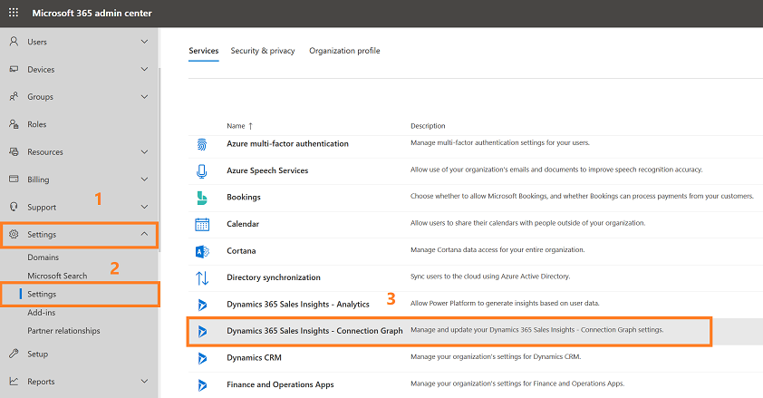
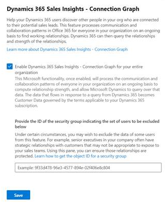
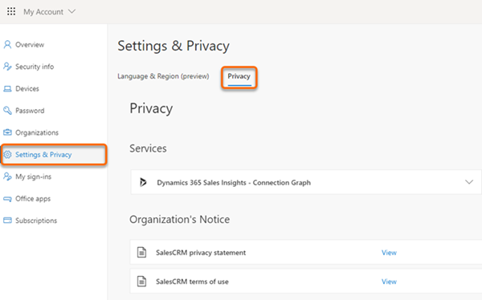

# Configure who knows whom

The who knows whom feature helps users to quickly identify colleagues within their organization who can introduce them to leads or contacts.

>[!NOTE]
><ul><li>Who knows whom is currently available in Europe, Middle East, and Africa (EMEA) and North American (NAM) regions.</li><li>For Office 365 data, you organization's data location must be in one of the following locations and not in your region-specific datacenter location:
> <ul><li>Global Geography 1 – EMEA (Austria, Finland, France, Ireland, Netherlands)</li><li>Global Geography 2 – Asia Pacific	(Hong Kong, Japan, Malaysia, Singapore, South Korea).</li><li>Global Geography 3 – Americas (Brazil, Chile, United States).</li></ul>More information: [Datacenter locations](https://docs.microsoft.com/microsoft-365/enterprise/o365-data-locations?view=o365-worldwide#data-center-locations)</ul>

To configure who knows whom, follow these steps:

1. Verify that advanced Sales Insights Add-in for Dynamics 365 features are enabled. More information: [Install and configure premium Sales Insights features](intro-admin-guide-sales-insights.md#install-and-configure-premium-sales-insights-features)

2.	Go to **Change area** and select **Sales Insights settings**.

    > [!div class="mx-imgBorder"]
    > 

3.  On the site map, select **Who knows whom** under **Connection insights**.

    > [!div class="mx-imgBorder"]
    > 

4. On the **Who knows whom** section, select **Turn on Who Knows Whom for your organization**.

    > [!div class="mx-imgBorder"]
    > 

5. Optionally, you can select an email template according to your organizational requirements. By default, an out-of-the-box email template will be selected.

6. Select **Save**.

The who knows whom feature is configured and ready to use in your organization.

## Enable the connection graph

After you enable the who knows whom feature in your organization, verify that the connection graph is enabled in the admin center. This allows [!INCLUDE[pn-dyn-365-sales](../includes/pn-dyn-365-sales.md)] to collect the communication and collaboration details of users from Exchange server.

> [!NOTE]
> Contact your Microsoft 365 administrator to enable the Sales Insights connection graph if you don't have sufficient privileges to enable it.

To configure the Sales Insights connection graph, follow these steps:

1. Go to the **Admin** center.

    > [!div class="mx-imgBorder"]
    > 

2. Select **Settings** > **Services & add-ins** > **Dynamics 365 Sales Insights – Connection Graph**.

    > [!div class="mx-imgBorder"]
    > 

3.  Read the description carefully and then select the **Enable Dynamics 365 Sales Insights - Connection Graph for your entire organization**‎ option.

    > [!div class="mx-imgBorder"]
    > 

4. (Optional) If you don't want to collect information about a group of users in your organization, add their group ID in the text box. 

5. Select **Save**.

## Opt out of the connection graph

As a user, you can always choose to opt out of the connection graph if you don't want Sales Insights to analyze your communication and collaboration data. 

>[!NOTE]
>You can only opt out of the connection graph if your Office 365 organization is in the EMEA or Asia Pacific global geography. More information: [Datacenter locations](https://docs.microsoft.com/microsoft-365/enterprise/o365-data-locations?view=o365-worldwide#data-center-locations)

1. Sign in to your [Office 365 account](https://myprofile.microsoft.com/).

    > [!div class="mx-imgBorder"]
    > 

2. Select **Settings & Privacy**, and then select the **Privacy** tab. 

    > [!div class="mx-imgBorder"]
    > 

3. In the **Services** section, select the arrow next to **Dynamics 365 Sales Insights - Connection Graph**.  

    > [!div class="mx-imgBorder"]
    > 

4. Turn off the **Include my data** toggle.

    > [!div class="mx-imgBorder"]
    > 

After you opt out of the connection graph, Sales Insights won't analyze your data.

### See also

[Get introduced to a lead](../sales/who-knows-whom.md)  
[Install and configure premium Sales Insights features](intro-admin-guide-sales-insights.md#install-and-configure-premium-sales-insights-features)
