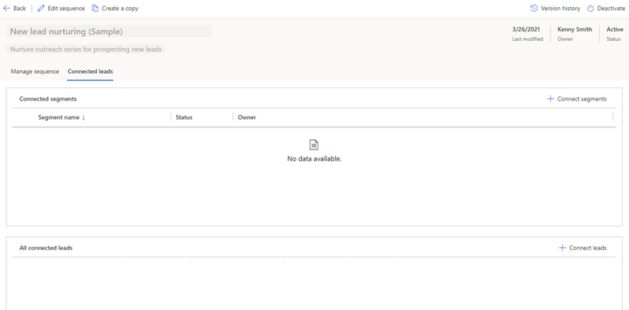
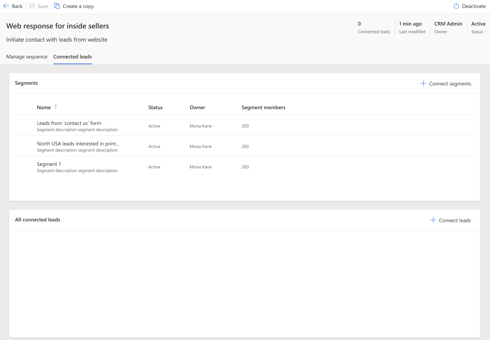

# Connect a segment to a sequence

After you create and activate a segment, you connect the segment to a sequence depending on the entity that you've created the sequence for. You can add segments to existing sequences. Open the sequences to view their details, and then add segments to them. More information: [View details of a sequence and its connected records](view-sequence-details-connected-records.md).  
<!--markdownlint-disable MD036-->
**To connect a segment to a sequence**
<!--markdownlint-enable MD036-->
>[!NOTE]
>In this procedure, we are using leads as example.

1. Sign in to your Dynamics 365 Sales Hub app.    
2. Go to **Change area** in the lower-left corner of the page, and select **Sales Insights settings**.    
3. Under **Sales accelerator**, select **Sequence**.    
4. On the **Sequences** page, select the **Active** tab.    
5. Select and open the sequence, and then go to the **Connected leads** tab.    

   >[!div class="mx-imgBorder"]
   >

6. From the **Connected segments** section, select **+ Connect segments**. 

   A list of available segments is displayed in the **Connect segments** window. If there are no segments connected to the sequence, an empty grid is displayed.

    1. Select the segments that you want to connect to the sequence.

       In this example, the segments **Leads from contact us form**, **North USA leads interested in printers**, and **South USA leads interested in laptops** are selected.

       >[!div class="mx-imgBorder"]
       >

    2. Select **Connect**. The selected segments are connected to the sequence, and include details such as status, owner, and number of records associated with the segment.

       >[!div class="mx-imgBorder"]
       >      

    3. Open each associated segment, and choose which records you want to connect to this sequence.   

    >[!NOTE]
    >To disassociate a segment from this sequence, select the segment, and then select **Disconnect**. In the confirmation message, select **Disconnect**.

8. Close the sequence.

### See also

[Create and activate a segment](create-and-activate-a-segment.md)   

[!INCLUDE[footer-include](../includes/footer-banner.md)]
