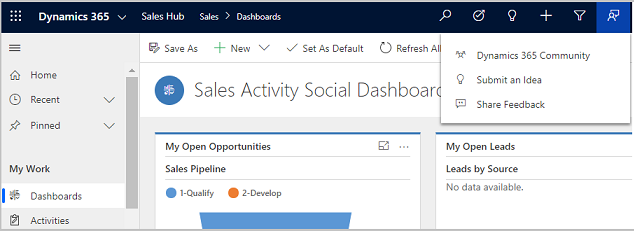

# Connect and share feedback for the Sales Hub app

The **Connect and share** capability in the Sales Hub app lets experts and peers connect with each other, submit ideas, and share any feedback that they have about the Sales Hub app.

## Connect through community and forum

To connect with experts and peers through Dynamics 365 Community, in your Sales Hub app, on the navigation bar, select **Connect and share**, and then select **Dynamics 365 Community**.

You’ll be taken to the Dynamics 365 Sales communities page where you can find valuable resources such as technical blogs, information on upcoming events, product updates, and so on.

## Submit an idea

To share an idea on how we can improve Dynamics 365 or to vote for ideas that others have suggested, on the navigation bar, select **Connect and share**, and then select **Submit an Idea**.

You’ll be taken to the Dynamics 365 Sales Ideas page.

## Share feedback

1.  To submit feedback around anything in the Sales Hub app, select **Connect and Share** on the navigation bar, and then select **Share Feedback**.

2.  On the **Feedback** page, choose what kind of feedback you have.

    

3.  After you select an option, use the text box to enter additional information about your feedback. You have an option to enter your email. Microsoft Support may use this email to contact you for more information. When done, select **Submit**.

    

### See also

[Sales Overview (Dynamics 365 Sales)](overview.md)  

[!INCLUDE[footer-include](../includes/footer-banner.md)]
