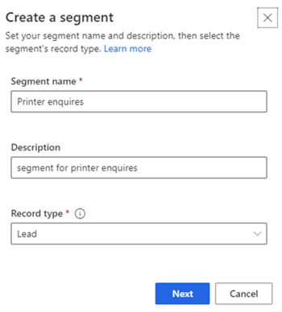
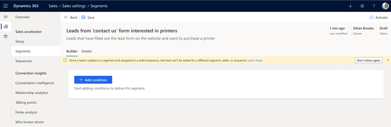

# Create and activate a segment

As a sequence manager, you create segments&mdash;groups of records&mdash;by defining different conditions for each segment. After a segment is activated and a record satisfies the conditions that are defined in the segment, the record becomes a member of the segment. A sequence that's connected to the segment is then automatically connected to records in the segment. You don't have to manually connect the sequence to a new record when it's created in Dynamics 365 Sales.
<!--markdownlint-disable MD036-->
**To create and activate a segment**
<!--markdownlint-enable MD036-->
1.	Sign in to your Dynamics 365 Sales Hub app.    
2.	Go to **Change area** in the lower-left corner of the page, and select **Sales Insights settings**.   
3.	Under **Sales accelerator**, select **Segments**.   
4.	On the **Segments** page, select **+ New segment**.

    The **Create a segment** dialog opens.

    >[!div class="mx-imgBorder"]
    >          
 
5.	In the **Create a segment** dialog, enter the following information:     

    | Parameter | Description |
    |-----------|-------------|
    | Segment name | The name of the segment. |
    | Description | A description of the segment (optional). |
    | Record type | The type of record to be grouped in this segment. By default, the **Lead** record type is selected. Currently, only leads and opportunities are supported. |
	
6.	Select **Next**.   

    The segment designer page opens.    
    >[!div class="mx-imgBorder"]
    >

7.	On the **Builder** tab, under **AND**, select **+ Add**. Use the following options to define the criteria for the conditions to use for evaluating records:     

    -	**Add row**: Add conditions for when the segment should be applied. For example, you can add rows to specify that this segment be applied to leads created by the user John Thomas.    
        1.	Select an attribute from the dropdown list in the first column.    
        2.	Select an operator from the dropdown list in the second column.    
        3.	Enter a value to filter by in the third column.   
            >[!div class="mx-imgBorder"]
            >          
        
            Similarly, you can create more conditions to further filter the leads to apply the segment to.    

    -	**Add group**: Add multiple conditions as a group to your segment if you want to filter leads by using more than one field.   

        1.	Select **AND** or **Or** to group the conditions.     

            >[!div class="mx-imgBorder"]
            >        

        2.	Select the conditions that you want to add to the group.    

            >[!div class="mx-imgBorder"]
            >        

        3.	When you select **AND**, this segment is only applied to leads that meet both criteria. When you select **Or**, the segment is applied to leads that meet any of the filter criteria. For example, to apply this segment to leads that are created by Kenny Smith and have the company name Contoso, select **AND**.

            Similarly, you can create multiple groups and further filter the leads based on the conditions defined in the groups.    

    -	**Add related entity**: Add a condition based on the attributes of related entities.   
        Select an attribute from the **Related Entity** list in the topmost field, and then choose **Contains data** or **Does not contain data**. This enables the condition section.   

        >[!div class="mx-imgBorder"]
        >        

        Define the condition as required.   

8.	To verify that conditions for the segment work as defined, select **Simulate results**.    

    A list of records that satisfy the conditions you've defined for the segment in the application are displayed.    
    >[!NOTE]
    >The records displayed here are only simulated results; they might not be records that the segment can actually be applied to.   

    >[!div class="mx-imgBorder"]
    >       
 
9.	Select **Activate**.    

The segment is activated. Now you can connect the segment to a sequence or a record. 

<table>
<tr><td>

> [!div class="nextstepaction"] 
> [Next step: Connect a segment to a sequence](connect-a-segment-to-sequence.md)
</td></tr>
</table> 

### See also

[Manage segments](manage-segments.md)

[!INCLUDE[footer-include](../includes/footer-banner.md)]

