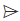
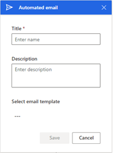
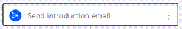

# Create and activate a sequence

Every organization has its own selling processes for sellers to follow. A sequence helps sellers overcome any inconsistencies in training or lack of documentation as they progress through the sales journey. When you create a sequence, you define the activities you want your sellers to perform&mdash;and the order to perform them in&mdash;as they handle records. This lets sellers concentrate on selling and gives them a better understanding of what to do next.

**To create and activate a sequence**

1. Sign in to your sales app.   
2. Go to **Change area** in the lower-left corner of the page, and select **Sales Insights settings**.   
3. Under **Sales accelerator**, select **Sequence**.  
4. On the **Sequences** page, select **+ New sequence**.   
    > [!div class="mx-imgBorder"]
    >    
5. In the **Create a sequence** dialog, enter the following information:   

    | Parameter | Description |
    |-----------|-------------|
    | Sequence name | The name of the sequence. |
    | Description | A description of the sequence. (Optional) |
    | Entity | The entity type for which you want to apply this sequence. By default, the Lead entity type is selected. |   
6. Select **Next**.   
7. Choose and configure one of the following activities:   
    > [!div class="mx-imgBorder"]
    >        
    - **Email**: Creates an email activity for sellers to communicate with customers. When this activity is shown to the seller, an envelope icon is displayed on the record. When a seller selects the icon, an email composer opens with a template, if one was selected. If no template was selected, an empty email composer opens.  
       > [!div class="mx-imgBorder"]
       >     

       Enter the following information to configure the email activity, and then select **Save**:   
       1. A name and description for the activity. The information you enter here will be displayed to sellers.   
       2. If templates are available for your organization, in the **Assign email template** box, select the template you want to assign for this step.   

          > [!div class="mx-imgBorder"]
          >    

        You can define conditions for an email activity to determine the branch that the sequence moves to as the next step. More information: [Define conditions for email activity](adaptive-sequence.md#define-conditions-for-email-activity)      

    - **Automated email**: Creates an automated email activity for sellers to communicate with customers. When this activity is shown to the seller, a send icon  is displayed on the record. The email is automatically sent to the customer based on the selected template.    
        >[!TIP]
        >Add a **Set wait time** activity before the **Automated email** activity. Adding wait time provides a time gap between the previous step and sending the automated email. If the time gap isn't configured, the automated email will be sent immediately after the previous activity is completed, which won't give sellers the time they might need to take action on the automated email activity.    

        >[!NOTE]
        >Verify that required email templates are created in your organization. More information: [Create templates for email](/power-platform/admin/create-templates-email)   

        > [!div class="mx-imgBorder"]
        >    

        Enter the following information to configure the automated email activity, and then select **Save**:    
        -	A name and description for the activity. The information you enter here will be displayed to sellers.
        -	An email template that you want to assign for this step in the **Select email template** box.   

        > [!div class="mx-imgBorder"]
        >    

        You can define conditions for automated email activity to determine the branch that sequence moves to next step. More information: [Define conditions for email activity](adaptive-sequence.md#define-conditions-for-email-activity).   

    - **Phone call**: Creates a phone call activity for sellers to communicate with customers. When this activity is shown to the seller, a phone icon is displayed on the record. When sellers select the icon, a softphone appears on the app to dial the customer.    
        > [!div class="mx-imgBorder"]
        >     

        Enter a name and description for the phone call activity, and then select **Save**. The information you enter here will be displayed to sellers.   
        > [!div class="mx-imgBorder"]
        >     

        You can define conditions for phone call activity to determine the branch that sequence moves to next step. More information: [Define conditions for phone call activity](adaptive-sequence.md#define-conditions-for-phone-call-activity).      
    - **Task**: Creates a custom activity that you define&mdash;such as scheduling a meeting with the customer&mdash;that isn't specified in the activity selector.   
        > [!div class="mx-imgBorder"]
        >     

        Enter the name and description of the custom activity, and then select **Save**. The information you enter here will be displayed to sellers.   
        > [!div class="mx-imgBorder"]
        >    
    - **Set wait time**: Specifies the interval between activities&mdash;that is, after an activity is completed and before the next activity occurs&mdash;during which sellers need to wait. A sequence can't end with this activity.    
        When this activity is shown to sellers on a record, they don't need to perform any action; they simply need to wait until the wait time expires before they perform the next activity.   
        > [!div class="mx-imgBorder"]
        >    

        Choose the duration in days and hours that you want sellers to wait before they perform the next activity, and then select **Save**. The maximum wait time is 30 days.   
        > [!div class="mx-imgBorder"]
        >    

    - **Advance to another sequence**: Transfers the sequence control from the current sequence to the selected sequence. For example, you defined a sequence **S1** and attached a sequence **S2** after an initial activity of sending an introduction email. when **S1** is attached to a record and seller completes the initial task of sending an introduction email, the record starts displaying the activities defined in **S2**. The following are the considerations to use this activity:   
        - A sequence can't start with this activity
        - Other steps can't be added after this activity

        > [!div class="mx-imgBorder"]
        >         

        From the **Connect to** list, choose a sequence to attach. The list consists of the sequences that are active and related to the record type. Select **Save** and the activity is created.
        > [!div class="mx-imgBorder"]
        >        

8. Select the **Add** icon, and then repeat step 7 for all the activities that you want to add to the sequence.    
9. Select **More options** in the upper-right corner of the page, and then select **Save**.    
10. Select **More options** again, and then select **Activate** to activate the sequence.   
    >[!NOTE]
    >You can have up to 250 active sequences at a time in your organization.        
11. Select **Yes** in the confirmation message that appears.   
    > [!NOTE]
    > An error might occur if you've added **Set wait time** as the last activity of the sequence. You must delete this last **Set wait time** activity, and then save and activate the sequence.       
    The sequence is activated and listed in the sequence designer home page.   
    > [!div class="mx-imgBorder"]
    >     

Next, you connect the active sequence to lead or opportunity records. More information: [Connect a sequence to records](connect-a-sequence-to-records.md)

## Exit a sequence during the flow

By enabling the option to exit a sequence, you disconnect the sequence from its records when the criteria is met. For example, if the flow includes an email reply from the customer, the record will be disconnected from the sequence.

**Prerequisites**

Review the following requirements before you enable the **Exit the sequence** option:

- At least one email activity step is created in the sequence. 
- The sequence must be in inactive or revision state.
- [Configure the email engagement feature](configure-email-engagement.md) in your organization before you start using this option for the email activity.

**To configure the exit sequence criteria**

1.	Open the sequence, and then select **Options**.

    > [!div class="mx-imgBorder"]
    > 

2.	On the **Sequence Options** pane, turn on the **Exit a sequence** toggle to exit a sequence when a customer replies to any email in the sequence.  

    > [!div class="mx-imgBorder"]
    > 

3.	Select **Save**.

### See also

[Create and manage sequences](create-manage-sequences.md)     
[Adaptive sequences](adaptive-sequence.md)

[!INCLUDE[footer-include](../includes/footer-banner.md)]
