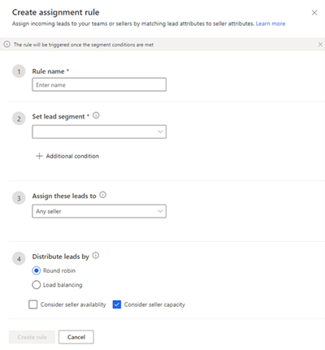
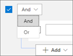
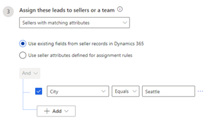
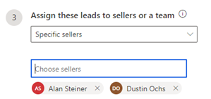
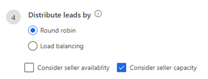

# Create and activate an assignment rule

As a sequence manager, you create an assignment rule by defining different conditions such as segment, sellers, and lead distribution. After a rule is activated and a lead satisfies the conditions that are defined in the rule, the lead is automatically assigned to a seller. You don't have to manually assign leads to sellers when they're created in Dynamics 365 Sales.

When a lead is created in an organization, assignment rules are applied from the top of the order in which they're listed. When the lead satisfies the conditions defined for a rule, that rule is applied to the lead. By default, rules are listed in the order in which they were created, with the most recent at the bottom. You can select and drag the rules into any order you want.

**To create and activate an assignment rule**

1.	Sign in to your Dynamics 365 Sales Hub app.   

2.	Go to the **Change area**  in the lower-left corner of the page, and select **Sales Insights settings**.   

3.	Under **Sales accelerator**, select **Assignment rules (preview)**.   

4.	On the **Assignment rules** page, select **+ New assignment rule**.
    The **Create assignment rule** pane opens.

    >[!div class="mx-imgBorder"]
    >   

5.	On the **Create assignment rule** pane, configure the rules as follows:

    -	**Rule name**: Enter a name for the rule.   

    -	**Set lead segment**: Select a [segment](create-and-activate-a-segment.md) to apply for this assignment rule. When the rule is activated, all leads in the segment will be assigned to sellers in accordance with the conditions defined in the rule.

        >[!NOTE]
        >If no segment is selected for a rule, or no segment is defined in the application, you can select the default segment that's applied on all leads.

        Also, you can configure more settings on how the leads in the segment must be assigned to sellers. Select **Additional condition** and then select **+ Add**. Configure the conditions as follows:

        -	**Add row**: Add conditions for when the segment should be applied. For example, you can add rows to specify that this segment be applied to leads created by the user **John Thomas**.

            1.	Select an attribute from the dropdown list in the first column.
            2.	Select an operator from the dropdown list in the second column.
            3.	Enter a value to filter by in the third column.

                >[!div class="mx-imgBorder"]
                >          
        
                Similarly, you can create more conditions to further filter the leads to apply the segment to.    

        -	**Add group**: Add multiple conditions as a group to your segment if you want to filter leads by using more than one field.

            1.	Select **AND** or **Or** to group the conditions.

                >[!div class="mx-imgBorder"]
                >        

            2.	Select the conditions that you want to add to the group.

                >[!div class="mx-imgBorder"]
                >        

            When you select **AND**, this segment is only applied to leads that meet both criteria. When you select **Or**, the segment is applied to leads that meet any of the filter criteria. For example, to apply this segment to leads that were created by Kenny Smith and have the company name Contoso, select **AND**. Similarly, you can create multiple groups and further filter the leads based on the conditions defined in the groups.

        -	**Add related entity**: Add a condition based on the attributes of related entities.
            Select an attribute from the **Related Entity** list in the topmost field, and then choose **Contains data** or **Does not contain data**. This enables the condition section.

            >[!div class="mx-imgBorder"]
            >        

    -	**Assign these leads to**: Choose an option to assign leads to sellers or teams.

        | Option | Description |
        |--------|-------------|
        | Any seller | Assign leads to any seller according to their availability, capacity, or distribution pattern. |
        | Seller with matching attributes | Assign leads to sellers who satisfy the conditions defined through attributes selected from Dynamics 365 or assignment rules. The following options are available:<ul><li>Use existing fields from seller records in Dynamics 365.</li><li>Use seller attributes defined for assignment rules. More information: [Manage seller attributes](manage-seller-attributes.md)</li></ul>For example, you want to assign leads to sellers who are based out of Seattle. Select the **Use existing fields from seller records in Dynamics 365** option, and then select **+ Add** > **Add row**. Enter the condition as **City** (attribute) **Equals** (condition) **Seattle** (value).  |
        | Specific sellers | Assign leads to specific sellers. Select the sellers from the **Choose sellers** lookup. **Note**: The security roles for sellers displayed in the list were added when the sales accelerator was configured. More information: step 4 in [Configure the sales accelerator](enable-configure-sales-accelerator.md)  |
        | Specific teams | Assign leads to a specific team. The lead will be available for all members of the selected team. The teams must be defined in your organization. More information: [Manage teams](/power-platform/admin/manage-teams#ownergroup-team-or-access-team) |

    -	**Distribute leads by**: This option is available only when you select a seller option in the **Assign these leads to** section.

        >[!NOTE]
        >The **Distribute leads by** option isn't available for teams.

        -	**Round robin**: Leads are distributed on a cyclical basis to sellers who are qualified to receive the lead, based on the assignment rule's conditions.

        -	**Load balancing**: Leads are distributed among sellers depending on their current workload. This helps ensure that sellers are equally busy.

        -	**Consider seller availability** (optional): Select this checkbox to take the availability of the seller into account when assigning leads. More information: [Configure your work availability](personalize-sales-accelerator.md#configure-your-work-availability)

            >[!NOTE]
            >- If sellers don't update their [work availability](personalize-sales-accelerator.md#configure-your-work-availability), the application always considers them as available and assigns them leads.   
            >- To assign leads, the application first considers those sellers who are currently available. If no seller is currently available, the application considers the sellers who will be available within 24 hours. If no seller is available within this timeframe, the application considers sellers who will be available within 48 hours. In this manner, the application verifies the sellers' availability up to 120 hours. If no seller will be available within the 120-hour limit, the lead isn't assigned.

        -	**Consider seller capacity** (optional): Select this checkbox to take into account the maximum number of leads a seller can handle at once. More information: [Set lead capacity for sellers](manage-sales-teams.md#set-lead-capacity-for-sellers)

        >[!div class="mx-imgBorder"]
        >      

6.	Select **Create rule**.

The rule is created and activated. The rule will be listed in the **Rules** section, which is organized in ascending order by date; the most recently created rule is always listed at the bottom of the list unless you move it.

### See also

[Manage assignment rules for lead routing](create-manage-assignment-rules-lead-routing.md)

[!INCLUDE[footer-include](../includes/footer-banner.md)]
