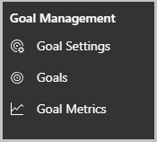
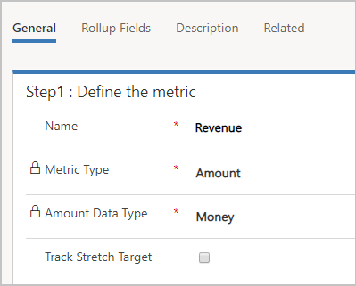
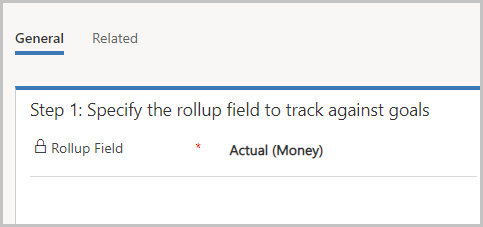
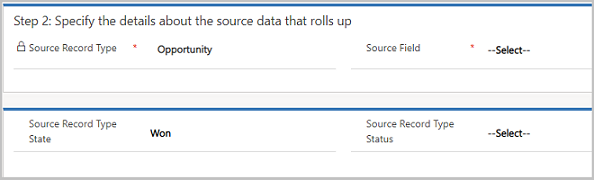
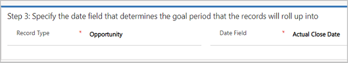

# Define a goal metric (Sales Hub)

Goal metrics let you clearly define how a goal will be measured. For example, a sales team's performance can be measured based on the number of leads they get or the revenue amount. There are two goal metric types: Amount and Count. The Amount metric type can be a money value, an integer, or a decimal number. The Count metric type is an integer. For example, you can use the Amount (money) goal metric to track the revenues from all active opportunities or sales orders. An integer type can be used to track sales calls made by a salesperson. A decimal number can represent a product sold by weight, such as grain or sugar.   

1.	Make sure that you have the Manager, Vice President, CEO-Business Manager, System Administrator, or System Customizer security role or equivalent permissions.

2.	In the site map, at the bottom, select the Change area icon , and then select **App Settings**.  

    > [!div class="mx-imgBorder"]
    > 

3. Select **Goal Metrics**.

    > [!div class="mx-imgBorder"]
    > 
 
4.	To create a new goal metric, on the command bar, select **New**.

5.	Under **Step 1: Define the metric**, fill in the information:

    a.	**Name**. Required. Enter a name between 1 and 100 characters.
    
    b.	**Metric Type**. Required. To track a monetary amount, select **Amount**. To track another type of amount, such as how many new contacts are added, select **Count**.

    
    > [!NOTE]
    > After you save the goal metric, you will no longer be able to edit this field.
    
    c.	**Amount Data Type**. Required. This option is not available if the you chose is **Count** as the **Metric Type** because [!INCLUDE[pn-dyn-365-sales](../includes/pn-dyn-365-sales.md)] automatically sets the data type to integer.
    
    > [!NOTE]
    > After you save the goal metric, you will no longer be able to edit this field.
    
    d.	**Track Stretch Target**. Select this check box if you want this metric to track an additional target beyond the primary goal.

    > [!div class="mx-imgBorder"]
    > 
 
6.	Select **Save**.

7.	Define the rollup fields for this metric to track the target's actual and in-progress values.

    a.	On the **Rollup Fields** tab, select **Add New Rollup Field**.

    b.	In the New Rollup Field form, under **Step 1: Specify the rollup field to track against goals**, fill in the information:

      -  **Rollup Field**. Select a rollup field where the metric rollup data will be displayed in the goal. You can display an integer or money, depending on the Metric Type you chose. You can't select a field you already added to the metric.

          > [!div class="mx-imgBorder"]
          > 
 
    c. Under **Step 2: Specify the details about the source data that rolls up**, fill in the information:

      - **Source Record Type**. Required. Select the record type to use as the source of the rollup data for the metric.

        > [!NOTE]
        > A custom record type (entity) that is organization-owned isn't available in the Source Record Type drop-down list for selection. For more information about entity ownership, see Types of entities.

      - **Source Record Type State**. Required. Select the record state you want to use as the source of the rollup data for the metric.

      - **Source Record Type Status**. Required. Select the status of the records you want to use as the source of the rollup data for the metric. State and status may be identical, depending on the record type you selected.

          > [!div class="mx-imgBorder"] 
          > 

    d. Under **Step 3: Specify the date field that determines the goal period that the records will roll up into**, fill in the information:

      - **Record Type**. Required. Select the entity that contains the date field you want. Typically, you can only choose the same record type you selected as the Source Record Type.

      - **Date Field**. Select a date field. The options available in the list are from the entity you selected in the Record Type field.

         > [!div class="mx-imgBorder"]
         > 
 
    e. Select **Save & Close**.

8.	On the **Description** tab, enter a description for the goal metric to enable other users to understand what metrics are being tracked.

9.	Select **Save**.

  
### See also  

[Create or edit goals](../sales-enterprise/create-edit-goal-sales.md)   
[Define a goal rollup queries](create-edit-goal-rollup-query-sales.md)

[!INCLUDE[footer-include](../includes/footer-banner.md)]