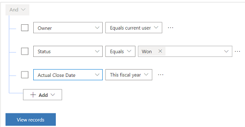

# Define goal rollup queries (Sales Hub)

When you define rollup queries, you identify the record types to compare against the goals you define in the rollup fields. For example, you could create a goal metric that measures all invoices closed within a specific period. A rollup query could then show you invoices owned by one person, or for customers in one territory.

1.	Make sure that you have the Manager, Vice President, CEO-Business Manager, System Administrator, or System Customizer security role or equivalent permissions.

2.	Select the Change area icon  at the lower-left corner, and then select **App Settings**.  

    > [!div class="mx-imgBorder"]
    > 

3. Select **Rollup Queries** under **Goal Management**.
 
4.	To create a new rollup query, on the command bar, select **New**.

5. In the **Entity Type** field, select the entity for the rollup query. For example, if you want the invoices for customers in a territory,select the Invoice entity.  
      > [!NOTE]
      >  If you change the entity type after you add your query criteria in the Query builder, the query criteria will be deleted as it is based on the entity type.  
  
6. In the Query builder, add the criteria for your query. 

    > [!div class="mx-imgBorder"]  
    > 
  
7. To see the results for the query, select **View records**.  
  
8. Select **Save**, **Save and Close**, or, to create a new rollup query, **Save and New**.  
    Now that the rollup query is created, you can apply it to the goals of individuals or teams who need to meet this specific criteria.

## Apply rollup query to a goal

Rollup queries define additional criteria for a goal. Applying the rollup query to individual or team goal ensures that the goal metrics are calculated based on the additional criteria.  

**Follow these steps:**

1. In the Sales Hub app, navigate to  **Performance**, **Goals** in the left pane.  
2. Open the goal to which you want to apply the rollup query.  
3. (Optional) Select the **Actuals** tab and note down the values before applying the rollup query.
    This step helps in comparing the values after applying the rollup query.  
4. Select the **Goal Criteria** tab.  
5. Select the rollup query in the **Rollup Query - Actual** and **Rollup Query - In-Progress** fields.  
6. Select **Recalculate** on the command bar and wait for the calculations. Calculation time depends on the complexity of the query and the volume of data.  
    >[!div class="mx-imgBorder"]
    >
7. Select the **Actuals** tab of the goal and verify the **Last Rolled Up Date** to ensure that the recalculated data is the latest.  
    The **Percentage Achieved**, **Actual**, and **In-Progress** fields display the values after applying the additional criteria in the rollup query. For example, values for a specific customer.  

> [!NOTE]
> The maximum number of records that can be counted  in a goal rollup query is 5000.  
  
 
### See also  

[Create or edit goals](../sales-enterprise/create-edit-goal-sales.md)   
[Define a goal metric](create-edit-goal-metric.md)

[!INCLUDE[footer-include](../includes/footer-banner.md)]
