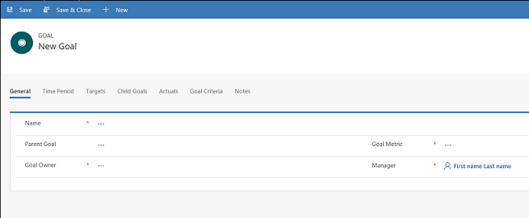
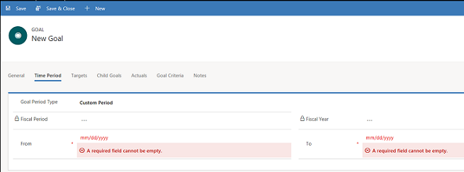

# Create or edit goals (Sales Hub)

Use goals to keep track of your progress on achieving target revenue.  
  
1. [!INCLUDE[proc_permissions_mgr_vp_sys_admin_sys_cust](../includes/proc-permissions-mgr-vp-sys-admin-sys-cust.md)]  
  
2. Select the site map icon , and then select **Goals**.   
  
3. On the command bar, select **New**.  

4. Fill in your information. Use the handy tooltips as a guide.

   - Name. Type a name that describes the goal. 
    
   - Parent Goal. If this goal is a child goal of another goal, select that goal as a parent goal here.  
    
   - Goal Metric. Choose how the goal will be tracked by selecting a metric for the goal.

      > [!NOTE]
      > If you select a parent goal for this goal, you can't select a goal metric. It is automatically populated from the parent goal.
    
   - Goal Owner. Select the user or team responsible for meeting the goal.

      > [!div class="mx-imgBorder"]
      > 
  
5. Select **Save**.

6. On the **Time Period** tab, specify whether the goal period is a fiscal period or a custom period. 

   - If **Goal Period Type** is **Fiscal Period**, select a fiscal period and fiscal year for which the goal is tracked.
    
   - If **Goal Period** Type is **Custom Period**, select a date in the From and To fields to define a custom period for which the goal is tracked.

     > [!div class="mx-imgBorder"]
     > 

   > [!NOTE]
   > 
   > If this goal has a parent goal, you can't specify the time period for the goal. It is automatically populated from the parent goal.     

7. On the **Targets** tab, specify a target value against which the results of the goal rollup are measured. The target type depends on the **Amount Data Type** selected for the goal metric that you chose for this goal. You will see one of the following fields:

   - **Target (Decimal)**. Required. This field is available if the goal **Metric Type** is **Amount** and the **Amount Data Type** is **Decimal**.
    
   - **Target (Money)**. Required. This field is available if the goal **Metric Type** is **Amount** and the **Amount Data** Type is **Money**.
    
   - **Target (Integer)**. Required. This field is available if the goal **Metric Type** is **Amount** and the **Amount Data** Type is **Integer** or if the goal **Metric Type** is **Count**.

8. If the goal metric you are using has **Track Stretch Target** selected, you will also see one of the following fields:
    
   - **Stretched Target (Decimal)**. Required. This field is available if the goal **Metric Type** is **Amount** and the **Amount Data Type** is **Decimal**.
    
   - **Stretched Target (Money)**. Required. This field is available if the goal **Metric Type** is **Amount** and the **Amount Data Type** is **Money**. 
    
   - **Stretched Target (Integer)**. Required. This field is available if the goal **Metric Type** is **Amount** and the **Amount Data Type** is **Integer** or if the goal Metric Type is **Count**.

9. To add an existing goal as a child goal of this goal, on the **Child Goals** tab, select the **Add Existing Goal** button.

10.	The **Actuals** tab shows the actual value achieved towards the target as of the last rolled-up date:

    - **Actual (Money)**. If the goal metric uses **Money** as the **Amount Data Type**, this field shows the total amount of money achieved towards the goal as of the last rolled-up date.
    
    - **In-progress (Money)**. If the goal metric uses **Money** as the **Amount Data Type**, this field shows the amount of money achieved towards the goal since the last time the actuals were calculated.
    
    - **Percentage Achieved**. If the goal metric is **Decimal** or **Integer**, this field shows the percentage of the goal that is complete as of the last rolled-up date.
    
    - **Last Rolled Up Date**. This field shows the last date and time that the actuals were recalculated.

11.	On the **Goal Criteria** tab, define the criteria that will be used for rolling up the Actuals data against the goal.

    - **Roll Up Only From Child Goals**. If you want to limit the data used for the roll up to only child goals, select **Yes**. To allow other data to be used for the roll ups, select **No**.
    
    - **Record Set for Rollup**. If you want to limit the records that can be included in the roll up to only those records owned by the goal owner, select **Owned by goal owner**. To allow all records to be included in the roll up data, select **All**.

12.	On the **Notes** tab, enter any notes for this goal.

13.	Select **Save** or **Save & Close**.

  
### See also  
 [Create or edit a goal rollup query](../sales-enterprise/create-edit-goal-rollup-query-sales.md)   

[!INCLUDE[footer-include](../includes/footer-banner.md)]