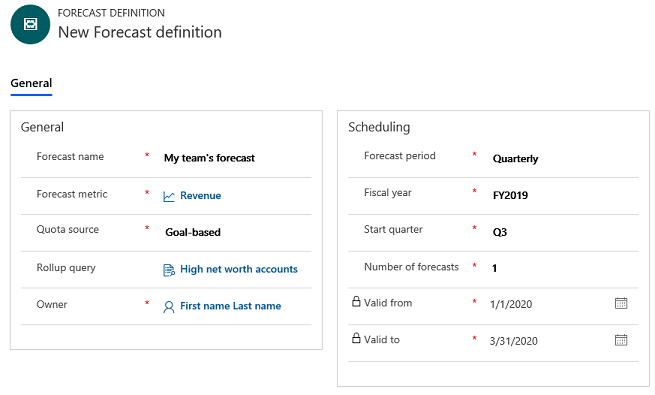
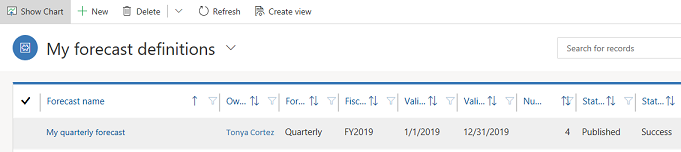

# Create a forecast definition
<!--note from editor: These tokens need to be deleted, I presume?-->
[!INCLUDE [cc-beta-prerelease-disclaimer](../includes/cc-beta-prerelease-disclaimer.md)]

> [!IMPORTANT]
> - [!INCLUDE[cc_preview_features_definition](../includes/cc-preview-features-definition.md)]  
> - [!INCLUDE[cc_preview_features_expect_changes](../includes/cc-preview-features-expect-changes.md)]
> - [!INCLUDE[cc-preview-features-no-ms-support](../includes/cc-preview-features-no-ms-support.md)]

<!--note from editor: I'm confused by this topic, sorry to say. I think it might have been included in your list of files to edit by mistake? The content seems to be covered by configure-forecast.md and the meta-procedure you include there. I'm going to skip it for now; please let me know if I need to get back to it.-->Capture information about parameters such as the period for which the forecast should be generated or the data to use for forecasting.

Sales forecasting has security roles that are defined specifically to create and publish forecast definitions. The following security roles are defined in Dynamics 365 Sales for forecast: 

| Security role        |    Description                                 |
|----------------------|----------------------------------------------|  
|**Forecast manager**  | Create, assign, and edit forecast definition in your business unit and other business units that are subordinate to your business unit.  Delete forecast definitions that are defined only for your business unit.  Share forecast definitions with all users in your organization.   After the forecast definition is published, you can view and edit forecast at your business unit and other business units that are subordinate to your business unit. |
|**Forecast user**     | Create forecast definitions only for yourself.  Edit and delete forecast definitions that are defined by you.   View forecast definitions that are defined for your business unit.  You can only view and edit forecast that are defined by you, after the forecast definition is published. |

## Prerequisites

Before creating a forecast definition, review the following requisites:

- Administrator, forecast manager, or forecast user role is assigned to you.
- Enable preview feature option. To learn more, see [How do I enable a preview feature](/power-platform/admin/what-are-preview-features-how-do-i-enable-them#how-do-i-enable-a-preview-feature).
- All the users under the selected hierarchy are assigned forecast manager or forecast user role. If not, the publishing of the forecast definition will fail. 
- No users are disabled under the selected hierarchy when you publish the forecast definition. If not, the publishing of the forecast definition will fail. 
 
## Create forecast definition

1.    Sign in to Dynamics 365 Sales.

2.  Select **Site map** , and in the lower-left corner of the site map, select **Change area** , and then select the **App Settings** area.    

3.    Select **Forecast definitions**.
 
4.    On the command bar, select **New**.

5.    In the **General** section of the forecast definition record, enter the following information:

    -  **Forecast name**. Enter a descriptive name that explains what the forecast is about. For example, **Jane's team's 2019 Quarterly Forecast**.

    -  **Forecast metric**. Select a metric for forecasting. This field is a lookup to the **Goal metric** entity. The field that you select here is used in aggregating data for the forecast. Only the opportunity fields of type amount (revenue) are available for selection. 
        
        > [!NOTE]
        > By default, the out-of-the-box **Revenue Metric** is selected.
    
    -  **Quota source**. Select whether the targets used for the purpose of forecasting will be based on existing goals or manual targets. If this is set to **Goal based**, when the forecast is being generated, the system looks for the matching goal based on the forecast metric and roll-up query <!--note from editor: What does "In-progress (Money)** refer to? Should it be formatted as a UI element?-->In-progress (Money) you've selected and the Goal owner, and uses the quota or target defined in the goal.

    - **Rollup query**. This is a lookup to the **Rollup query** entity. Select a rollup query to define which records to consider for forecasting. For example, to include only the opportunities coming from the East region in the forecast, you can create a rollup query to filter only the opportunities that have accounts in the East region and use it in the forecast definition.

        > [!NOTE]
        > Only the rollup queries with opportunity as the parent entity are available and valid for selection.
    - **Owner**. If you are creating the forecast definition for yourself, choose your name as owner. Otherwise, choose the username for whom you are creating the forecast definition. This user acts as the top of the forecast hierarchy. Based on the user hierarchy (as defined by the Manager field of the User object) a forecast is created for all child users.

        For example, Bert Hair (manager) requests Wade Roque (reports to Bert) to create a forecast definition for Bert. While creating the forecast definition, Wade selects Bert Hair as the owner so the forecast definition is created based on Bert's hierarchy. 

      > [!div class="mx-imgBorder"]
      > 

6.  In the **Scheduling** section of the Forecast definition form, enter the following:

    -  **Forecast period**. Select whether the forecast is to be generated monthly, quarterly or for a custom period. Quarterly is selected by default.

    -  **Fiscal year**. Select the fiscal year for the forecast. This is populated based on the org's fiscal year settings.

    -  **Start month/Start quarter**. Select when to start forecasting. If you select the forecast period as Monthly, select the month from which you want to start forecasting. If you select the forecast period as Quarterly, select the quarter from which forecasting should start.

    -  **Number of forecasts**. Enter the number of forecasts that need to be generated. You can only create one forecast when the Forecast period is custom. 

        > [!NOTE]
        > If you select the Forecast period as monthly, Fiscal year as FY19, Start month as January, and Number of forecasts as 4, the forecasts that are generated are grouped by four months, January, February, March, and April. In such case, the Forecast start and end date is automatically set to Jan 1, 2019, and April 30, 2019, respectively.

    -  **Start date**. If you selected **Custom** in **Forecast period**, select the start date to identify the date when the forecasting should start.

    -  **End date**. If you selected **Custom** in **Forecast period**, select the end date to identify the date when the forecasting should stop.

7.    Select **Save**.

8.    To generate forecasts based on this definition, publish the forecast definition. On the command bar, select **Publish**. After a forecast definition is published, it becomes read-only.
 
Generating a forecast is a background process. After all the forecasts are generated, the forecast definition's status and status reason is set to Published and Success respectively.

> [!div class="mx-imgBorder"]
> 

> [!NOTE]
> If the publishing fails, the forecast definition's status and status reason is set to Published and Failed respectively. To learn more, see [Why am I unable to publish forecast definition? ](../sales-enterprise/ts-forecasts.md#publish_forecast_definition).

## See also

[Project accurate revenue with sales forecasting](project-accurate-revenue-sales-forecasting.md)  
[View forecasts](view-forecasts.md)
