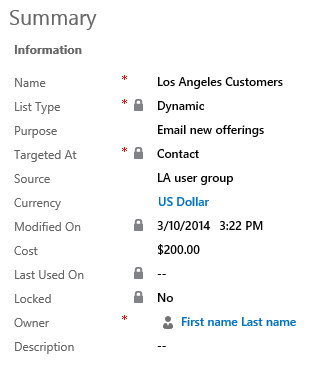

# Create a marketing list using in-app marketing (Sales)

Your marketing list is the core of running a successful marketing campaign. It can include any one type of customer record, such as leads, accounts, or contacts.  
  
 You can create two types of marketing lists:  
  
- **Static** Use a static list if you prefer to add and update members manually.  
  
- **Dynamic** Use a dynamic marketing list if you want the list to return a list of members dynamically when needed, based on search criteria you set. For example, if you want to run a campaign to members of a specific city, use a dynamic list. A dynamic marketing list retrieves the updated list of members each time you open the list, create a quick campaign from the list, or distribute a campaign activity for a campaign associated with the list.  
  
## Create a marketing list  
  
1. [!INCLUDE[proc_marketing_marketing_lists](../includes/proc-marketing-marketing-lists.md)]  
  
2. Select **New**.  
  
3. On the **Summary** tab, add or change the information. This screenshot provides an example.  
  
   > [!div class="mx-imgBorder"]  
   >   
  
   > [!NOTE]
   >  To look up records in the **Owner** field, first select **Save**, or you'll lose your changes.  
  
4. Select **Save** so you can enter information in other areas of the form.  
  
5. Add any other information that applies to your marketing list in the **Notes** area.  
  
6. Select **Save**.  
  
## Add members to a static marketing list  
  
1.  In any marketing list record, on the command bar, select **Manage Members**, and then select one of the following options:  
  
    #### Add using Lookup  
  
    1.  In the **Lookup Records** dialog box, select your search criteria.  
  
    2.  Select the records that you want to add, and then select **Add**.  
  
    #### Add using Advanced Find  
  
    1. In the **Add Members using advanced find** dialog box, the entity that the marketing list is targeted at is automatically selected.
    
    2. In the **Use Saved View** drop-down box, select a view for the selected entity, which will be used for filtering.
    
    3. Select **Add**, and then select **Add Row**, to define the search criteria. For example, to find all the contacts in the Seattle city, in the first box select the field as **Address 1: City**. Then, in the second box, select the query relational operator as **Equals**. In the third box, type **Seattle**. You can select fields from the current record type, or from related record types.   
    
    4.  Select **Find**.  
  
    6.  Select the members that you want to add, and then select one of the following:  
  
        -   Add only selected  
  
        -   Add all  
  
    #### Remove using Advanced Find  
  
    1. In the **Add Members using advanced find** dialog box, the entity that the marketing list is targeted at is automatically selected.
    
    2. In the **Use Saved View** drop-down box, select a view for the selected entity, which will be used for filtering.
    
    3. Select **Add**, and then select **Add Row**, to define the search criteria. For example, to find all the contacts in the Seattle city, in the first box select the field as **Address 1: City**. Then, in the second box, select the query relational operator as **Equals**. In the third box, type **Seattle**. You can select fields from the current record type, or from related record types.   
    
    4.  Select **Find**.  
  
    5.  Select the members that you want to remove, select one of the following:  
  
        -   Remove only selected  
  
        -   Remove all  
  
    #### Evaluate using Advanced Find  
  
    1. In the **Add Members using advanced find** dialog box, the entity that the marketing list is targeted at is automatically selected.
    
    2. In the **Use Saved View** drop-down box, select a view for the selected entity, which will be used for filtering.
    
    3. Select **Add**, and then select **Add Row**, to define the search criteria. For example, to find all the contacts in the Seattle city, in the first box select the field as **Address 1: City**. Then, in the second box, select the query relational operator as **Equals**. In the third box, type **Seattle**. You can select fields from the current record type, or from related record types.   
  
    4.  Select **Find**.  
  
    5.  Select the members that you want to keep, select one of the following:  
  
        -   Keep only selected  
  
        -   Keep all  

  > [!NOTE]
  > You can add up to 120,000 members to a static marketing list in one Add operation. If you need to add more than 120,000 members to a static marketing list, split those members into multiple add operations. One way to do this is by using the [Advanced Find](#add-using-advanced-find) dialog to create queries that return less than 120,000 members. Alternatively, depending on your scenario, you can also consider using a dynamic marketing list instead of static list. More information: [Create a dynamic marketing list](#define-the-member-selection-criteria-for-a-dynamic-marketing-list)

## Define the member selection criteria for a dynamic marketing list  
  
1.  In any marketing list, on the command bar, select **Manage Members**.  
  
2.  In the **Manage Dynamic List Members** dialog box, the entity that the marketing list is targeted at is automatically selected.
    
3. In the **Use Saved View** drop-down box, select a view for the selected entity, which will be used for filtering.
    
4. Select **Add**, and then select **Add Row**, to define the search criteria. For example, to find all the contacts in the Seattle city, in the first box select the field as **Address 1: City**. Then, in the second box, select the query relational operator as **Equals**. In the third box, type **Seattle**. You can select fields from the current record type, or from related record types.  
  
5.  Select **Use Query** to add the matching records to your dynamic marketing list.  
  
## Associate campaigns or quick campaigns to a marketing list  
 After you have created a campaign or quick campaign, you can associate it to your marketing list. You can also create a new campaign or quick campaign from your marketing list.  
  
1.  In the **Campaigns** or **Quick Campaigns** area, select **New Campaign** or **New Quick Campaign**.  
  
2.  Search for the campaign or quick campaign you want to associate to this marketing list.  
  
    > [!NOTE]
    >  If you don't have any campaigns, or if you want to create a new one, you can select **+ New**.  
    >   
    >  If you don't have any quick campaigns, the Quick Campaign Wizard will start.  
  
## Customized marketing list form

If you're using a custom form for a marketing list that doesn't include certain fields, you'll see the following message: 'The form is missing the following elements: 'query', 'membertype', 'accountsUCI', 'contactsUCI', 'leadsUCI', 'dynamic_accounts', 'dynamic_contacts', 'dynamic_leads'. Functionalities will be affected.

The elements listed in the message are required to populate the members list that is included in the default form. If your custom form doesn't display the members list, you can ignore the message.

### See also  
 [Get started with in-app marketing](../sales-enterprise/get-started-app-marketing-sales.md)   
 [Create or edit a campaign using in-app marketing](../sales-enterprise/create-edit-campaign-using-app-marketing-sales.md)   
 [Create a quick campaign using in-app marketing](../sales-enterprise/create-quick-campaign-using-app-marketing-sales.md)   
 [Add an activity to a campaign using in-app marketing](../sales-enterprise/add-activity-campaign-using-app-marketing-sales.md)   
 [Add a marketing list, sales literature, or product to a campaign using in-app marketing](../sales-enterprise/add-marketing-list-sales-literature-product-campaign-using-app-marketing-sales.md)   
 [Track a marketing campaign response using in-app marketing](../sales-enterprise/track-marketing-campaign-response-using-app-marketing-sales.md)   
 

[!INCLUDE[footer-include](../includes/footer-banner.md)]
