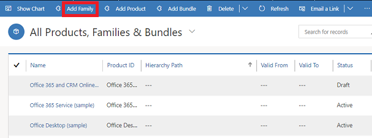

# Set up product families (Sales and Sales Hub)

Make it easier for sales agents to find products and services in a product catalog by creating a product family and classifying similar products in it. A product family lets you group and categorize products, making it easier for you to manage them.  
  
 With product families, you can:  
  
- Categorize your products in whichever way is most meaningful to your organization.  
  
- Create child products and product bundles within a product family. (Product bundles allow you to sell multiple items together.)  
  
- Create as many levels of product families as you want by creating a family within a family.  
  
    
  
> [!NOTE]
> The product family that you use for creating a product, bundle, or another product family becomes the parent family.   

## Create a product family (Sales Hub)

1. [!INCLUDE[proc_permissions_admin_cust_mgr_vp_sales_ceo](../includes/proc-permissions-admin-cust-mgr-vp-sales-ceo.md)]  
  
2. Select the site map , and then select **Products**.  
  
3. To create a family, on the command bar, select **Add Family**.  
  
    -OR-  
  
    To create a child product family under an existing family, select the family, and select **Add Family**. The selected family becomes the parent family of the new family you're creating.  
  
      
  
4. [!INCLUDE[proc_handy_infotips](../includes/proc-handy-infotips.md)]  
  
   > [!NOTE]
   > The **Valid From** and **Valid To** fields define the duration that a product is valid for. There's no business logic associated with these fields except that the **Valid To** date must be later than the **Valid From** date. If required, you can implement your own business logic in these fields with a workflow, plug-in, or by using the [!INCLUDE[pn_sdk](../includes/pn-sdk.md)]. For example, you could run a scheduled job to automatically retire last season's products using the date selected in the **Valid To** field.  
  
5. Select **Save**.  
  
6. In the list of products, families, and bundles, open the family that you just created.  
  
7. On the **Product Properties** tab, select the **Add New Property** button, and add the required properties. [!INCLUDE[proc_more_information](../includes/proc-more-information.md)] [Use properties to describe a product](../sales-enterprise/use-properties-describe-product.md)  

## Create a product family (Sales)
  
1. [!INCLUDE[proc_permissions_admin_cust_mgr_vp_sales_ceo](../includes/proc-permissions-admin-cust-mgr-vp-sales-ceo.md)]  
  
    #### Check your security role  
  
   - [!INCLUDE[proc_follow_steps_in_link](../includes/proc-follow-steps-in-link.md)]  
  
   - [!INCLUDE[proc_dont_have_correct_permissions](../includes/proc-dont-have-correct-permissions.md)]  
  
2. [!INCLUDE[proc_settings_prod_catalog](../includes/proc-settings-prod-catalog.md)]  
  
3. In the **Product Catalog** area, select **Families & Products**.  
  
4. To create a family, select **Add Family**.  
  
    -OR-  
  
    To create a child product family under an existing family, select the family, and select **Add Family**. The selected family becomes the parent family of the new family you're creating.  
  
    If you want to see your current product family levels, see [View product hierarchy](../sales-enterprise/view-product-hierarchy.md).  
  
5. [!INCLUDE[proc_handy_infotips](../includes/proc-handy-infotips.md)]  
  
   > [!NOTE]
   > The **Valid From** and **Valid To** fields define the duration that a product is valid for. There's no business logic associated with these fields except that the **Valid To** date must be later than the **Valid From** date. If required, you can implement your own business logic in these fields with a workflow, plug-in, or by using the [!INCLUDE[pn_sdk](../includes/pn-sdk.md)]. For example, you could run a scheduled job to automatically retire last season's products using the date selected in the **Valid To** field.  
  
6. Select **Save**.  
  
7. In the list of products, families, and bundles, open the family that you just created.  
  
8. In the **Product Properties** section, select the **Add Properties** button , and add the required properties. [!INCLUDE[proc_more_information](../includes/proc-more-information.md)] [Use properties to describe a product](../sales-enterprise/use-properties-describe-product.md)  
  
## Typical next steps  
  [Use properties to describe a product](../sales-enterprise/use-properties-describe-product.md)  
  
  [Create a product](../sales-enterprise/create-product-sales.md)  
  
  [Classify products and bundles into product families](../sales-enterprise/create-product-bundles-sell-multiple-items-together.md)  
  
### See also  
 [Set up a product catalog](../sales-enterprise/set-up-product-catalog-walkthrough.md)   
 [Clone a product](../sales-enterprise/clone-product.md) 
 [Change the parent of a product (reparenting)](change-product-parent.md)  
