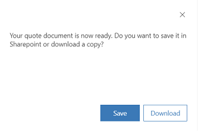

# Create PDF files from sales records

You can create and share professional-looking PDF files for sales records by using a standard template from your organization to generate the PDF file. The capability to create PDF files is available for the following entities: Account, Contact, Lead, Opportunity, Order, Quote, and Invoice.

Your system administrator can choose the entities for which PDF generation is enabled. 

> [!IMPORTANT]
> - The PDF generation capability for additional entities (entities other than Quote) is released with Dynamics 365 Sales (Sales Hub) app version: 9.0.1911.1009, as part of the weekly release of the product to individual geographies.
> - If you don't see the **Create PDF** and **Email as PDF** options on one of the supported entity records, it might be because your system administrator hasn't enabled the PDF-generation capability for that entity. Check with your system administrator.

**To create a PDF file from a sales record** 

1. Open the entity record for which you want to create a PDF file&mdash;in this example, a record for a Quote entity.

2. On the command bar, select **Create PDF**, and then select the template you want to use to create the PDF. 

    > [!div class="mx-imgBorder"]
    > 

    > [!IMPORTANT]
    > Templates are available out of the box for the Account, Opportunity, Order, Quote, and Invoice entities. For entities that don't have out-of-the-box templates, you can create new templates. You can't create a PDF file for an entity record if there's no template available for that entity. 

    > [!TIP]
    > To learn more about using Word templates, see [Use Word templates to create standardized documents](../admin/using-word-templates-dynamics-365.md). 

    You'll see a dialog box with options to save the PDF or download the PDF. 

    > [!div class="mx-imgBorder"]    
    > 
    
    If you select **Save**, the PDF file is stored in the default SharePoint site if SharePoint is configured and enabled for the **Quote** entity. If SharePoint isn't configured, the **Save** option saves the PDF as a Notes attachment to the Quote record in Dynamics 365 Sales. The **Download** option downloads the PDF to your local drive. After it's downloaded, you can add this file to a note, send it as an attachment in an email, or upload it to SharePoint.

## Email a PDF file

You can also generate a PDF file and directly email it to a customer.

1. Open an entity record&mdash;in this example, a record for a Quote entity.

2. On the command bar, select **Email as PDF**, and then select a document template.

    

    In the email form that opens, the following information is automatically populated.

    |Field             |    Populated with                                 |
    |------------------|-------------------------------------------------|  
    |**To**                |    Potential customer, if applicable                |
    |**From**                 |  The current user                                   |
    |**Attachments**       |    The generated PDF, added as an attachment         |
    |**Regarding**           |  The record from which the email was triggered| 
    |**Subject**             |  The title of the record                                    |

3. Verify or change any details in the email form as necessary, and then select **Send**.

> [!IMPORTANT]
> The time taken to generate the PDF file and download or send the email depends on the size of the file. You'll see optimum performance when the file size is less than 2 MB. Larger files can require considerably more response time.

### See also

[Enable or disable PDF generation from sales records](enable-pdf-generation-quote.md)  
