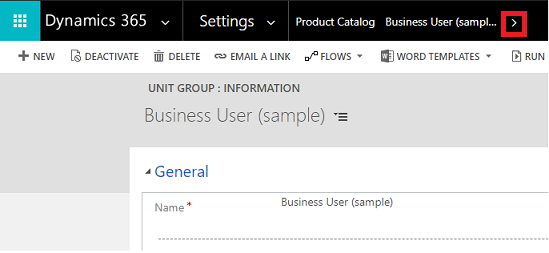
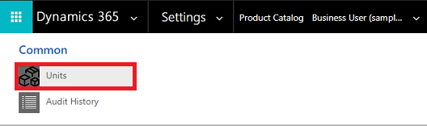

# Create a unit group and add units to that group (Sales and Sales Hub)

Units are the quantities or measurements that you sell your products or services in. For example, if you sell gardening supplies, you might sell seeds in units of packets, boxes, and pallets. A unit group is a collection of these different units.  
  
 In [!INCLUDE[pn-dyn-365-sales](../includes/pn-dyn-365-sales.md)], you first create a unit group and then create units within that group. Let's look at both of these tasks, using seeds as our example.  
 
## Create a unit group and add units (Sales Hub)

1. [!INCLUDE[proc_permissions_mgr_vp_ceo_busmgr_sysadmin_syscust](../includes/proc-permissions-mgr-vp-ceo-busmgr-sysadmin-syscust.md)]  
  
2. Select the site map icon , and then select **App Settings**. 
  
3. In the **Product Catalog** area, select **Unit Groups**. 

    > [!div class="mx-imgBorder"]
    > 

4. To create a new unit group, on the command bar, select **New**.

    -OR-

    To edit a unit group, open a unit group from the list.

5.	Fill in your information, and select **OK**:

    a.	**Name**. Type a meaningful name for the unit group. In our example, you would type "Televisions."

    b.	**Primary Unit**. Type the lowest common unit of measure that the product will be sold in. In our example, you would type "Piece." Other examples could include box, cartons, ounces, hours, or tons, depending on your product.

    > [!div class="mx-imgBorder"]
    > 
 
      > [!NOTE]
      > You cannot delete the primary unit in a unit group.

6.	To add units to the unit group, select the **Related** tab, and then select **Units**.

    > [!div class="mx-imgBorder"]
    > 
 
7.	On the **Units** tab, you’ll see that the primary unit is already added. Select **Add New Unit**.

8.	In the **Quick Create: Unit** form, fill in the following, and select **Save**:

    a.	**Name**. Type a meaningful name for the unit. In our example, you would type "box."

    b.	**Quantity**. Type the quantity that this unit will contain. For example, if a box contains 2 pieces, you would type "2."

    c.	**Base Unit**. Select a base unit. The base unit will establish the lowest unit of measurement for the unit you're creating. Using our example, you would select "Piece."

    > [!div class="mx-imgBorder"]	
      

## Create a unit group (Sales app)
  
1. [!INCLUDE[proc_permissions_mgr_vp_ceo_busmgr_sysadmin_syscust](../includes/proc-permissions-mgr-vp-ceo-busmgr-sysadmin-syscust.md)]  
  
    #### Check your security role  
  
   - [!INCLUDE[proc_follow_steps_in_link](../includes/proc-follow-steps-in-link.md)]  
  
   - [!INCLUDE[proc_dont_have_correct_permissions](../includes/proc-dont-have-correct-permissions.md)]  
  
2. [!INCLUDE[proc_settings_prod_catalog](../includes/proc-settings-prod-catalog.md)]  
  
3. Select **Unit Groups**.  
  
4. To create a new unit group, select **New**.  
  
    -OR-  
  
    To edit a unit group, open a unit group from the list.  
  
5. Fill in your information:  
  
   - **Name**. Type a meaningful name for the unit group. In our example, you would type "Seeds."  
  
   - **Primary Unit**. Type the lowest common unit of measure that the product will be sold in. In our example, you would type "packet." Other examples could include ounces, hours, or tons, depending on your product or service.
   
      > [!div class="mx-imgBorder"]  
      >   
  
6. Select **OK**.  
  
> [!NOTE]
>  You cannot delete the primary unit in a unit group.  
  
## Create units in a unit group (Sales)
  
1. In the unit group record you want to add the units to, on the nav bar, select the arrow next to the record name, and then under **Common**, select **Units**.

    > [!div class="mx-imgBorder"] 
    > 

    > [!div class="mx-imgBorder"] 
    > 
  
2. Select **Add New Unit**.  
  
     The unit that you specified as the primary unit earlier is already in the list of units.  
  
3. Fill in your information:  
  
   1. **Name**. Type a meaningful name for the unit. In our example, you would type "box."  
  
   2. **Quantity**. Type the quantity that this unit will contain. For example, if a box contains 12 packets, you would type "12."  
  
   3. **Base Unit**. Select a base unit. The base unit will establish the lowest unit of measurement for the unit you're creating. Using our example, you would select "packet."  
  
        If you then create a unit called "pallet," and one pallet contains 48 boxes, you would type "48" in **Quantity** and select "box" in **Base Unit**.  
  
      Here's how:  

     > [!div class="mx-imgBorder"]   
     >   
  
     > [!div class="mx-imgBorder"]   
     >   
  
4. Select **Save** or **Save and Close**.  
  
## Typical next steps  
  [Create a product](../sales-enterprise/create-product-sales.md)  
  
 \- OR -  
  
  [Create product bundles to sell multiple items together](../sales-enterprise/create-product-bundles-sell-multiple-items-together.md)  
  
  [Set up a product catalog: Walkthrough](../sales-enterprise/set-up-product-catalog-walkthrough.md)
