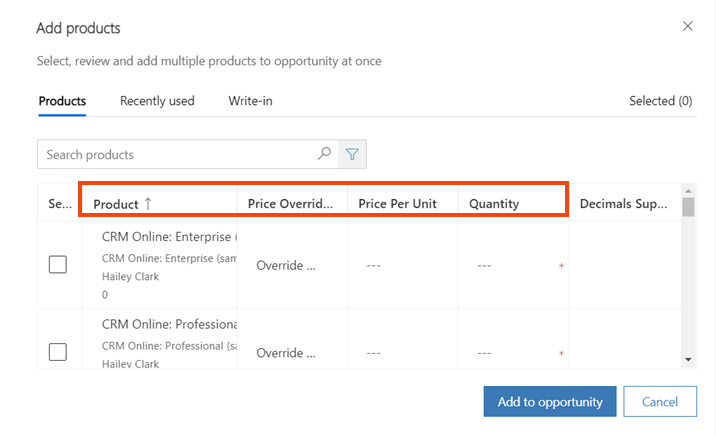
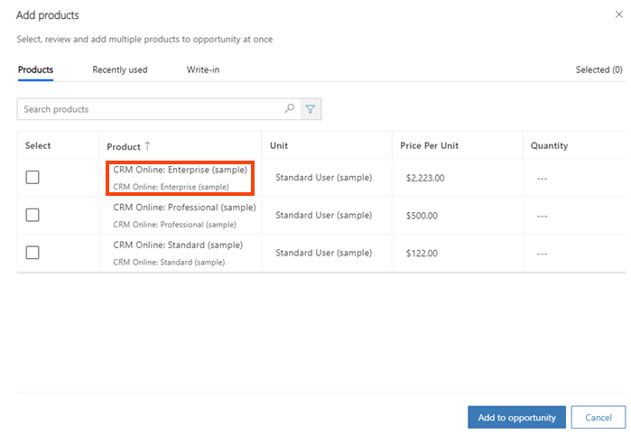

# Preview: Customize the Add products dialog box (Dynamics 365 Sales)

[!INCLUDE [cc-beta-prerelease-disclaimer](../includes/cc-beta-prerelease-disclaimer.md)]

A system customizer or system administrator can customize the **Add products** dialog box to add or edit columns or to add or edit fields that show additional details of the products in the grid. These additional details help salespeople correctly identify the product that they want to add.  

> [!IMPORTANT]
> - The enhanced experience for adding products is a preview feature. [!INCLUDE[cc-preview-features-definition](../includes/cc-preview-features-definition.md)]
> - [!INCLUDE[cc-preview-features-expect-changes](../includes/cc-preview-features-expect-changes.md)]
> - [!INCLUDE[cc-preview-features-no-ms-support](../includes/cc-preview-features-no-ms-support.md)]

## Add or remove columns of the grid

The **Add products** dialog box uses the following views that define the columns that appear in the grid. 

| Table (entity)         | View name         |
|------------------------|-------------------|
| Opportunity product    | Opportunity products Add products   |
| Quote product          | Quote products Add products         |
| Order product          | Order products Add products         |
| Invoice product        | Opportunity products Add products   |
|                        |                   |

By default, the following columns are added to the view:

- Product name
- Unit
- Price per unit
- Quantity

> [!div class="mx-imgBorder"]  
> 

You can edit the respective views to add or edit columns of the grid in the **Add products** dialog box. For more information about configuring columns, go to [Choose and configure columns in model-driven app views](/powerapps/maker/model-driven-apps/choose-and-configure-columns).

## Add or edit product attributes in the Product column

In the products grid of the **Add products** dialog box, the **Products** column shows additional details about the product that help salespeople identify the correct product. 

> [!div class="mx-imgBorder"]  
> 

For opportunity products&mdash;in addition to quote, order, or invoice products&mdash;these details are captured from the columns (fields) that are added in the **Product Lookup View** of the **Product** table (entity).

By default, the views show data from two columns (fields): **Product name** and **Product ID**. You can customize these views to add or edit columns, in accordance with your business requirements. You can add up to three columns to these views.

### See also

[Choose and configure columns in model-driven app views](/powerapps/maker/model-driven-apps/choose-and-configure-columns)  
[Preview: Enable the enhanced experience of adding products](enable-enhanced-add-product-experience.md)  
[Customize the Add Products dialog box](customize-add-products-dialog-box.md)  

[!INCLUDE[footer-include](../includes/footer-banner.md)]