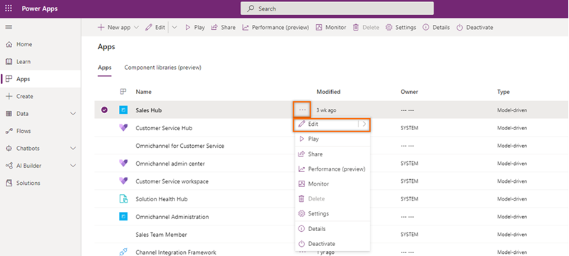

# Customize the ZoomInfo app    
After you install the ZoomInfo app, it is available as a standalone app and every time sellers must come back to the app selection area and choose the ZoomInfo app to view the required information.   
As an administrator, you can customize the ZoomInfo app in the following ways:   
-	**Add ZoomInfo entry to site map**: You can add the ZoomInfo entry to your Dynamics 365 Sales environment on the left navigation site map and providing easy access to ZoomInfo - including Admin Portal and the ZoomInfo Knowledge Center. More information: [Add ZoomInfo entry to site map](#add-zoominfo-entry-to-site-map).
-	**Add ZoomInfo form to table entities**: You can add the ZoomInfo form to your standard or custom Account, Contacts, and Leads table entities to provide sellers with inline access to ZoomInfo data. More information: [Add ZoomInfo form to entities](#add-zoominfo-form-to-table-entities).

## Prerequisites
Before you start, be sure you have met the following prerequisites:
-	You must have the system administrator role. More information: [Assign a security role to a user](/power-platform/admin/create-users-assign-online-security-roles#assign-a-security-role-to-a-user).   
-	The ZoomInfo app is installed on your Dynamics 365 Sales organization. More information: [Install ZoomInfo app](install-zoominfo-app.md).   

## Add ZoomInfo entry to site map
You can add the ZoomInfo entry to your left navigation site map to your Dynamics 365 Sales app lets ales teams can perform searches and administrators can access the Admin Portal to configure export preferences, custom mapping, and other settings. Also, you can add site map entry to ZoomInfo knowledge center.   

**To add the entry to site map**  

1.	Sign in to the [Power Apps portal](https://make.preview.powerapps.com/) and choose your organization in which you’ve installed the ZoomInfo app.
2.	On the left navigation pane, select **Apps**.   
    A list of apps that are available in the environment is displayed.    
3.	Select the **Sales Hub** app and then select **More options** (**…**) > **Edit**.   
    
    > [!div class="mx-imgBorder"]
    > 

4.	In the app designer page, under site map section, select the pencil icon to open the site map designer.
    
    > [!div class="mx-imgBorder"]
    > 
 
5.	Choose an existing area or add new area to the site map and then from the **Component** tab, drag and drop **Group**.
    
    > [!div class="mx-imgBorder"]
    > 
 
6.	On the **Properties** tab, under the **General** section, add the following group information:

    | Field | Description |
    |-------|-------------|
    | Title | Specifies the name of the group. Enter **ZoomInfo** as the title. |
    | ID | Specifies the unique identification number for the group. Use the default value. |

    > [!div class="mx-imgBorder"]
    > 

7.	Select the added ZoomInfo group and then on the right pane, under the **Components** tab, drag and drop the **Subarea**.

    > [!div class="mx-imgBorder"]
    > 
 
8.	Select the added subarea and then on the right pane, under the **Properties** tab, enter the following information to add **ZoomInfo** site map entry:

    | Field | Description |
    |-------|-------------|
    | Type | Web Resource |
    | URL | ZoomInfo |
    | Title | ZoomInfo |

    > [!div class="mx-imgBorder"]
    > 

9.	Similarly, repeat the **steps 7-8** for **ZoomInfo Knowledge Center** and enter the following information:

    | Field | Description |
    |-------|-------------|
    | Type | URL |
    | URL | ```https://university.zoominfo.com/pages/knowledge-center-zoominfo-for-sales-home``` |
    | Title | Knowledge Center |

    > [!div class="mx-imgBorder"]
    > 

10.	Save and publish the changes.    
11.	(Optional) To verify the successful addition of ZoomInfo site map, open the Dynamics 365 Sales Hub app and the ZoomInfo Group you added is shown in the left navigation pane.

    > [!div class="mx-imgBorder"]
    >    

## Add ZoomInfo form to table entities    
You can add the ZoomInfo form to standard or custom Account, Contacts, and Leads table entities to help sellers to access the ZoomInfo data without moving away from records.
As an administrator, to add the ZoomInfo form to standard or custom Account, Contacts, and Leads table entities, follow the sequence of steps as mentioned:
1.	[Create a solution](#create-a-solution)
2.	Add solution components to table entity
3.	Add form to table entity 
4.	Customize form components

### Create a solution   
Create a Solution to locate and work with the components you’ve customized and then apply them to your Dynamics 365 environment. This makes it easier to return to your custom solution to make future changes.
Follow these steps:


### See also

[Install ZoomInfo app](install-zoominfo-app.md)   

[!INCLUDE[footer-include](../includes/footer-banner.md)]
