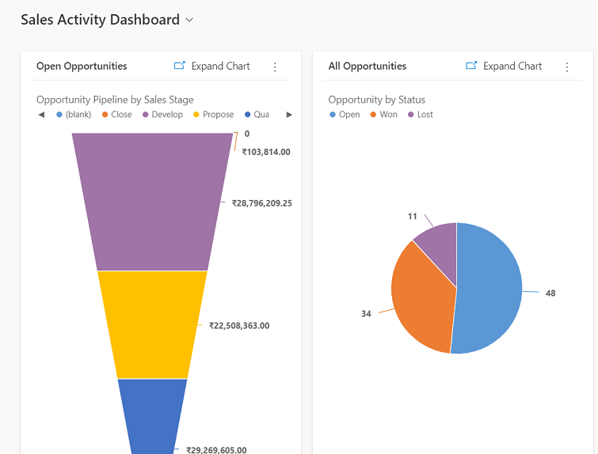
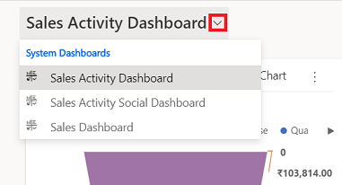

# Gain insights with dashboards in Dynamics 365 Sales

Dashboards in Dynamics 365 Sales provide an overview of actionable business data that's viewable across the organization. Use dashboards to see important data at a glance.

Dashboards use views, lists, and charts to bring data that's meaningful to you to one place.

## Where to find dashboards

To open dashboards, select **Dashboards** in the site map.

## Dashboards in Sales Hub

Sales Hub comes with some prebuilt dashboards that you can use to quickly get insights on your sales data and team performance. The dashboards show daily work-related sales numbers, such as the activities you're working on, your sales pipeline, and your open opportunities and leads.

Sales reps or managers use the out-of-the-box Sales Pipeline chart to visualize the revenue for an opportunity based on each pipeline phase. More information: [Understand the sales pipeline chart and its phases](sales-pipeline-chart.md)  

## Open a different dashboard

You can use the view selector to select the dashboard of your choice. Select the view selector, and then select the dashboard you want to open from the drop-down list.

## Set a dashboard as the default

To see a specific dashboard every time you sign in to Sales Professional, set it as the default. To do this, open the dashboard, and then select **Set as Default** in the site map.

### See also

[Understand the sales pipeline chart and its phases](sales-pipeline-chart.md)  

[!INCLUDE[footer-include](../includes/footer-banner.md)]
