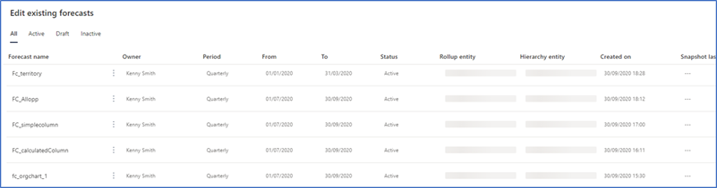

# Deactivate and delete forecasts

You can deactivate or delete forecasts that are no longer required in your organization.  

## Deactivate a forecast 

You can deactivate forecasts that are that are no longer required in your organization. You can view the list of deactivated forecasts under the **Inactive** tab.

> [!IMPORTANT]
> - You can't activate a forecast after you deactivate it.
> - Don’t deactivate a forecast through any other options such as **Advanced find**. Use only forecast configuration page to deactivate forecasts. 
 
1.	Open the **Forecast configuration** page.

    The forecast configuration page opens.

    > [!div class="mx-imgBorder"]
    > 
 
2.	Select the **More options** icon corresponding to the forecast that you want to deactivate, and then select **Deactivate**.
 
    > [!div class="mx-imgBorder"]
    > 

    A confirmation message is displayed.

    > [!div class="mx-imgBorder"]
    > 

3.	Select **Deactivate**.

    The forecast is deactivated and listed under the **Inactive** tab.

    > [!div class="mx-imgBorder"]
    >  

## Delete a forecast

You can permanently delete a forecast that is in the active, inactive, or draft state.

1.	Open the **Forecast configuration** page.

    The forecast configuration page opens.

    > [!div class="mx-imgBorder"]
    > 
 
2.	Select the **More options** icon corresponding to the forecast that you want to deactivate, and then select **Delete**.

    > [!div class="mx-imgBorder"]
    > 

    A confirmation message is displayed.

    > [!div class="mx-imgBorder"]
    > 

3.	Select **Delete**.

    The forecast is deleted permanently from your organization.

### See also

[Activate and upload simple columns data](activate-upload-simple-columns-data-forecast.md)

[Configure forecasts in your organization](configure-forecast.md)

[!INCLUDE[footer-include](../includes/footer-banner.md)]