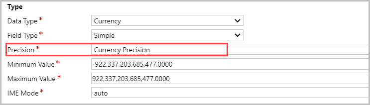
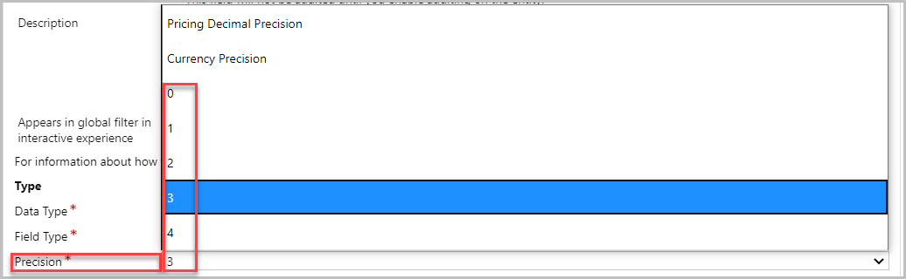

# Decimal precision in currency and pricing

[!INCLUDE[cc-data-platform-banner](../includes/cc-data-platform-banner.md)]

Decimal precision plays an important role in determining the number of decimal places to be used with field type **Currency** in Dynamics 365 Sales. It also affects rounding in calculations.

Decimal precision can be used with the following three levels:

- **Pricing decimal precision.** This is an organization-level setting used for pricing precisions.

- **Currency precision.** This option applies the precision defined for the currency in the record.

- **Field-level precision.** This is used to define a specific set precision using values between 0 and 4.

These precision levels are set while configuring currency fields. More information: [Create and edit fields for Common Data Service using Power Apps solution explorer](/powerapps/maker/common-data-service/create-edit-field-solution-explorer)

## Pricing decimal precision 

This setting allows you to enable and set decimal precision for all supported price-related fields in the system. Pricing decimal precision can be defined in the **Settings** &gt; **Administration** &gt; **System Settings** &gt; **General** tab. More information: [System Settings General tab](/power-platform/admin/system-settings-dialog-box-general-tab).

> [!NOTE]
> This setting supports values between 0 and 4.

This precision setting is applied to any currency field whose precision is set to **Pricing Decimal Precision** in the field properties. To see the field properties, go to **Settings** &gt; **Customizations** &gt; **Entity** &gt; **Fields**. Open the currency field to see the properties.

> [!div class="mx-imgBorder"]
> 

By default, the following fields support pricing decimal precision:

- Product
  - List Price
  - Standard Cost
  - Current Cost

- Price List Item
    -   Amount
    -   Rounding Amount

-   Opportunity Product, Quote Product, Order Product, and Invoice Product
    -   Price Per Unit

## Currency precision 

This option allows you to enable and set decimal precision to individual currencies. To define this setting, go to **Settings** &gt; **Business Management** &gt; **Currencies**. Open the currency record and define the precision for currency. More information: [Manage transactions with multiple currencies](/power-platform/admin/manage-transactions-with-multiple-currencies)

> [!NOTE]
> This setting supports values between 0 and 4.

This precision setting is applied to any currency field whose precision is set to **Currency Precision** in the field properties. To see the field properties, go to **Settings** &gt; **Customizations** &gt; **Entity** &gt; **Fields**. Open the currency field to see the properties.

> [!div class="mx-imgBorder"]
> 

All currency fields except for the ones listed under the **Pricing decimal precision** section support currency precision.

## Field-level precision

This setting allows you to define the precision to individual currency fields.

To apply this precision setting to any of the currency field in the system, go to **Settings** &gt; **Customizations** &gt; **Entity** &gt; **Fields**. Then, open a currency field and define the precision.

> [!div class="mx-imgBorder"]
> 

> [!NOTE]
> This setting supports values between 0 and 4.

### See also
[Define product pricing with price lists and price list items](create-price-lists-price-list-items-define-pricing-products.md)  
[Manage transactions with multiple currencies](/power-platform/admin/manage-transactions-with-multiple-currencies)  
[Troubleshooting the Product entity](ts-products.md)

[!INCLUDE[footer-include](../includes/footer-banner.md)]