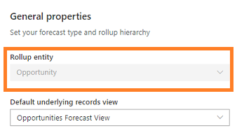

# Define general properties and scheduling

Using the general properties and scheduling options of the forecast configuration page, you can define a forecast model by specifying a hierarchy and timeframe. 

**To enter configuration and scheduling information**

1.	In the **General** step, enter a descriptive name for the forecast. For example, **Kenny's Org FY 2019 Forecast**.

    > [!div class="mx-imgBorder"]
    > 

    >[!NOTE]
    >By default, **Rollup entity** is configured as **Opportunity**. This value can't be changed. 
    >

2.	If you've selected the **Create from scratch** template to create a forecast, choose the **Hierarchy entity**. The entities that are displayed in the list are hierarchy-enabled entities that are available in your organization.

    By default, for the **Org chart forecast** template, the hierarchy entity is selected as **User** and for the **Territory forecast** template, the hierarchy entity is selected as **Territory**. 

3.	Select the **Rollup to hierarchy relationship** attribute to establish a relationship between the rollup and hierarchy entities.

    For example, If you've selected the hierarchy entity as **User**, the attributes in the **Opportunity** entity that has a relationship with the **User** entity are displayed. 
    
    > [!div class="mx-imgBorder"]
    > 
    
    Select an attribute to define the rollup relationship between the rollup entity (**Opportunity**) and the hierarchy entity (**User**). Here, we're selecting the relationship attribute as **Owner (User)**. The relationship is mapped as *Opportunity > Owner (User) > User*. The mapping specifies that the attribute **Owner** is in the **Opportunity** entity that has a relationship with the **User** entity.

    > [!div class="mx-imgBorder"]
    > 

    Similarly, if there is no direct entity relationship between the rollup entity and the hierarchy entity, you can choose a related attribute to define the relationship. Select the **Related** tab, and then choose a related attribute from the list. The list displays attributes of the hierarchy-defined entities only. 
    
    Here, we're selecting the hierarchy entity as **Territory**. Because there's no direct relationship between the rollup entity (**Opportunity**) and the hierarchy entity (**Territory**), the  relationship attributes are displayed on the **Related** tab. These attributes have an indirect relationship with the rollup entity through the **Account** entity. The **Account** entity is considered to be an intermediate entity for establishing a relationship with the hierarchical entity **Territory**. 
    
    The relationship is mapped as *Opportunity > Account (Account) > Territory (Territory) > Territory*. The mapping specifies that there is an attribute **Account** in the **Opportunity** entity that's related to the **Account** entity, which in turn has the **Territory** attribute that's related to the **Territory** entity. The rollup values in the forecast will be based on the relationship defined through the **Territory** attribute.

    > [!div class="mx-imgBorder"]
    > 

    By default, for both the **Org chart forecast** and **Territory forecast** templates, the rollup relationships are predefined as described in the following table.

    | Template | Rollup to hierarchy relationship | Description |
    |----------|----------------------------------|-------------|
    | Org chart forecast | Opportunity > Owner (User) > User | The forecast hierarchy is defined based on the organizational hierarchy. |
    | Territory forecast | Opportunity > Account (Account) > Territory (Territory) > Territory | The forecast hierarchy is defined based on the territory hierarchy. |

    You can edit these values if you want to use your organization-specific attributes to define the relationship between the rollup entity and hierarchy entity.

4.	In the **Top of hierarchy** list, choose a value from the list that will be at the top of this forecast hierarchy. The list of values depends on the selected hierarchy entity.

    For example, if you select the hierarchy entity as **User**, the list displays all active users in your organization. You can then select a user from the list to be displayed at the top of the hierarchy. Say, Kenny Smith, a sales director, is looking at a forecast based on the **Org chart** template. He wants to see a forecast for his team, so he selects his name as the top name in the hierarchy. After Kenny makes his selection, he can see a preview of the full hierarchy in the rightmost pane. 

    > [!div class="mx-imgBorder"]
    > 

5.	Choose a **Default underlying records view**. This is the default view used when users select a row or a cell of the forecast to view its underlying opportunities. To learn more, see [View and manage underlying opportunities](view-and-manage-underlying-opportunities.md).

6.	In the **Scheduling** section, specify the following information.

    | Parameter | Description |
    |-----------|-------------|
    | Forecast period | Select whether the forecast is to be generated monthly or quarterly. By default, **Quarterly** is selected. You can schedule the forecast up to one year. |
    | Fiscal year | Select the fiscal year for the forecast. This is populated based on the organization's fiscal year settings. |
    | Forecast starts at | Select the time period to start forecasting. If you select the forecast period as **Monthly**, select the month you want to start forecasting. If you select the forecast period as **Quarterly**, select the quarter you want to start forecasting. |
    | Number of periods | Enter the number of forecast periods to be generated. You can only create forecasts that span up to one year.   **Note**: If you set the **Forecast period** to **Monthly**, **Fiscal year** to **FY19**, **Forecast starts at** as **January**, and **Number of periods** as **4**, the generated forecasts will be grouped by four months: January, February, March, and April. In such a case, the forecast start and end dates will automatically be set to January 1, 2019 and April 30, 2019, respectively. |
    | Valid from | This field is read-only. It identifies the date the forecast starts. |
    | Valid to | This field is read-only. It identifies the date the forecast ends. |
 
    > [!div class="mx-imgBorder"]
    > 

7.	Select **Next**.

<table>
<tr><td>

> [!div class="nextstepaction"] 
> [Previous step: Select a template](select-template-forecast.md)
</td><td>

> [!div class="nextstepaction"] 
> [Next step: Provide viewing permissions](provide-permissions-forecast.md)
</td></tr>
</table>

### See also

[Configure forecasts in your organization](configure-forecast.md)

[Troubleshooting forecasts](ts-forecasts.md)
