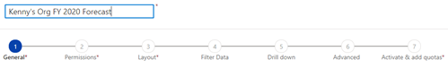
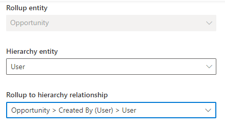
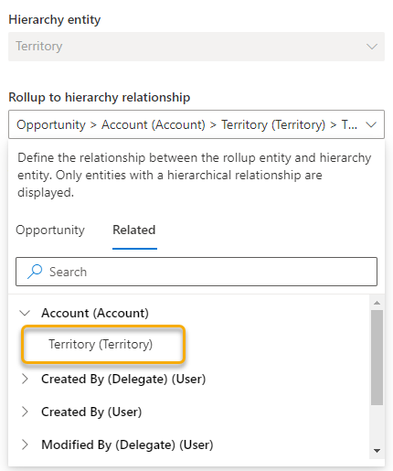
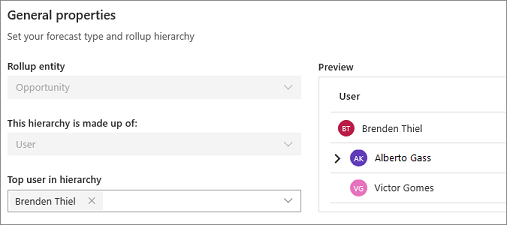
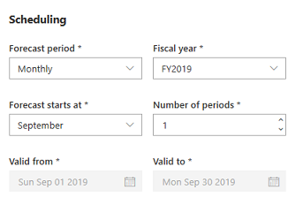
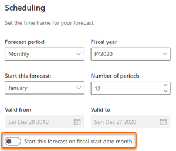
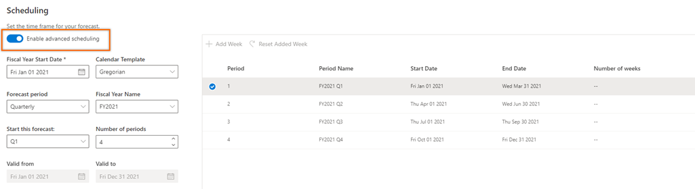

# Define general properties and scheduling

Using the general properties and scheduling options of the forecast configuration page, you can define a forecast model by specifying a hierarchy and timeframe. 

## Basic forecast scheduling

1.	In the **General** step, enter a descriptive name for the forecast. For example, **Kenny's Org FY 2020 Forecast**.

    > [!div class="mx-imgBorder"]
    > 

2.	Select a **Rollup entity**. The forecast is based on the gross rollup of the selected entity. 

    By default, **Opportunity** is selected as the rollup entity. You can choose a custom or other out-of-the-box entity, to support your organizational requirements. Only the entities that have **Change Track** enabled will be listed here. To learn more, see [Enable change tracking to control data synchronization](https://docs.microsoft.com/power-platform/admin/enable-change-tracking-control-data-synchronization).

    > [!div class="mx-imgBorder"]
    > 

    The following rollup entities are selected for templates:

    | Template | Default rollup entity |
    |----------|-----------------------|
    | Org chart forecast | Opportunity |
    | Territory forecast | Opportunity |
    | Product forecast | Opportunity Product |

3.	Choose the **Hierarchy entity**. The entities that are displayed in the list are hierarchy-enabled entities that are available in your organization. 

    By default, the following entities are selected for templates:

    | Template | Default hierarchy entity |
    |----------|--------------------------|
    | Org chart forecast | User |
    | Territory forecast | Territory |
    | Product forecast | Product |
      
4.	Select the **Rollup to hierarchy relationship** attribute to establish a relationship between the rollup and hierarchy entities.

    For example, if you've selected the hierarchy entity as **User**, the attributes in the **Opportunity** entity that has a relationship with the **User** entity are displayed. 
    
    > [!div class="mx-imgBorder"]
    > 
    
    Select an attribute to define the rollup relationship between the rollup entity (**Opportunity**) and the hierarchy entity (**User**). Here, we're selecting the relationship attribute as **Owner (User)**. The relationship is mapped as *Opportunity > Owner (User) > User*. The mapping specifies that the attribute **Owner** is in the **Opportunity** entity that has a relationship with the **User** entity.

    > [!div class="mx-imgBorder"]
    > 

    Similarly, if there is no direct entity relationship between the rollup entity and the hierarchy entity, you can choose a related attribute to define the relationship. Select the **Related** tab, and then choose a related attribute from the list. The list displays attributes of the hierarchy-defined entities only.

    >[!NOTE]
    >The entities that contains related attributes must be hierarchical type only. For example, if **Opportunity Product** is rollup entity and **User** is hierarchy entity, the relationship between them can't be established through the **Opportunity** entity(*Opportunity Product > Opportunity(Opportunity) > Owner(User) > User*), because **Opportunity** entity is not a hierarchical type entity.
    
    Here, we're selecting the hierarchy entity as **Territory**. Because there's no direct relationship between the rollup entity (**Opportunity**) and the hierarchy entity (**Territory**), the  relationship attributes are displayed on the **Related** tab. These attributes have an indirect relationship with the rollup entity through the **Account** entity. The **Account** entity is considered to be an intermediate entity for establishing a relationship with the hierarchical entity **Territory**. 
    
    The relationship is mapped as *Opportunity > Account (Account) > Territory (Territory) > Territory*. The mapping specifies that there is an attribute **Account** in the **Opportunity** entity that's related to the **Account** entity, which in turn has the **Territory** attribute that's related to the **Territory** entity. The rollup values in the forecast will be based on the relationship defined through the **Territory** attribute.

    > [!div class="mx-imgBorder"]
    > 

    By default, for both the **Org chart forecast** and **Territory forecast** templates, the rollup relationships are predefined as described in the following table.

    | Template | Rollup to hierarchy relationship | Description |
    |----------|----------------------------------|-------------|
    | Org chart forecast | Opportunity > Owner (User) > User | The forecast hierarchy is defined based on the organizational hierarchy. |
    | Territory forecast | Opportunity > Account (Account) > Territory (Territory) > Territory | The forecast hierarchy is defined based on the territory hierarchy. |
    | Product forecast | Opportunity Product > Existing Product (Product) > Product | The forecast hierarchy is defined based on the product hierarchy. |

    You can edit these values if you want to use your organization-specific attributes to define the relationship between the rollup entity and hierarchy entity.

5.	In the **Top of hierarchy** list, choose a value from the list that will be at the top of this forecast hierarchy. The list of values depends on the selected hierarchy entity.

    For example, if you select the hierarchy entity as **User**, the list displays all active users in your organization. You can then select a user from the list to be displayed at the top of the hierarchy. Say, Kenny Smith, a sales director, is looking at a forecast based on the **Org chart** template. He wants to see a forecast for his team, so he selects his name as the top name in the hierarchy. After Kenny makes his selection, he can see a preview of the full hierarchy in the rightmost pane. 

    > [!div class="mx-imgBorder"]
    > 

6.	Choose a **Default underlying records view**. This is the default view used when users select a row or a cell of the forecast to view its underlying opportunities. To learn more, see [View and manage underlying opportunities](view-and-manage-underlying-opportunities.md).

7.	In the **Scheduling** section, specify the following information.   

    >[!NOTE]
    >You can use the advanced scheduling to configure the forecast scheduling based on the calendar used by your organization. More information: [Advanced scheduling](#advanced-scheduling)

    | Parameter | Description |
    |-----------|-------------|
    | Forecast period | Select whether the forecast is to be generated monthly or quarterly. By default, **Quarterly** is selected. You can schedule the forecast up to one year. |
    | Fiscal year | Select the fiscal year for the forecast. This is populated based on the organization's fiscal year settings. To learn more, see [Work with fiscal year settings](https://docs.microsoft.com/power-platform/admin/work-fiscal-year-settings).|
    | Forecast starts at | Select the time period to start forecasting. If you select the forecast period as **Monthly**, select the month you want to start forecasting. If you select the forecast period as **Quarterly**, select the quarter you want to start forecasting. |
    | Number of periods | Enter the number of forecast periods to be generated. You can only create forecasts that span up to one year.   **Note**: If you set the **Forecast period** to **Monthly**, **Fiscal year** to **FY19**, **Forecast starts at** as **January**, and **Number of periods** as **4**, the generated forecasts will be grouped by four months: January, February, March, and April. In such a case, the forecast start and end dates will automatically be set to January 1, 2019 and April 30, 2019, respectively. |
    | Valid from | This field is read-only. It identifies the date the forecast starts. |
    | Valid to | This field is read-only. It identifies the date the forecast ends. |
    
    > [!div class="mx-imgBorder"]
    > 

    Scheduling supports fiscal year that spans across calendar years and fiscal months that spans across calendar months. For example, your organization's fiscal year spans across two different calendar years&mdash;from 28 December to 27 December of next year. Let's see how we can schedule a monthly forecast for the fiscal year FY2020.
    
    1. In your organization's fiscal year setting, verify **Start Date** and **Name Based On** settings.

        The start date determines when the fiscal year must start and the name base defines which date has to be considered to name the fiscal year.
        
        > [!div class="mx-imgBorder"]
        > 
        
        In the above image, you can see that:
        
        **Start Date** is selected as **12/28/2019** (format is DD/MM/YYYY) specifying that the fiscal year starts on 28 December 2019 and ends on 27 December 2020.
        
        **Name Based On** is selected as **End Date** specifying that the name of fiscal year is **FY2020**. If the option is selected as **Start Date**, the name will be **FY2019**.
        
        To learn more, see [Work with fiscal year settings](https://docs.microsoft.com/power-platform/admin/work-fiscal-year-settings).
        
    2. In the **Scheduling** section, select the following values: 
        **Forecast period** as **Monthly** 
        **Fiscal year** as **FY2020** 
        **Start this forecast** as **December** 
        **Number of periods** as **12** 

        The dates in the **Valid from** and **Valid to** are selected according to your organizational fiscal year settings.
        
        When you select the forecast period as monthly, the **Start this forecast on fiscal start date month** option is displayed at the bottom of the section. 
        When this option is enabled, the forecast’s first month will be taken from the **Valid from** month (**December** when valid from is **12/28/2019**). When disabled, the forecast’s first month will be the following month (**January**). 

    > [!div class="mx-imgBorder"]
    > 

8.	Select **Next**.

## Advanced scheduling

> [!IMPORTANT]
> - The enhanced experience for advanced scheduling is a preview feature. [!INCLUDE[cc-preview-features-definition](../includes/cc-preview-features-definition.md)]
> - [!INCLUDE[cc-preview-features-expect-changes](../includes/cc-preview-features-expect-changes.md)]
> - [!INCLUDE[cc-preview-features-no-ms-support](../includes/cc-preview-features-no-ms-support.md)]

Using advanced scheduling, you can configure forecast scheduling based on the calendar used by your organization. For example, a car manufacturing company, Contoso, has a planning calendar that uses 13 weeks per quarter. Contoso uses what's referred to as a 4-4-5 calendar, in which quarters are divided into two 4-week months and one 5-week month. The 13 weeks can also be grouped into 5–4–4 or 4–5–4 calendars, depending on organizational requirements.

Forecasting now supports the selection of different calendar patterns to match your organizational requirements. In the **Scheduling** section, enable the preview for advanced scheduling.

> [!div class="mx-imgBorder"]
>      

In addition to the [basic scheduling settings described earlier in this article](#basic-scheduling), the following options are available for you to configure:

- **Fiscal Year Start Date**: Select the date depending on your organization's fiscal year start date. In general, the fiscal year start date starts at the beginning of a quarter, such as January 1, April 1, July 1, or October 1.
- **Calendar Template**: Select the calendar template that corresponds to the accounting periods used in your organization. The calendar patterns supported in forecasting are described in the following table.

    | Calendar templates | Description |
    |--------------------|-------------|
    | 4-4-5, 4-5-4, and 5-4-4 | This calendar pattern divides a year into four quarters of 13 weeks each. In the 4-4-5 pattern, the quarter is grouped into two 4-week months and one 5-week month. Similarly, the grouping can be configured as 5–4–4 or 4–5–4. Using this calendar pattern, the end date of the period is always the same day of the week, which is useful for shift or manufacturing planning because every period is the same length. This calendar pattern has only 364 days (7 days &times; 52 weeks), meaning that a fifty-third week will need to be added every five or six years. This might make year-on-year comparison difficult. You can add an extra week to a specific quarter or month by selecting **Add week** in the preview section. |
    | Gregorian | This calendar pattern is a 12-month period between January 1 and December 31. You can choose a different start and end date for this 12-month period. |
    | Broadcast Calendar | This calendar pattern starts on a Monday and ends on a Sunday, and every month has either four or five such weeks. The broadcast calendar months thus have either 28 or 35 days. The key link between the broadcast and Gregorian calendars is that the first week of every broadcast month always contains the Gregorian calendar first of the month. For example, if January 1 falls on a Saturday, the broadcast calendar year begins on the preceding Monday, December 27. Broadcast January would then have five weeks, ending on January 30, and the four weeks of broadcast February would begin on January 31. The number of weeks in a broadcast month is based on the number of Sundays that fall in that month, with the period ending on the last Sunday of the month. When you choose this option, the **Fiscal Year Start Date** is automatically set to the Monday in the week that contains January 1. To remained aligned with the established broadcast calendar logic, the start date can't be changed. |
    | 3-3-3-4, 3-3-4-3, 3-4-3-3, and 4-3-3-3 | This calendar pattern divides a year into 13 periods where each period is of 4 weeks. For example, in 3-3-3-4 calender, the first 3 quarters consist of 3 periods and the fourth quarter consists 4 periods. Similarly, the grouping can also be configured as 3-3-4-3, 3-4-3-3, or 4-3-3-3. This calendar pattern has only 364 days (7 days &times; 52 weeks), meaning that a fifty-third week will need to be added every five or six years. This might make year-on-year comparison difficult. You can add an extra week to a specific quarter or month by selecting **Add week** in the preview section. |
    
<table>
<tr><td>

> [!div class="nextstepaction"] 
> [Previous step: Select a template](select-template-forecast.md)
</td><td>

> [!div class="nextstepaction"] 
> [Next step: Provide viewing and adjustment privileges](provide-permissions-forecast.md)
</td></tr>
</table>

### See also

[Configure forecasts in your organization](configure-forecast.md)  
[Configure forecasts by using a custom rollup entity](configure-forecast-using-custom-rollup-entity.md)  
[Troubleshooting forecasts](ts-forecasts.md)
