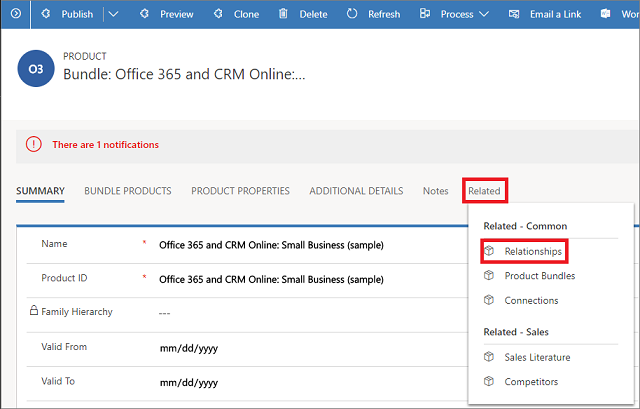
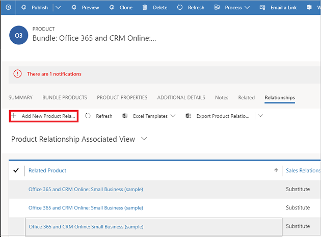

# Define related products to increase sales

Improve your opportunities to increase sales by adding related products as suggestions for up-sell, cross-sell, accessories, or substitutes. Defining related products will help your sales agents with their recommendations to customers. You can add related products to a product or product bundle, but not to product families.  
  
 The related products are displayed as suggestions to your sales agents during opportunity or order management. These suggestions help your sales agents recommend related products and bundles/kits to the customers, and increase product sales. You can define the following relationships for a product: Accessory, cross-sell, substitute, and up-sell. For example, for a [!INCLUDE[pn_microsoft_surface](../includes/pn-microsoft-surface.md)] Pro product, you can add [!INCLUDE[pn_microsoft_surface](../includes/pn-microsoft-surface.md)] Book as an up-sell product so that when your sales agent is adding [!INCLUDE[pn_microsoft_surface](../includes/pn-microsoft-surface.md)] Pro to any opportunity, quote, order, or invoice,  [!INCLUDE[pn_microsoft_surface](../includes/pn-microsoft-surface.md)] is suggested as the up-sell option.  
  
## Add related products (Sales Hub)

1. [!INCLUDE[proc_permissions_admin_cust_mgr_vp_sales_ceo](../includes/proc-permissions-admin-cust-mgr-vp-sales-ceo.md)]  
  
2. Select the site map , then select **App Settings**, and then select **Families and Products**.

3. Open a product you want to define related products for. The product must be in the **Draft**, **Active** or **Under Revision** state. 

4. Select the **Related** tab, and then select **Product Relationships**.

    > [!div class="mx-imgBorder"]
    > 

    On the **Product Relationships** tab, you’ll see the list of products if the product has existing related products.

5. Select **New Product Relationship**. 
 
    > [!div class="mx-imgBorder"]
    > 

6. In the **New Product Relationship** form, enter the following details: 

   - **Related Product**. Select a product that you want to add as a related product to the existing product record you're working on. 
    
   - **Sales Relation Type**. Select whether you want to add the product as an up-sell, cross-sell, accessory, or substitute product. 
    
   - **Direction**. Select whether the relationship between the products will be uni-directional or bi-directional. When you select Uni-Directional, the product that you select in Related Product will be shown as a recommendation for the existing product but not vice-versa. 

7. Select **Save** or **Save & Close**. 

> [!NOTE]
> 
> Currently, product suggestions are not supported in the Sales Hub app. 

  
## Typical next steps  
  [Publish a product or bundle to make it available for selling](../sales-enterprise/publish-product-bundle-make-available-selling.md)  
  
  [Set up a product catalog: Walkthrough](../sales-enterprise/set-up-product-catalog-walkthrough.md)  
  
### See also  
 [Create a product family](../sales-enterprise/create-product-family.md)

[!INCLUDE[footer-include](../includes/footer-banner.md)]