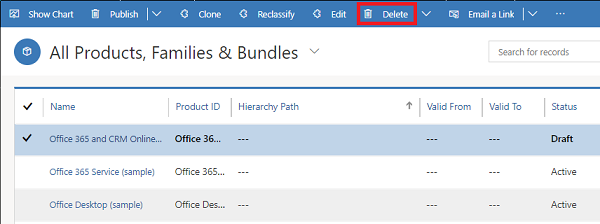

# Delete a family, product, or bundle (Sales Hub)

To stop selling a product, delete it. If you delete a parent family, its child products, families, and bundles are also deleted.  
  
> [!IMPORTANT]
>  You can't recover a deleted record.  

1. [!INCLUDE[proc_permissions_admin_cust_mgr_vp_sales_ceo](../includes/proc-permissions-admin-cust-mgr-vp-sales-ceo.md)]  
  
2. Select the site map , and then select **Products**.
  
3. Select a product family, product, or bundle record you want to delete, and on the command bar, select **Delete**.  

   > [!div class="mx-imgBorder"]
   > 

4. In the **Confirm Deletion** dialog box, select **Delete**.

   
   
>[!NOTE]
>Products or bundles can't be deleted if they are associated with an existing quote, order, or invoice.  
  
### See also  
 [Set up a product catalog: Walkthrough](../sales-enterprise/set-up-product-catalog-walkthrough.md)   
 [Create a product family](../sales-enterprise/create-product-family.md)

[!INCLUDE[footer-include](../includes/footer-banner.md)]
