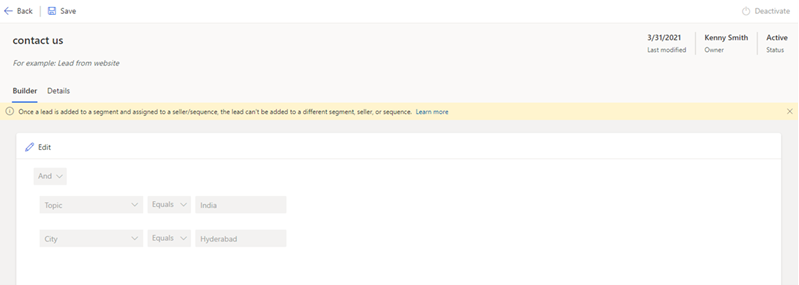

# Edit a segment

To modify your process for choosing the records you want as members of a segment, you can update the conditions that you've defined in the segment.

1.	Sign in to your Dynamics 365 Sales Hub app.   
2.	Go to **Change area** in the lower-left corner of the page, and select **Sales Insights settings**.
3.	Under **Sales accelerator**, select **Segments**.   

    The **Segments** page opens with the list of available segments.   

    >[!div class="mx-imgBorder"]
    >  

4.	Select and open the segment that you want to edit. In this example, **Leads from contact us** is selected.

    >[!div class="mx-imgBorder"]
    >  
 
5.	Select **Edit**. 
6.	On the confirmation message, select **Edit**.

    >[!div class="mx-imgBorder"]
    >  
  
7.	Edit the conditions, select **Save**, and then in the confirmation message that appears, select **Update segment**.

    >[!div class="mx-imgBorder"]
    >  

The changes will be applied to records that are created in the future in the application. The records that the segment has already been applied to won't change.

### See also

[Create and activate a segment](create-and-activate-a-segment.md)   

[!INCLUDE[footer-include](../includes/footer-banner.md)]
