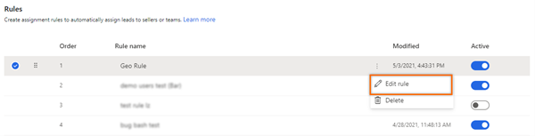
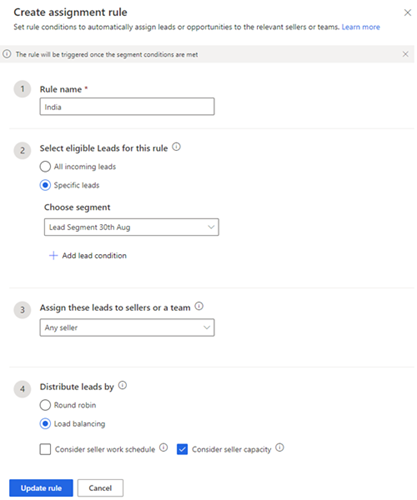

# Edit an assignment rule

To modify your process for automatically assigning leads to sellers, you can update the conditions that you've defined in the rule.

1.	Sign in to your Dynamics 365 Sales Hub app.

2.	Go to the **Change area**  in the lower-left corner of the page, and select **Sales Insights settings**.

3.	Under **Sales accelerator**, select **Assignment rules (preview)**.

4.	On the **Assignment rules** page, select the rule that you want to edit from the **Rules** section.   

    >[!div class="mx-imgBorder"]
    >   

5.	Select **More options** **&vellip;**, and then select **Edit rule**.   

    >[!div class="mx-imgBorder"]
    >    

    The **Create assignment rule** pane opens.

    >[!div class="mx-imgBorder"]
    >    

6.	Edit the information according to your needs, and then select **Update Rule**.

The changes will be applied to new leads that are created in the future in the application. The leads that were already assigned through the rule won't change.

### See also

[Manage assignment rules for lead routing](create-manage-assignment-rules-lead-routing.md)    
[Create and activate an assignment rule](create-and-activate-assignment-rule.md)

[!INCLUDE[footer-include](../includes/footer-banner.md)]
