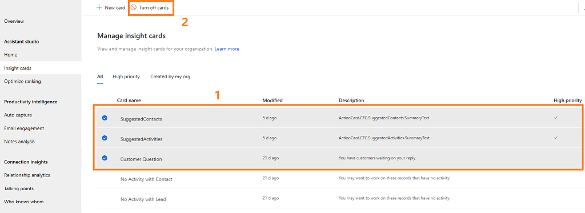
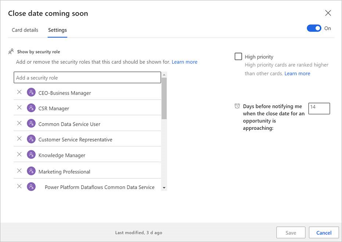
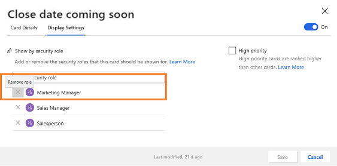
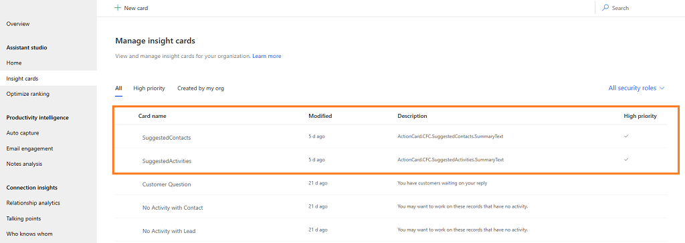
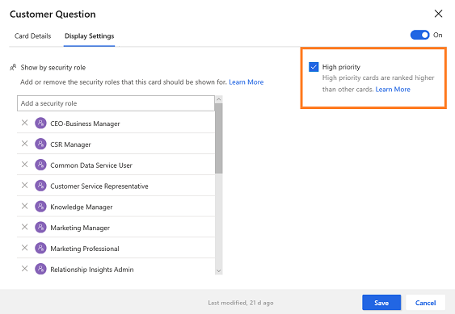
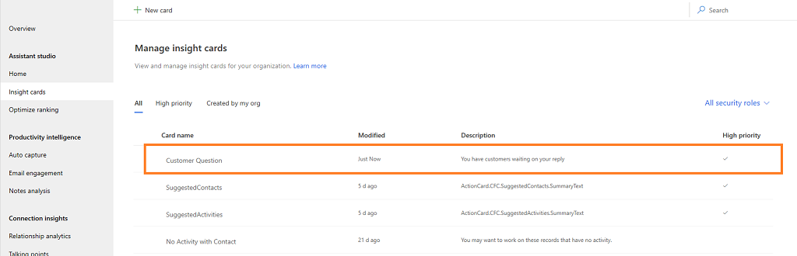
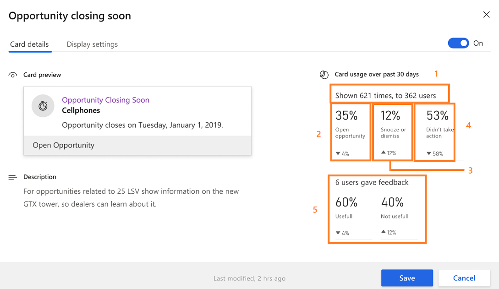

# Edit insight cards

[!INCLUDE[cc-data-platform-banner](../includes/cc-data-platform-banner.md)]

Editing the cards allows you to do the following tasks based on the card:

- [Turn cards on or off](#turn-cards-on-or-off)
- [Assign to or remove roles from a card](#assign-roles-to-or-remove-roles-from-a-card)
- [Set priority of a card](#set-priority-for-a-card)
- [Edit flow of a card](#edit-flow-of-a-card)
- [View card usage metrics](#view-card-usage-metrics) 

## Turn cards on or off

Different users have different needs in using the cards, and you don’t want to show the card for some users at this point in time. Similarly, you don’t want to show certain cards in your organization or you might not need them to be displayed at this time. You can turn the cards on or off depending on the need to show them to specific user roles in the **Personal settings** section of the **Sales Insights settings** setup center.

When you turn off a card, the assistant feature disables the card for the security roles you've assigned the card to. However, the assistant feature doesn't disable other properties that are associated with the card. For the card that you generated using Microsoft Power Automate, you can disable the card but you can't delete the flow. Even after you disable the card, the flow remains active because other custom insight cards might use the flow.

Go to the **Assistant Studio** page (**Home** tab) under **Assistant** and open a card from the list that you want to turn on or off. Select the **On**/**Off** toggle as required. In this example, we turned on the **Stake holder Recommendation** card.

> [!div class="mx-imgBorder"]
> 

### Turn multiple cards on or off

To turn multiple cards on or off, go to the **Manage insight cards** page (**Insight cards** tab) under **Assistant** and select the cards that you want to turn on or off. Select **Turn on cards** or **Turn off cards** as per your requirement.

In this example, we want to turn off the cards **SuggestedContacts**, **SuggestedActivities**, and **Customer Question**. After choosing the cards, select **Turn off cards** and the three cards are disabled. 

> [!div class="mx-imgBorder"]
> 

### Turn cards on or off for a security role

If you want to turn off cards for a particular security role, go to the **Manage insight cards** page (**Insight cards** tab) under **Assistant** and filter the cards based on the role. Choose the cards that you want to turn off for the selected role and select **Remove for *role name***. The cards will not show for the role that you have selected.

In this example, we have filtered the cards with the security role **Survey Owner** and chosen the cards **SuggestedContacts**, **SuggestedActivities**, and **Customer Question**. Select **Remove for Survey Owner** and the cards are turned off only for the **Survey Owner** role. 

> [!div class="mx-imgBorder"]
> 

## Assign roles to or remove roles from a card

When you create a card, you can specify the security roles to whom you want the card to display. By default, the cards are assigned to all the security roles in your organization. You can edit the card to assign or remove the security roles to the card. 

> [!NOTE]
> The security roles you see in the cards are defined in the Microsoft Power Platform admin center. To learn more on security roles, see [Security roles and privileges](/dynamics365/customer-engagement/admin/security-roles-privileges).

1. Go to the **Manage insight cards** page (**Insight cards** tab) under **Assistant** and select the card for which you want to add the security roles. In this example, we've selected the **Close date coming soon** card.

    > [!div class="mx-imgBorder"]
    > 

2. Go to the **Display Settings** tab. You can see that by default the card is assigned to all the security roles.

3. Under the **Show by security role (preview)** section, select the **Add a security role** search box. A list of security roles that are available in your organization is displayed.

    > [!div class="mx-imgBorder"]
    > 

   In this example, we have added the **Marketing Manager** security role to the **Close date coming soon** card.

    > [!div class="mx-imgBorder"]
    > 

4. Save the card.

5. To remove security roles, select the role to remove. In this example, we're removing the **Marketing Manager** security role from the **Close date coming soon** card.

    > [!div class="mx-imgBorder"]
    > 

## Set priority for a card

You can prioritize the cards that display in your organization. When you set a card as a priority, the card is displayed to the user at the top.

When you open the **Manage insight cards** page (**Insight cards** tab), the list of cards that are defined for your organization is displayed. A check mark corresponding to the card in the **High priority** column specifies that the card is set as priority.

> [!NOTE]
> You can also select the **High priority** tab to view the high priority cards.

In this example, the **SuggestedContacts** and **SuggestedActivities** cards are set as high priority. These cards will be promoted above other cards and displayed on top of the others.

> [!div class="mx-imgBorder"]
> 


1. Go to the **Manage insight cards** page (**Insight cards** tab) under **Assistant** and open the card that you want to set as a priority.

2. Go to the **Display Settings** tab and select **High priority**. In this example, we're selecting and prioritizing the **Customer Question** card.

    > [!div class="mx-imgBorder"]
    > 
 
2. Save the card.

    The **Customer Question** card is set as priority and you can verify that the **High priority** column corresponding to the card is updated with a check.

    > [!div class="mx-imgBorder"]
    > 

To know how to optimize ranking of cards,  see [Optimize ranking of insight cards](optimize-ranking-insight-cards.md).

## Edit flow of a card

You can always edit the flow of the card when there is a business need to update it. You can add or update conditions and steps, and update the properties of a condition. 

> [!NOTE]
> The **Edit card logic in Microsoft Power Automate** option appears only for the cards that are created in Microsoft Power Automate. You can see a flow icon corresponding to the name of the cards that are created using Power Automate.

1. Go to the **Manage insight cards** page (**Insight cards** tab) under **Assistant** and select the card for which you want to change the flow. In this example, we have selected the **No update in opportunity** card.

    > [!div class="mx-imgBorder"]
    > 
 
2. Select **Edit card logic in Microsoft Power Automate** and the flow opens in a tab to edit.

    > [!div class="mx-imgBorder"]
    > 
 
3. Edit the flow as required and select **Save**. The flow of the card is updated.

To learn more about editing the flow, see [Add an action](/flow/multi-step-logic-flow) and [Add a condition](/flow/add-condition).

## View card usage metrics 

Each insight card that is available in Assistant shows usage metrics based on the views and actions that users perform. These metrics help to get real-time data on how the card is used. Also, you can analyze what updates are necessary for the card, if it is underused.

The metric values are for the last 30 days and calculated as follows:

```
Percentage value = (Number of actions performed * 100) / Number of views
```

For example, when a card is displayed for 10 users and only four users have performed an action, the value displayed is 40%.

Also, at the bottom of each metric, a trend value is displayed for the last 30 days from the current date. For example, the metric value was 30% in the last 30 days and 40% on the current date, so the trend value displays a 10% increase in usage.

> [!NOTE]
> The metric values are refreshed every 24 hours.

The following metrics are available on the card.

| Number | Metrics | Description |
|------|---------|-------------|
| 1 | Header | Specifies the number of times the card has been displayed to the number of users. For example, if a card is displayed 621 times to 362 users, then the header shows **Shown 621 times, to 362 users**. |
| 2 | Action | Displays in percentage value the number of times the users performed actions on the card. |
| 3 | Snooze or dismiss | Displays in percentage value that users have performed snooze and dismiss actions on the card.|
| 4 | No action | Displays in percentage value that users didn't perform actions on the card. |
| 5 | Feedback | Displays in percentage value the number of times the users liked and disliked the card. Also, a header displays the total number of users who gave the feedback. |

 > [!div class="mx-imgBorder"]
 > 


### See also

[Configure and manage insight cards for the premium assistant](configure-assistant.md#configure-and-manage-insight-cards-for-the-premium-assistant)

[Create custom insight cards](create-insight-cards-flow.md)

[Optimize ranking of insight cards](optimize-ranking-insight-cards.md)

