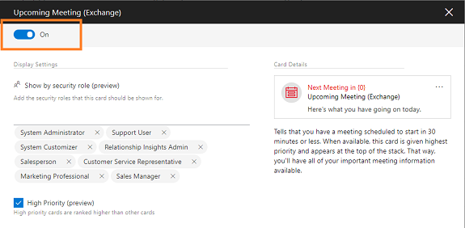
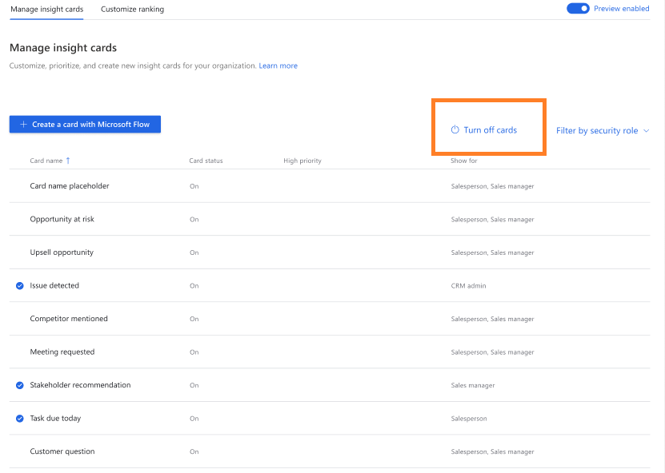
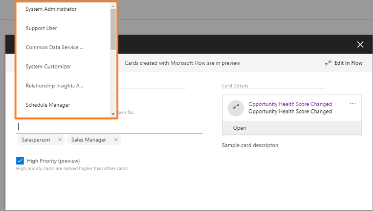
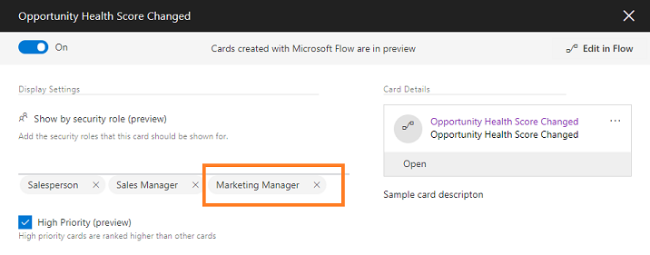
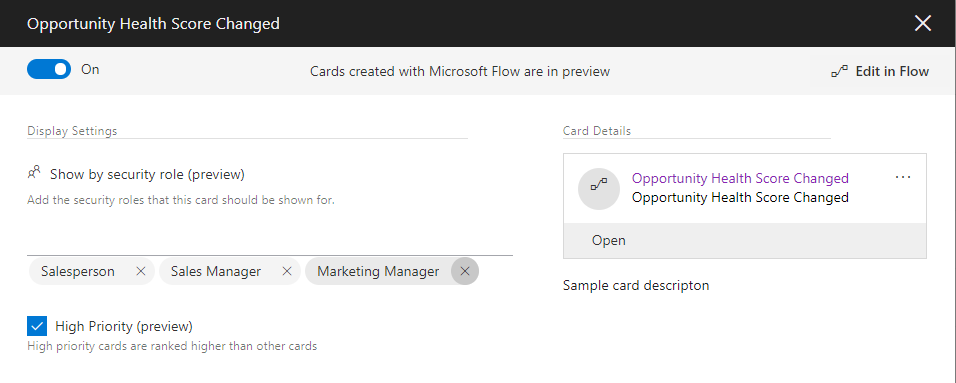
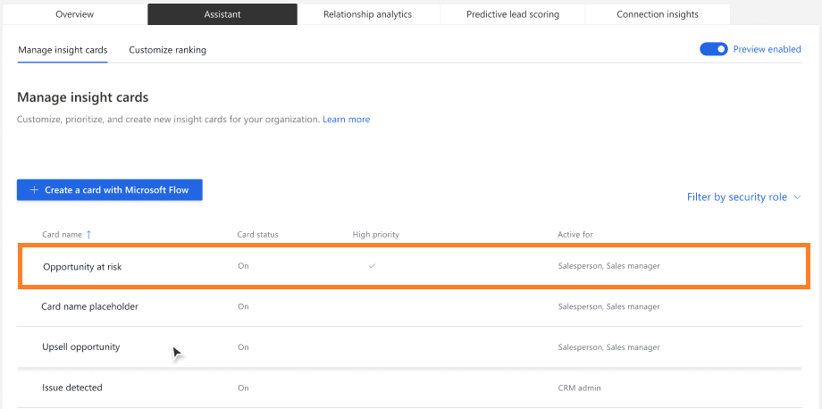
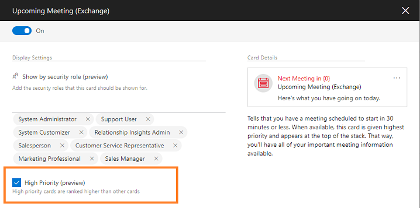
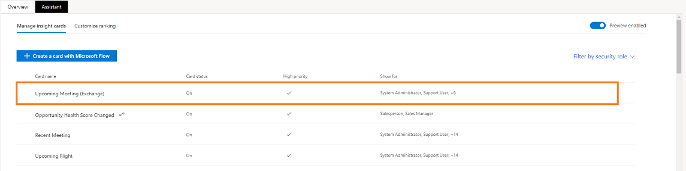
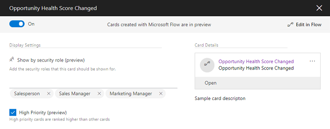
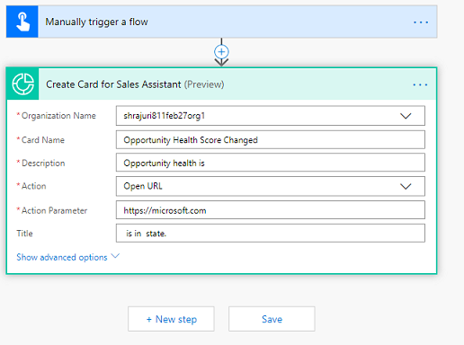

# Preview: Edit insight cards

Applies to [!INCLUDE[pn-crm-online](../includes/pn-crm-online.md)] version 9.1.0.

[!INCLUDE [cc-beta-prerelease-disclaimer](../includes/cc-beta-prerelease-disclaimer.md)]

> [!IMPORTANT]
> [!INCLUDE[cc_preview_features_definition](../includes/cc-preview-features-definition.md)] 

Editing the cards allows you to perform the following tasks based on the card:

- Turn cards on or off
- Assign to or remove roles from a card
- Set priority of a card
- Edit the flow of a card

## Turn cards on or off

Different users have different needs in using the cards, and you don’t want to show the card for some users at this point of time. Similarly, you don’t want to show certain cards in your organization or you might not need them to be displayed at this time. You can turn the cards on or off depending on the need to show them to specific user roles in the **Assistant** section of the **Sales AI** setup center.

When you turn off a card, the assistant feature disables the card for the security roles you have assigned the card to. However, the assistant feature doesn't disable other properties that are associated with the card. For the card that you generated using Microsoft Flow, you can disable the card but you can't delete the flow. Even after you disable the card, the flow remains active because other custom insight cards might use the flow.

Go to the **Assistant** tab and open a card from the list that you want to turn on or off. Select the **On**/**Off** toggle as required. In this example, we turned on the **Upcoming Meeting (Exchange) opportunity** card.
    

### Turn multiple cards on or off

To turn multiple cards on or off, go to the **Assistant** tab and select the cards that you want to turn on or off. Select **Turn on cards** or **Turn off cards** as per your requirement.

In this example, we want to turn off the cards **Issue detected**, **Stakeholder recommendations**, and **Task due today**. After choosing the cards, select **Turn off cards** and the three cards are disabled. 
    

### Turn cards on or off for a security role

If you want to turn off cards for a particular security role, go to the **Assistant** tab and filter the cards based on the role. Choose the cards that you want to turn off for the selected role and select **Remove for this role**. The cards will not show for the role that you have selected.

In this example we have filtered the cards with the security role **Sales manager** and chosen the cards **Card name placeholder**, **Opportunity at risk**, and **Stakeholder recommendation**. Select **Remove for this role** and the cards are turned off only for the **Sales manager** role. 
    

## Assign roles to or remove roles from a card

When you create a card, you must specify the security roles to whom you want the card to display. By default, all the cards are assigned to the security roles **Salesperson** and **Sales manager**. You can edit the card to assign or remove the security roles to the card. 

>[!NOTE]
>The security roles you see in the cards are defined in Dynamics 365 for Customer Engagement. To learn more on security roles, see [Security roles and privileges](/dynamics365/customer-engagement/admin/security-roles-privileges).

1. Go to the **Assistant** tab and select the card for which you want to add the security roles. In this example, we have selected the **Opportunity Health Score Changed** card.

   

   You can see that by default the card is assigned to the security roles **Salesperson** and **Sales manager**.
2. Select the **Show by security role (preview)** section and the list of security roles that are available in your organization is displayed.

   

   In this example we have added the **Marketing Manager** security role to the **Opportunity Health Score Changed** card.

   

3. Close the card.
4. (Optional) To remove security roles, select the role to remove. In this example, we are removing the **Marketing Manager** security role from the **Opportunity Health Score Changed** card.

   

## Set priority for a card

You can prioritize the cards that display in your organization. When you set a card as a priority, the card is displayed to the user at the top.

When you open the **Assistant** tab, the list of cards that are defined for your organization is displayed. A check mark corresponding to the card specifies that the card is set as priority. In this example, the **Opportunity at risk** card is set as high priority. This card will be promoted above other cards and displayed on top of the others.
    

1. Go to the **Assistant** tab and open the card that you want to set as a priority. Select **High Priority (preview)**. In this example, we are selecting and prioritizing the **Upcoming Meeting (Exchange)** card.

   

2. Close the card. The **Upcoming Meeting (Exchange)** card is set as priority and you can verify that the **High priority** column corresponding to the card is updated with a check.

    

To know how to optimize ranking of cards,  see [Optimize ranking of insight cards](optimize-ranking-insight-cards.md).

## Edit flow of a card

You can always edit the flow of the card when there is a business need to update it. You can add or update conditions and steps, and update the properties of a condition. 

> [!NOTE]
> The **Edit in Flow** option appears only for the cards that are created in Microsoft Flow.

1. Go to the **Assistant** tab and select the card for which you want to change the flow. In this example we have selected the **Opportunity Health Score Changed** card.

   
 
2. Select **Edit in Flow** and the flow opens in a tab to edit.

   
 
3. Edit the flow as required and select **Save**. The flow of the card is updated.

To learn more about editing the flow, see [Add an action](/flow/multi-step-logic-flow) and [Add a condition](/flow/add-condition).

### See also

- [Manage custom insight cards using Microsoft Flow](manage-custom-cards-flow.md)
- [Create insight cards](create-insight-cards-flow.md)
- [Optimize ranking of insight cards](optimize-ranking-insight-cards.md)
