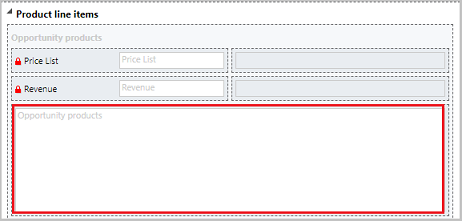
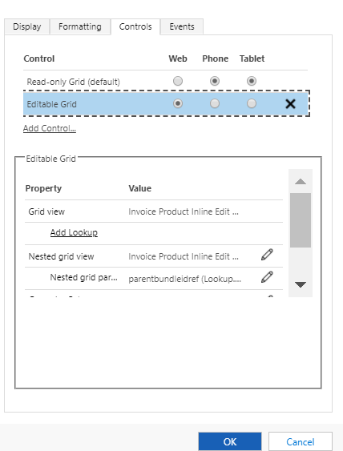

# Add editable Products grid on Opportunity, Quote, Order, and Invoice forms (Sales Hub)

Products grid on the Opportunity, Quote, Order, or Invoice forms is now editable, so you don’t have to open individual product records to make changes to the product. 

Currently, the preconfigured Products grid is available only on apps built on the Unified Interface framework and is optimized to work on the web.

The product editable grid is added out-of-the-box to the **Product Line Items** section of the Opportunity form of type **Main**. For Quote, Order, or Invoice, it is added to the Products section of the forms of type **Main**. 

If you’re upgrading to the latest version and you’ve made customizations to the **Product Line Items** or **Products** sections of these forms, your customizations will prevail, and the product editable grid won’t be added to the forms by default. You must manually enable the product editable grid, though the product grid configurations for the editable grid already will be defined. If there are no customizations to these sections, the Products grid will be automatically configured and enabled after the upgrade. 

To enable the editable products grid on the Opportunity, Quote, Order, or Invoice form:

1. Go to **Settings** > **Customization**. 

2. Select **Customize the System** to open the default solution. 

3. Under **Components**, expand **Entities**, expand the entity you want, and then select **Forms**. 

4. In the list of forms, open the form of type Main.

5. If you’re enabling the editable product grid in the Opportunity form, select the **Opportunity Products** area in the **Product Line items** section, and in the **Edit** group, select **Change Properties**.

    
    
    **– OR –** 
    
    If you’re enabling the editable product grid in the Quote, Order, or Invoice form, select the **Products** area in the **Products** section, and in the **Edit** group, select **Change Properties**.
  
    

6.	In the **Set Properties** dialog box, select the devices on which you want the editable grid to be available by selecting the corresponding radio button. Currently, the editable grid is optimized to work on the web.

    

    Notice that the properties of the editable grid such as Grid view or Nested grid view are preconfigured by default.
 
7.	Select **OK**.

### See also  

[Make grids (lists) editable using the Editable Grid custom control](../customize/make-grids-lists-editable-custom-control.md)

[!INCLUDE[footer-include](../includes/footer-banner.md)]