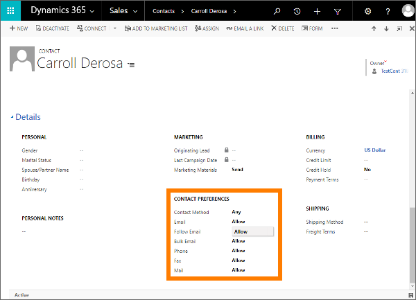

# Use email engagement to view message interactions

 Email engagement helps you to:  
  
-   See when recipients opened your message, clicked a link, opened an attachment, or sent a reply.  
  
-   Receive an alert right away, the first time a recipient opens your message.  
  
-   Schedule the most effective delivery time, and receive advice for the best time based on the recipient's time zone.  
  
-   Choose the most effective message template, with recommendations based on your organization's previous email interaction history.  
  
-   Set an alert to remind you when it's time to follow up on an email message.  
  
-   Review the full interaction history of a single message, or review  KPIs.  
  
The administrator must enable email engagement before you can try it out. Email engagement uses the relationship assistant to deliver alerts and other messages, so we strongly recommend that you also enable the assistant if you are using email engagement. For complete details about prerequisites, how to enable the feature, see [Enable email engagement](configure-email-engagement.md).

> [!NOTE]
>  Some aspects of the email engagement feature may be visible in [!INCLUDE[pn_sales_business_doc_name_shortest](../includes/pn-sales-business-doc-name-shortest.md)] even when the feature is turned off. These include:  
> 
> -   The **Attachments** grid, which is shown when you author an email message or email template, always includes the **Followed** column.  
> -   The **Followed Email** grid always shows **Opens**, **Last Opened Time**, **Attachment Views**, **Link Clicks**, and **Replies** columns.  
> -   The **Email Template** grid always shows **Reply Rate**, **Open Rate**, **Recommended**, and **Email Count** columns.  
> -   The out-of-the-box versions of the account, contact, and lead forms all include the **Follow Email** field.  
> 
> While the email engagement feature is disabled, these features will still appear but will usually be empty. Read the rest of this topic for details about what these columns mean and how to use them when the feature is enabled.  
  
## Get interaction history for email  
 Usually when you send an email, you'll never know if it was opened or read unless the recipient chooses to write back to you. That's because the email system was created to simulate traditional mail, and was  not designed with response tracking in mind. [!INCLUDE[pn_sales_business_doc_name](../includes/pn-sales-business-doc-name.md)] uses special techniques to work around this limitation and provide the following message-following features:  
  
- **Find out when your message was opened**: When you send a followed email message from [!INCLUDE[pn_sales_business_doc_name](../includes/pn-sales-business-doc-name.md)], the system automatically generates  a uniquely named, transparent, one-pixel GIF and adds it as a linked image to the message. This invisible GIF, and all the other images that you add to the message, are stored on your [!INCLUDE[pn_dynamics_crm](../includes/pn-dynamics-crm.md)] server and are first loaded from the server when somebody opens the message (and chooses to download its images). When a unique GIF is requested,[!INCLUDE[pn_sales_business_doc_name](../includes/pn-sales-business-doc-name.md)] registers that the associated message was opened, and notes the device type. We recommend that you always include other images in your message because that will help motivate recipients to download the images (you won't know they open it if images aren't loaded).  
  
- **Find out when each link was clicked**: When you send a followed email message from [!INCLUDE[pn_sales_business_doc_name](../includes/pn-sales-business-doc-name.md)], the system automatically replaces each of its hyperlinks with a unique redirect link that points to the [!INCLUDE[pn_dynamics_crm](../includes/pn-dynamics-crm.md)] server. Each redirect link includes an ID that uniquely identifies both the message that contains it and the URL of the original link target. When the [!INCLUDE[pn_dynamics_crm](../includes/pn-dynamics-crm.md)] server receives the link request, it logs the click and then redirects the click to its original address so that the recipient still gets the correct information with little or no delay.  
  
- **Find out when each attachment was opened**: When you add a followed attachment, the file isn't attached directly as with a standard email. Instead, it gets stored on the [!INCLUDE[pn_onedrive_for_business](../includes/pn-onedrive-for-business.md)] share used by your [!INCLUDE[pn_dynamics_crm](../includes/pn-dynamics-crm.md)] server and added as a link to the message. As with followed links, when a recipient clicks to download the attachment, the [!INCLUDE[pn_dynamics_crm](../includes/pn-dynamics-crm.md)] server notes the click and the time. You can mix both followed and unfollowed attachments in a single email, which can be important if you are sending sensitive files that you don't want to save on [!INCLUDE[pn_onedrive_for_business](../includes/pn-onedrive-for-business.md)]. Many of your recipients may actually prefer to receive attachments as links rather than files because that means that  your messages will take up much less room in their inbox.  
  
Using this information, [!INCLUDE[pn_sales_business_doc_name](../includes/pn-sales-business-doc-name.md)] shows you the full interaction history for any message, and calculates key performance indicators (KPIs). 

> [!NOTE]
> The actions that are performed on email are stored in Microsoft Azure Storage. This storage is unique for each organization. If an organization is restored to another organization, the history of the actions that are performed on email of previous organization will not be displayed in the restored organization.

> [!IMPORTANT]
>  You should treat all email interaction data as approximations. The system can only register an email-open event if the recipient also downloads the message's images (including the invisible GIF), so the actual number of opens could be larger than the number recorded in [!INCLUDE[pn_sales_business_doc_name](../includes/pn-sales-business-doc-name.md)]. Similarly, if images are cached (which is typical for web-based email clients), then additional opens may not get reported to [!INCLUDE[pn_sales_business_doc_name](../includes/pn-sales-business-doc-name.md)].  
> 
>  It  can therefore be a good idea to include visible images in your followed email messages (such as a company logo or illustration) to encourage recipients to download the images.  
  
   

## Create and send followed email message  
  
> [!NOTE]
> Users can only follow emails through an Email form.

When email engagement is enabled for your site, all of the controls required to create and send an email with some or all of its  features enabled are available on the **New Email** page, as shown in the following figure. This page is shown whenever you create an email in [!INCLUDE[pn_sales_business_doc_name](../includes/pn-sales-business-doc-name.md)].  
  
   
  
 The following email engagement features are indicated in the figure:  
  
1. **Followed (and unfollowed) attachments**: This table lists all of the files attached to your email and indicates the followed status of each of them. Controls for adding, removing, and modifying the attachments are also provided in this area.  
  
2. **Enable/disable following controls**: Here you can enable or disable following for the current message. Additional controls and links are provided here as needed, such as information about recipients that may be configured not to allow following.  
  
3. **Delivery scheduling controls**: Here you can view and set the delivery time for your message. Advice for recommended delivery times can also be shown here, such as information related to the recipient's time zone.  
  
4. **Follow-up reminder controls**: Here you can view and set a follow-up reminder, which might display an alert if the message remains unopened for three days.  
  
5. **Insert Template button**: Select the button to insert standard text for any of several general purposes (such as a meeting follow-up). You can select from a variety of available templates, and email engagement provides advice on which template to choose based on previous performance.  
  
   See the remainder of this topic for complete details about how to use these controls.  
  
> [!TIP]
>  The **Email** page doesn't include any features to help you add a link to your message, but if you are using [!INCLUDE[pn_Internet_Explorer](../includes/pn-internet-explorer.md)] then you can do it by selecting  the text you want to add the link to, and then pressing Ctrl-K to open a window where you can define the link target.  
  
   

### Create a new message  
 You can activate email engagement features for any email that you send from within [!INCLUDE[pn_sales_business_doc_name](../includes/pn-sales-business-doc-name.md)]. The main record for the message (typically the record are looking at when you create it), is set as its **Regarding** value, though the various to, from, and copy-to email addresses can also affect the places where you are able to see the message and where its KPIs may apply.  
  
 To add an email activity to a record:  
  
1.  Open the record you want to add the activity to (typically a contact, opportunity, lead, or account).  
  
2.  In the middle of the page, select **Activities** > **More Commands** > **Email**.  
  
3.  Add recipients, a message subject, and body text as usual. Speed up your writing by using a template if it's appropriate, and use the handy tooltips for help with other settings. See also the other subsections in this section for details about setting up the various engagement features.  
  
4.  When you are ready to send the message, select **Send** (or select **Save** if you want to save a draft and finish it later).  

   

### Choose and apply the most effective email template  
 Email templates are standard messages that you send often, such as introductions, confirmations, thank-you messages, and reminders. They can include dynamic values (such as sender or recipient data). They give you a quick start when you're writing common messages.  
  
 The email engagement feature automatically analyzes the performance of all messages sent through [!INCLUDE[pn_sales_business_doc_name](../includes/pn-sales-business-doc-name.md)] and identifies your most successful templates. It shows all available templates, but highlights the ones that were found to generate the most opens, replies, or sales.  
  
 To use a template:  
  
1.  Create a new message as described previously in [Create a new message](#NewMessage).  
  
2.  On the command bar, select **Insert Template**. When you use a template, you'll  usually choose it right away, immediately after creating the message and before you do anything else.  
  
3.  On the **Insert Template** pop-up window, choose the language and then choose a template from the **Search Template** lookup.   
  
      
  
4.  Select **Select**. Template content is loaded into your message.  
  
5.  Customize the template content as needed and enable any other email engagement features that you want to use, as described in the other sections of this topic.  
  
6.  When you are ready to send the message, select **Send** (or select **Save** if you want to save a draft and finish it later).  
  
[!INCLUDE[proc_more_information](../includes/proc-more-information.md)] [Create templates for email](/dynamics365/customer-engagement/admin/create-templates-email)  
  
   

### Enable or disable following for individual messages  
 Followed emails can tell you when a recipient opened the message, replied to the message, opened an attachment, or clicked a link.  
  
 When email engagement is enabled on your site, it will also be enabled by default for all messages you create in [!INCLUDE[pn_sales_business_doc_name](../includes/pn-sales-business-doc-name.md)], provided that none of the recipients are set up to block followed messages. [!INCLUDE[proc_more_information](../includes/proc-more-information.md)] [Set following to Do Not Allow to respect individuals' privacy and preferences](#set-individuals-privacy-and-preferences)  
  
 Use the controls at the top of the **Email Engagement** area to view and edit the follow state for your message, as summarized in the following table.  
  
|Follow state|Description|  
|------------------|-----------------|  
||Indicates that the current email will be followed. All links will be followed, and followed attachments are enabled (but still optional). This is the default status for all new email messages when email engagement is enabled for your site and all of the recipients allow following. Select the **Don't Follow** link to disable following for this message.|  
||Indicates that the current email won't be followed. No links will be followed and followed attachments are also disabled. Select the **Follow** link to enable following (if permitted).|  
||Indicates that one or more of the current email's recipients have following set to Do Not Allow, which means that you can't follow this message unless you remove the recipients that don't allow following (or change their settings). You now have the following options:   -   Select the **View Preferences** link to open a pop-up window that shows the name and following  preference for each recipient. From here you can open any recipient's record by clicking their name in the list. -   If you have attempted to fix the issue by removing recipients or changing settings, then select **Retry Follow** to try again. -   Select **Don't Follow** to stop attempting to follow this message.|  
  
> [!NOTE]
>  Within about 15 minutes of the first time a followed message is registered as opened, the system notifies you by creating a new action card for the relationship assistant. The card provides links to the message, related records, and action buttons to generate a call activity, snooze the alert, or dismiss it. [!INCLUDE[proc_more_information](../includes/proc-more-information.md)] [Guide customer communications with assistant](assistant.md).  
  
   

### Add followed attachments  
  
> [!NOTE]
>  To follow attachments, [!INCLUDE[pn_onedrive_for_business](../includes/pn-onedrive-for-business.md)] must be available to your [!INCLUDE[pn_dynamics_crm](../includes/pn-dynamics-crm.md)] server and Document Management for Email must be enabled. Talk to your administrator if you think these features are missing from your server. [!INCLUDE[proc_more_information](../includes/proc-more-information.md)] [Enable Email engagement](configure-email-engagement.md)  
  
 Followed attachments can tell you when a recipient opens an attachment. To add one or more followed attachments:  
  
1. Create a new message as described previously in [Create a new message](#NewMessage).  
  
2. Make sure that following is enabled for the message as described previously in [Enable or disable following for individual messages](#EnableTrackingOnMessages). You can't add followed attachments if the message recipients are set to not allow following, but you can still add unfollowed attachments. You can also mix followed and unfollowed attachments in any message that is enabled for following.  
  
3. Select **Save** on the toolbar to save your message. This enables the attachment feature for this message.  
  
4. From the **Attachment** section, select **More Commands** > **New Attachment**.  
  
     
  
    The **Manage Attachment** dialog opens.  
  
     
  
6. Select **Choose File** to open a file-browser window, then locate and select the file.  
  
7. Your selected file name is now shown in the **Manage Attachment** window. Select **Attach** to upload the file, which may take several seconds, depending on its size.  
  
     
  
8. Select **Follow** button to enable tracking of the attachment. The button text changes to **Do Not Follow**, which indicates that the attachment is now being followed (select again to stop following the attachment).
  
9. Select **Close** to close the pop-up window.  
  
10. Your file is now listed in the **Attachment** area. Note that each attachment listed here indicates its size and follow status.  
  
11. Finish authoring your message, and enable any other email engagement features that you want to use, as described in the other sections of this topic.  
  
12. When you are ready to send the message, select **Send** (or select **Save** if you want to save a draft and finish it later).  
  
   

### Choose the most effective delivery time  
 Your email messages may receive more or less attention depending on when they arrive in recipients' inboxes. For example, many people start their day with a full inbox, so messages that arrive overnight must compete with one another for attention and may get put off or even forgotten, while emails arriving later in the day may get noticed and handled right away. Write your email messages when it's convenient for you, but let [!INCLUDE[pn_sales_business_doc_name](../includes/pn-sales-business-doc-name.md)] deliver them when it's best for your recipients.  
  
 The system will sometimes suggest a recommended delivery time, which works as follows:  
  
- Suggestions are based on the  recipient's time zone.  
  
- The system assumes a standard workday of 8:00 AM to 5:00 PM, Monday to Friday, and suggests the next closest working hour if you are currently working outside of this range in the recipient's time zone.  
  
- No suggestion is provided if you have more than one recipient or if address information is not available for that recipient.  
  
- [!INCLUDE[pn_bing_maps](../includes/pn-bing-maps.md)] must be enabled for your system to enable the time zone calculation.  
  
If no advice is given, or if you prefer to use your own logic, then you can always specify any delivery time you choose.  
  
You can use this feature both with followed and unfollowed messages.  
  
1. Create a new message as described previously in [Create a new message](#NewMessage).  
  
2. Finish authoring your message, and enable any other email engagement features that you want to use, as described in the other sections of this topic.  
  
3. Take a look at the **Send Later** row  in the **Email Engagement** area. If the system has any information that suggests a preferred delivery time, it will show some advice here. Even if no message is shown, you can decide to delay the delivery anyway.  
  
     
  
4. To delay the message, select the **Send Later** link to open the **Send Later** pop-up window.  
  
     
  
   If the system recommended a time or date, then that information is pre-filled, otherwise it shows a blank date and time. In either case, it uses *your local time* (not the recipients'). Use the **Set at** controls here to set your preferred delivery time and date, and then select **OK** to save your setting and close the window.  
  
5. The **Delay Send**  button now turns green, and links for **Change Schedule** and **Remove Delay** are provided in case you need to change the delay or send right away. You can change the schedule any time from now until it gets sent.  
  
     
  
6. Finish authoring your message, and enable any other email engagement features that you want to use, as described in the other sections of this topic.  
  
7. When you are ready to send the message, select **Send**.  
  
   To specify a delayed send time for a message:  
  
> [!NOTE]
>  Scheduled messages are listed as such in the **Activities** list for the **Regarding** record. Until the scheduled time arrives, you can still delete or reschedule the message from there. You can also edit the follow-up reminder date or time, but all other settings are read-only once you select **Send**.  
  
   
### Set a message follow-up reminder  

 Do you want to be reminded to follow up on an important email for some reason? Then set a follow-up reminder.  
  
1. Create a new message as described previously in [Create a new message](#NewMessage).  
  
2. Finish authoring your message, and enable any other email engagement features that you want to use, as described in the other sections of this topic.  
  
3. Select **Set Reminder** link under the **Email Engagement** heading.  
  
     
  
4. The **Set Reminder** pop-up window opens.  
  
     
  
5. Enter a **Title** for your reminder. This is the text that you will see when the reminder is triggered, so enter enough text to ensure that you will know what the reminder is about when the time comes.  
  
6. Use the **Condition** drop-down list to choose one of the following reminder conditions:  
  
   - **If I do not receive a reply by**: Triggers the reminder if no reply has been received by the specified time and date (only available for followed messages).  
  
   - **If the email is not opened by**: Triggers the reminder if the message hasn't been opened by the specified time and date (only available for followed messages).  
  
   - **Remind me anyway at**: Triggers the reminder at the specified time and date, no matter what.  
  
7. Use the **Remind by** setting to establish the date and time you would like the reminder to be shown, provided the **Condition** is met.  
  
8. Select **OK** to save the reminder.  
  
9. The **Set Reminder** button now turns blue, and a short summary of your reminder settings is shown (once the reminder time passes, this text updates to indicate this). The link text next to the button now reads **Change Reminder**, and a **Remove Reminder** link is also added. As the names suggests, you can select here to edit or remove the reminder.  
  
     
  
10. Finish authoring your message and enable any other email engagement features that you want to use, as described in the other sections of this topic.  
  
11. When you are ready to send the message, select **Send**.  
  
    When the reminder gets triggered, the system notifies you by creating a new action card for the Relationship Assistant. The card will be given high priority, so you should see it right away. The card provides links to the message, related records, and action buttons to dismiss or snooze the alert. [!INCLUDE[proc_more_information](../includes/proc-more-information.md)] [Guide customer communications with assistant](assistant.md).  
  
   

## View email engagement history  

 The current status, interaction statistics, and KPIs for followed email messages are available throughout [!INCLUDE[pn_sales_business_doc_name](../includes/pn-sales-business-doc-name.md)], where they are gathered and displayed for each record where they are relevant. The following sections highlight the various places where you can see this information in [!INCLUDE[pn_sales_business_doc_name](../includes/pn-sales-business-doc-name.md)].  
  
   

### Email history in the Activities column  

 After you have saved or sent a message, you can find it listed  in the **Activities** list for its **Regarding** record or, in some cases, another related record. Usually you'll find the message listed in the same record that you were viewing when you wrote it.  
  
   
  
 Followed messages show their current interaction status (such as "scheduled to send", "not yet opened", or "Last opened yesterday") right on their tile in the **Activities** list. Use the buttons in the upper-right corner of an email tile to expand its content and interaction history right in the list, or to open the full message page.  
  
### Email KPIs in the emails list  
 You can view a list of all  emails that you (and possibly others) have sent from [!INCLUDE[pn_sales_business_doc_name](../includes/pn-sales-business-doc-name.md)] by doing the following:  
  
1.  Go to **Sales** > **Activities**.  
  
2.  You now see the list of activities that you chose the last time you were here. To view a list of followed emails, open the drop-down list at the top of the page, and then choose **Email** > **All Followed Emails** (or some other email view that you find useful).  
  
3.  You now see a list of emails of the type you selected. If the list includes followed emails, then you can read and sort by columns for open, attachment views, link clicks, and reply counts. You can also open the full details for any message by selecting its **Subject** in the list.  
  
      
  
   

### Message details  

 Open the details page for a delivered message by selecting its subject in an **Activities** or **Emails** list. This brings you to a read-only view of your complete message, with the **Email Engagement** section on the right side of the page that shows the message interaction history and key performance indicators (KPIs).  
  
   
  
 The KPIs, shown at the top of the time line, show the total opens, attachment views, clicks, and replies that have been recorded for the message. The time line shows a symbol for each interaction event (newest on top) and includes a few details about each of them.  
  
   

### Template results and recommendations in the template list  

 You can see email template results and recommendations for all of the templates defined in your system by doing the following:  
  
1.  Go to **Settings** > **Business** > **Templates**, and then choose **Email Templates**.  
  
2.  You now see the list of templates, which includes columns that show the **Reply Rate**, **Open Rate**, and**Sent Email Count** results for each template (where available), plus their **Recommended** status.  
  
      
  
   
## Set individuals' privacy and preferences  

 Some types of customers have special privacy or security concerns and may therefore request that you don't use any email following features when you communicate with them. You can easily disable these features for specific customers by setting email following options for their contact, lead, or account record. Email following is enabled by default for all records, so you must explicitly disable it when needed.  
  
 To enable or disable following for any contact, account or lead:  
  
1.  Open the contact, account, or lead record you want to work with.  
  
2.  Go to the **Details** tab, under the **CONTACT PREFERENCES** section, find the **Follow Email** setting.  
  
      
  
3.  Select the value shown for **Follow Email** to toggle the setting between **Do Not Allow** and **Allow**, as needed.  
  
4.  Select **Save** to save your setting.  
  
Any time you compose an email that includes one or more recipients that do  not allow following, the controls for enabling the various follow features are shown as disabled on the email authoring page. When following features are turned off, the message won't include a web beacon (clear GIF), all files will be attached directly rather than linked, and no links will redirect through [!INCLUDE[pn_sales_business_doc_name](../includes/pn-sales-business-doc-name.md)]. But you can still schedule delivery, and may still see template and delivery-time recommendations.  
  
To view the tracking preferences for all of the recipients of a message, select the **View Recipients' Preferences** link shown above the body text. A pop-up window opens, showing the name and follow preference for each recipient. From here you can open any contact, account, or lead record by selecting their name in the list.  
  
### See also  

[Enable email engagement](configure-email-engagement.md)
